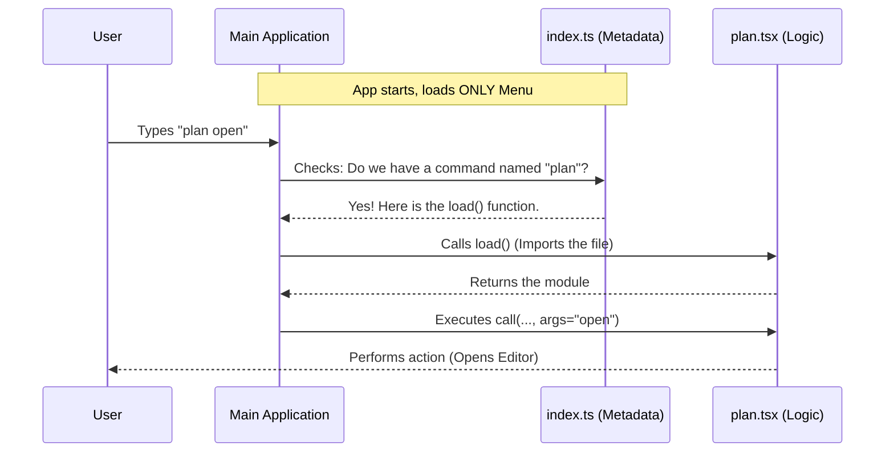

# Chapter 1: Command Architecture

Welcome to the **Command Architecture** of the `plan` project! If you are new to building CLI tools, you might wonder how the application knows what commands exist and how to run them efficiently.

In this chapter, we will explore the structural framework that defines commands. We will use the `plan` command as our primary example to understand how we separate **metadata** (what the command is) from **execution logic** (what the command does).

## The Restaurant Analogy 🍽️

Imagine you are at a restaurant. You sit down and look at the **Menu**.

1.  **The Menu (`index.ts`):** It lists the names of the dishes (e.g., "Steak", "Salad") and a short description. It doesn't contain the actual food; it just tells you what is available.
2.  **The Kitchen (`plan.tsx`):** This is where the cooking happens. The chef doesn't start cooking a steak until you actually order it from the menu.

Our Command Architecture works exactly the same way. We separate the command definition (the Menu) from the heavy logic (the Kitchen). This technique is often called **Lazy Loading**.

### Why do we do this?
If we loaded all the code for every command immediately when the CLI starts, the application would be slow to open. By using this architecture, the CLI starts instantly, and only loads the specific code for the command you type.

---

## 1. The Menu: Defining the Command

Every command starts with a definition file, typically named `index.ts`. This file is lightweight and loads instantly.

Here is the definition for the `plan` command:

```typescript
// --- File: index.ts ---
import type { Command } from '../../commands.js'

const plan = {
  type: 'local-jsx',
  name: 'plan',
  description: 'Enable plan mode or view the current session plan',
  argumentHint: '[open|<description>]',
  load: () => import('./plan.js'),
} satisfies Command

export default plan
```

### Breakdown:
*   **`name`**: The keyword the user types (e.g., `plan`).
*   **`description`**: Shown in the help menu.
*   **`load`**: This is the magic. It uses a dynamic `import()`. It tells the system: *"Only fetch the file `./plan.js` when the user actually runs this command."*

---

## 2. The Kitchen: The Execution Logic

Once the user types `plan`, the system triggers the `load` function we defined above. This loads the actual logic file, `plan.tsx`.

The entry point for every command logic file is a specific function called `call`.

```typescript
// --- File: plan.tsx ---
import type { LocalJSXCommandOnDone, LocalJSXCommandContext } from '../../types/command.js';
// ... other imports

export async function call(
  onDone: LocalJSXCommandOnDone,
  context: LocalJSXCommandContext,
  args: string
): Promise<React.ReactNode> {
  // The logic happens here!
  // ...
}
```

### Breakdown:
*   **`call`**: This is the standard entry point. The CLI framework looks for this exact function name.
*   **`context`**: Gives the command access to the app's internal data (like permissions or state).
*   **`args`**: The text the user typed after the command name (e.g., if they typed `plan open`, args is `"open"`).
*   **`onDone`**: A callback function to tell the CLI "I am finished."

---

## How It Works Under the Hood

Let's visualize the flow when a user types a command.



1.  **Lookup:** The App checks the loaded metadata (`index.ts`) to see if the command exists.
2.  **Lazy Load:** If found, it executes the `load()` function to import the heavy logic (`plan.tsx`).
3.  **Execution:** Finally, it runs the `call()` function within that file.

---

## A Peak Inside the Logic

Let's look at a simplified slice of the logic inside `plan.tsx` to see how it interacts with other systems.

### Handling Arguments
The command logic first decides what to do based on `args`.

```typescript
// Inside call() function...

// Check if the user typed "open"
const argList = args.trim().split(/\s+/);

if (argList[0] === 'open') {
  // Logic to open an external editor
  // See Chapter 4 for details!
}
```

### Interacting with State
The command often needs to check or update the global state of the application.

```typescript
const { getAppState, setAppState } = context;
const appState = getAppState();
const currentMode = appState.toolPermissionContext.mode;

if (currentMode !== 'plan') {
  // Transition the session into 'plan' mode
  // We will cover this in Chapter 2!
}
```
*Note: We will dive deep into how state works in [Session State & Mode Management](02_session_state___mode_management.md).*

### Rendering Output
Finally, the command needs to show something to the user. In this architecture, we often return UI components.

```typescript
const display = (
  <PlanDisplay 
    planContent={planContent} 
    planPath={planPath} 
  />
);

// Render the component to a string for the terminal
const output = await renderToString(display);
onDone(output);
```
*Note: This utilizes React for the terminal! We explore this in [React-Ink UI Rendering](03_react_ink_ui_rendering.md).*

---

## Summary

In this chapter, we learned:
1.  **Separation of Concerns:** We keep the "Menu" (metadata) separate from the "Kitchen" (logic).
2.  **Lazy Loading:** We use `import()` in the metadata to load code only when needed, making the CLI fast.
3.  **The Interface:** logic files export a `call` function that receives `context`, `args`, and `onDone`.

This architecture provides the foundation for building complex, high-performance CLI tools.

Now that we understand *how* a command is loaded, let's look at what happens inside the `call` function when we need to manage the application's memory and modes.

👉 **Next Step:** [Session State & Mode Management](02_session_state___mode_management.md)

---

Generated by [Code IQ](https://github.com/adityasoni99/Code-IQ)