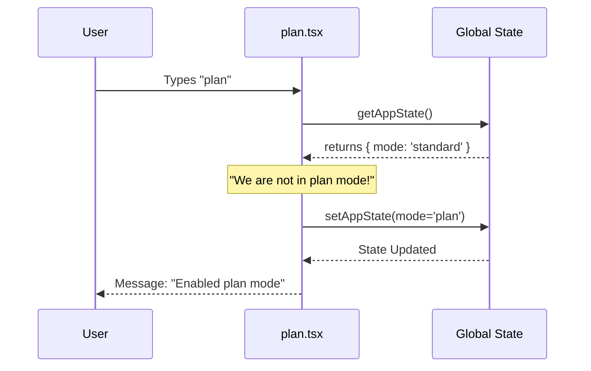

# Chapter 2: Session State & Mode Management

Welcome back! In [Command Architecture](01_command_architecture.md), we learned how the application finds and executes code (the "Menu" and the "Kitchen").

However, executing commands in isolation isn't enough. A smart CLI needs a **Memory**. It needs to know:
*   "What happened in the previous command?"
*   "Am I currently editing a file or just browsing?"
*   "What is the user allowed to do right now?"

In this chapter, we explore **Session State** and the concept of **Modes**.

## The Car Analogy 🚗

Think of the `plan` CLI like a modern car. A car has different **Driving Modes**:

1.  **Normal Mode:** Good for everyday driving.
2.  **Sport Mode:** Changes how the engine responds to the gas pedal.
3.  **Off-Road Mode:** Changes how the wheels spin to handle dirt.

The car is the same, but the **Mode** changes how the system behaves.

In our application, we have a **"Plan Mode"**. When active, the CLI focuses on high-level architectural planning and might restrict accidental code execution. Switching modes updates the **Global State** so every part of the app knows how to behave.

---

## 1. Accessing the Global Brain

In the previous chapter, we saw the `call` function. It receives a `context` object. This `context` is the gateway to our application's memory.

Inside `plan.tsx`, we access the state functions like this:

```typescript
export async function call(onDone, context, args) {
  // 1. Get the tools to read/write memory
  const { getAppState, setAppState } = context;
  
  // 2. Read the current memory (Snapshot)
  const appState = getAppState();
  
  // ...
}
```

### Breakdown:
*   **`getAppState`**: Gives us a snapshot of everything happening *right now*.
*   **`setAppState`**: Allows us to change the memory.

---

## 2. Checking the Current Mode

The most important piece of state for the `plan` command is the **Mode**. This lives inside a specific section of the state called `toolPermissionContext`.

Here is how we check if we are already in Plan Mode:

```typescript
// Look inside the permission context
const currentMode = appState.toolPermissionContext.mode;

// Check our logic
if (currentMode !== 'plan') {
  // We are NOT in plan mode yet. 
  // We need to switch gears!
}
```

If `currentMode` is `'standard'`, we treat the user differently than if it is `'plan'`.

---

## 3. Switching Modes (Writing State)

This is the core of this chapter. If the user isn't in Plan Mode, we need to transition them.

Changing state in a modern application isn't just `state.mode = 'plan'`. We must respect **Immutability**. We take the previous state and create a *new* version of it with our changes.

Here is the code inside `plan.tsx` that performs the switch:

```typescript
// Update the global state
setAppState(prev => ({
  ...prev, // Keep everything else the same
  
  // Update the permission context to 'plan'
  toolPermissionContext: applyPermissionUpdate(
    prepareContextForPlanMode(prev.toolPermissionContext),
    { type: 'setMode', mode: 'plan', destination: 'session' }
  )
}));
```

### Breakdown:
1.  **`setAppState(prev => ...)`**: We use a function to ensure we are modifying the latest version of the state.
2.  **`...prev`**: This spreads the old state, ensuring we don't accidentally delete other data (like user preferences).
3.  **`prepareContextForPlanMode`**: A helper that sets up the rules for the new mode.
4.  **`applyPermissionUpdate`**: This securely commits the change to the `mode` setting.

---

## Visualizing the Flow

What happens when you type `plan`?



1.  **Check:** The command asks the Store for the current mode.
2.  **Decision:** It sees we are in `standard` mode.
3.  **Action:** It tells the Store to switch to `plan` mode.
4.  **Feedback:** It tells the user the switch is complete.

---

## 4. What Happens Inside a Mode?

Once the mode is set to `'plan'`, the application behavior changes.

If we run the command again, the `if (currentMode !== 'plan')` check returns `false`. The code skips the transition logic and instead shows the user the current plan.

```typescript
// We are already in plan mode!
const planContent = getPlan();

if (!planContent) {
  onDone('Already in plan mode. No plan written yet.');
  return null;
}
```

*Note: In future chapters, other systems will also check `appState.mode`. for example, the AI might refuse to edit code if it's strictly in 'plan' mode.*

---

## Summary

In this chapter, we learned:
1.  **State is Memory:** Commands are transient, but State persists.
2.  **Modes:** We use modes (like `'plan'`) to define the "driving style" of the application.
3.  **Reading State:** We use `getAppState()` to see where we are.
4.  **Writing State:** We use `setAppState()` to safely transition between modes.

Now that our application knows *what* mode it is in, we need a way to show complex information to the user—more than just simple text messages.

👉 **Next Step:** [React-Ink UI Rendering](03_react_ink_ui_rendering.md)

---

Generated by [Code IQ](https://github.com/adityasoni99/Code-IQ)