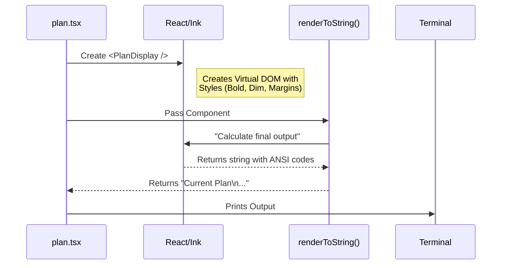

# Chapter 3: React-Ink UI Rendering

Welcome back! In [Session State & Mode Management](02_session_state___mode_management.md), we learned how to switch the application into "Plan Mode" and manage the global memory.

But once we are in Plan Mode, we need to show the user the current plan. We *could* just print a bunch of text strings, but that gets messy quickly. We want borders, colors, padding, and layout.

In this chapter, we explore **React-Ink**. We use the same technology used to build websites (React) to build beautiful Command Line Interfaces (CLIs).

## The Webpage Analogy 🌐

If you have ever built a website, you know HTML:
*   You use `<div>` to group things together.
*   You use `<span>` or `<p>` for text.
*   You use CSS for margins and colors.

**React-Ink** is exactly the same, but for your terminal:
1.  **`<Box>`**: Replaces `<div>`. Handles layout (Flexbox), margins, and padding.
2.  **`<Text>`**: Replaces `<span>`. Handles bold, colors, and text content.

Instead of a browser rendering pixels, Ink renders **ANSI escape codes** (special characters that terminals understand as colors and formatting).

---

## 1. The Component: `PlanDisplay`

In our `plan` command, we don't just `console.log` the plan. We define a React component called `PlanDisplay`.

Let's look at how we structure the UI. We want to show a title, the file path, and the content.

### The Container (`Box`)
First, we need a wrapper to hold everything in a vertical column.

```tsx
import { Box, Text } from '../../ink.js';

function PlanDisplay({ planContent, planPath }) {
  return (
    <Box flexDirection="column">
      {/* Content goes here */}
    </Box>
  );
}
```
*   **`Box`**: This is our main container.
*   **`flexDirection="column"`**: This stacks items vertically (top to bottom).

### Adding Text and Styling
Now let's add the title and the file path.

```tsx
<Box flexDirection="column">
  {/* The Title */}
  <Text bold>Current Plan</Text>
  
  {/* The File Path */}
  <Text dimColor={true}>
    {planPath}
  </Text>
  
  {/* ... */}
</Box>
```
*   **`<Text bold>`**: Makes the font heavy/bright.
*   **`<Text dimColor>`**: Makes the text greyed out (less distracting).

### Content and Margins
Finally, we display the actual plan content. We wrap it in a `Box` to add spacing.

```tsx
  {/* ... previous code ... */}
  
  <Box marginTop={1}>
    <Text>{planContent}</Text>
  </Box>

  {/* ... */}
</Box>
```
*   **`marginTop={1}`**: Adds one empty line above the content. This is much cleaner than manually printing `\n`.

---

## 2. Conditional Rendering

One of the best features of React is **Conditional Rendering**. We only want to show a "Tip" if an editor (like VSCode) is detected.

In standard text printing, this would require messy `if/else` statements. In JSX, it flows naturally.

```tsx
// Inside PlanDisplay component...

{editorName && (
  <Box marginTop={1}>
    <Text dimColor>"/plan open"</Text>
    <Text dimColor> to edit in </Text>
    <Text bold dimColor>{editorName}</Text>
  </Box>
)}
```

### Breakdown:
*   **`{editorName && (...)}`**: This is a Javascript shortcut. If `editorName` exists, render the Box. If it is undefined, render nothing.
*   **Nested `<Text>`**: Notice how we can put `<Text>` inside `<Box>` to create a sentence with different styles (some dim, some bold).

---

## 3. Rendering to String

In a web browser, React "mounts" to the DOM and stays there. However, for this specific command, we want to generate a **Static Snapshot**. We want to calculate the UI, convert it to text, print it, and then finish the command.

We use a helper function called `renderToString`.

### The `call` Function Integration

Here is how the `plan.tsx` file uses the component we just built.

```tsx
// --- File: plan.tsx ---

// 1. Create the element with data
const display = (
  <PlanDisplay 
    planContent={planContent} 
    planPath={planPath} 
    editorName={editorName} 
  />
);
```

Once the element is created, we convert it to a string format the terminal understands.

```tsx
// 2. Render to a static string
import { renderToString } from '../../utils/staticRender.js';

const output = await renderToString(display);

// 3. Send the output to the CLI framework
onDone(output);
```

### Why `renderToString`?
Usually, Ink applications "take over" the screen and listen for keystrokes. However, the `plan` command is designed to show information and exit immediately (unless we are opening an editor). `renderToString` takes our complex component tree and flattens it into a final string result.

---

## How It Works Under the Hood

Let's visualize the lifecycle of a UI render in this CLI.



1.  **Creation:** The command gathers data (State/Plan content) and passes it to the React Component as props.
2.  **Calculation:** React calculates the layout. If `marginTop={1}` is set, it adds a newline character. If `bold` is set, it adds `\x1b[1m`.
3.  **Output:** The function returns a standard string that looks formatted when printed.

---

## Summary

In this chapter, we learned:
1.  **Declarative UI:** Instead of printing strings line-by-line, we describe *what* we want using Components.
2.  **Box & Text:** We use `<Box>` for layout (margins/padding) and `<Text>` for styling (color/bold).
3.  **Conditional UI:** We can easily hide or show parts of the UI (like the Editor hint) using logical operators.
4.  **Static Rendering:** We convert these React components into a text string to display them in the terminal.

We now have a nice way to view the plan. But what if we want to change it? We saw a hint: `"/plan open" to edit`.

How does the CLI break out of the terminal to open a real code editor like VSCode or Vim?

👉 **Next Step:** [External Editor Integration](04_external_editor_integration.md)

---

Generated by [Code IQ](https://github.com/adityasoni99/Code-IQ)