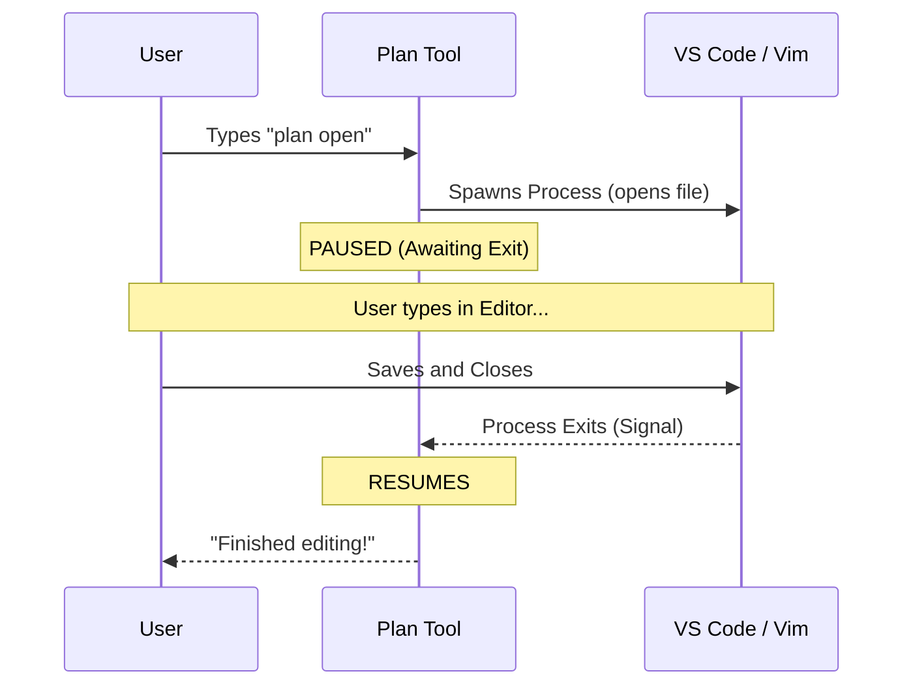

# Chapter 4: External Editor Integration

Welcome back! In [React-Ink UI Rendering](03_react_ink_ui_rendering.md), we built a beautiful dashboard to display our project plan directly in the terminal.

But reading a plan is only half the battle. Eventually, you need to **write** or **edit** that plan.

Have you ever tried to write a long essay or code a complex function directly inside a terminal prompt? It is painful. You lose your mouse, your shortcuts, and your spellcheck.

In this chapter, we will learn how to bridge the gap between our CLI tool and the user's favorite tools (like VS Code, Vim, or Cursor).

## The Sub-Contractor Analogy 👷

Think of the `plan` CLI as a **General Contractor** managing a construction site.

1.  **General Work:** The Contractor handles simple tasks (checking status, moving materials).
2.  **Specialized Work:** When the plumbing needs to be done, the Contractor doesn't do it themselves. They hire a **Plumber** (a specialist).
3.  **The Handoff:** The Contractor points to the room and says, "Fix this."
4.  **The Wait:** The Contractor waits outside until the Plumber finishes before resuming work.

In our case:
*   The **CLI** is the Contractor.
*   **VS Code** (or Vim) is the Specialist (the Editor).
*   **The File** is the room being fixed.

---

## 1. The Trigger: Identifying the Request

In previous chapters, we looked at `plan.tsx`. You might have noticed a specific check for the word "open".

When the user runs `plan open`, we don't want to show the UI. We want to hand off control.

```typescript
// --- File: plan.tsx ---
// Inside the call() function

const argList = args.trim().split(/\s+/);

// Did the user type "plan open"?
if (argList[0] === 'open') {
  // Logic to hand off control goes here...
}
```

This is our "dispatch" center. If the argument matches, we switch logic paths.

---

## 2. Delegating the Task

We use a utility function called `editFileInEditor`. This function is the bridge. It takes a file path, opens it in the user's editor, and returns a promise that resolves only when the editor is closed.

```typescript
// --- File: plan.tsx ---

if (argList[0] === 'open') {
  // 1. Pause CLI and open the editor
  const result = await editFileInEditor(planPath);

  // 2. Check if it went well
  if (result.error) {
    onDone(`Failed: ${result.error}`);
  } else {
    onDone(`Success: Edited ${planPath}`);
  }
  return null; // Stop here, don't render the UI
}
```

### Breakdown:
*   **`await`**: This is crucial. The CLI literally pauses here. It will not execute the next line until the user closes the editor window.
*   **`planPath`**: The location of the file we want to modify.

---

## 3. How It Works Under the Hood

How does a JavaScript program running in a terminal open a separate desktop application?

It uses a Node.js feature called **Child Processes**.



1.  **Spawn:** The CLI creates a "child" process (the editor).
2.  **Inherit IO:** The CLI connects the child process to your keyboard and screen.
3.  **Wait:** The CLI listens for the 'exit' event from the child.

---

## 4. Inside the `editFileInEditor` Function

Let's look at the implementation logic inside our utility file.

### Step A: Finding the Editor
First, we need to know *which* specialist to hire. We look at the user's environment variables.

```typescript
// --- File: utils/editor.ts ---

export function getExternalEditor(): string {
  // 1. Check if user specifically set a VISUAL editor
  // 2. Fallback to standard EDITOR
  // 3. Default to 'code' (VS Code) if nothing is set
  return process.env.VISUAL || process.env.EDITOR || 'code';
}
```

### Step B: Spawning the Process
This is the most technical part. We use `spawn` from `node:child_process`.

```typescript
// --- File: utils/promptEditor.ts ---
import { spawn } from 'child_process';

// We wrap the event-based spawn in a Promise so we can "await" it
const child = spawn(editorCommand, [filePath], {
  // 'inherit' means the editor takes over the user's screen/keyboard
  stdio: 'inherit' 
});
```

*   **`stdio: 'inherit'`**: This is the secret sauce. Without this, programs like Vim wouldn't work because they wouldn't receive your keystrokes. It effectively gives the "microphone" to the editor.

### Step C: The Promise Wrapper
Since `spawn` relies on events (callbacks), we wrap it in a Promise to make our code clean and linear.

```typescript
return new Promise((resolve) => {
  // Listen for the editor closing
  child.on('exit', (code) => {
    if (code === 0) {
      resolve({ success: true });
    } else {
      resolve({ error: 'Editor crashed' });
    }
  });
});
```

---

## 5. Handling the Result

Once the promise resolves (the user closed the editor), execution returns to `plan.tsx`.

At this point, the file on the disk has changed. If we were to display the plan immediately, we would need to read the file again to show the updated content.

In our current architecture (Chapter 1), the command finishes via `onDone`.

```typescript
// Back in plan.tsx
onDone(`Opened plan in editor: ${planPath}`);
```

This simply tells the user we finished the job. The next time they run `plan`, the CLI will read the fresh file from the disk.

---

## Summary

In this chapter, we learned:
1.  **Delegation:** The CLI shouldn't try to do everything. It delegates complex text editing to specialized tools.
2.  **`child_process`:** We use this Node.js API to launch external programs.
3.  **`stdio: 'inherit'`:** This connects the external program to the user's terminal input/output.
4.  **The Await Loop:** We pause the CLI logic until the external process sends an exit signal.

Now our tool is powerful: it can view plans (UI) and edit plans (External Editor).

However, opening files and running commands on the user's computer implies trust. How do we ensure the tool doesn't edit the wrong file or run a dangerous command?

👉 **Next Step:** [Permission System](05_permission_system.md)

---

Generated by [Code IQ](https://github.com/adityasoni99/Code-IQ)