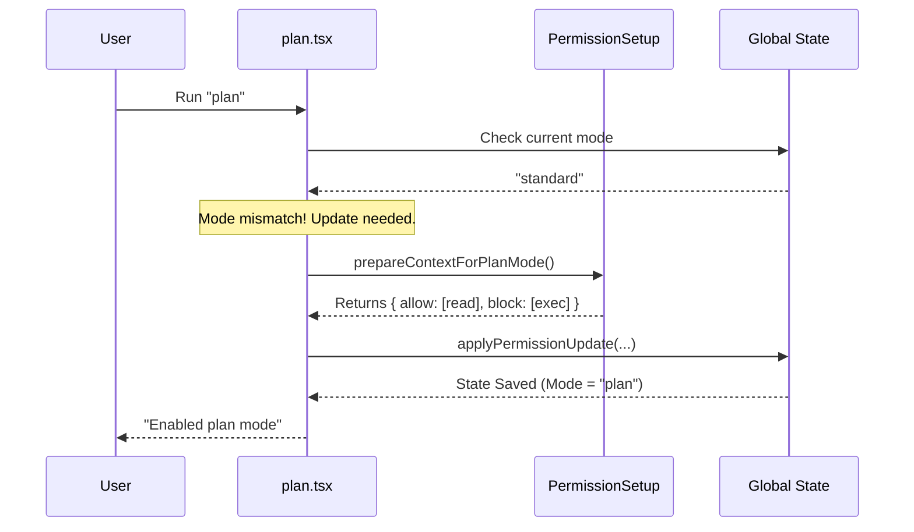

# Chapter 5: Permission System

Welcome to the final chapter of our tutorial series!

In [External Editor Integration](04_external_editor_integration.md), we gave our CLI the power to open files and interact with your operating system. That is a very powerful feature. But with great power comes great responsibility.

If you are in "Creative Mode" just brainstorming ideas, you probably don't want your tool to accidentally delete files or execute dangerous terminal commands.

In this chapter, we will explore the **Permission System**.

## The Smart Keycard Analogy 💳

Imagine a high-security research facility.

1.  **The Lobby (Standard Mode):** Your keycard opens the front door and the cafeteria. You can't enter the labs.
2.  **The Lab (Plan Mode):** When you swipe into the Lab, your access rights change. You can now use the microscopes (read files), but you are strictly forbidden from using the wrecking ball (delete files) outside.

In the `plan` project, when we switch modes (e.g., entering `plan` mode), we automatically update the user's "Keycard" (the Permission Context) to ensure they only have access to the tools relevant to that task.

---

## 1. The Context: Your Digital ID

In [Session State & Mode Management](02_session_state___mode_management.md), we introduced the Global State. Inside that state lives a very specific object called `toolPermissionContext`.

This object is your ID badge. It tracks:
1.  **Current Mode:** (e.g., `standard`, `plan`, `ask`).
2.  **Tool Rules:** Which tools are allowed or blocked.

When the `plan` command runs, it first checks your ID badge.

```typescript
// --- File: plan.tsx ---

const { getAppState } = context;
const appState = getAppState();

// Check the ID Badge
const currentMode = appState.toolPermissionContext.mode;
```

---

## 2. Preparing the Update

If the system detects you are **not** in `plan` mode, it needs to issue you a new badge.

We don't just manually hack the database. We use a helper function called `prepareContextForPlanMode`. Think of this as a "Template" or a "Preset" for permissions.

### What does the "Plan Mode" preset do?
*   **Allow:** Reading files (to understand the project).
*   **Restrict:** Execute commands (to prevent side effects).
*   **Restrict:** Writing code (focus on planning, not implementation).

```typescript
import { prepareContextForPlanMode } from '../../utils/permissions/permissionSetup.js';

// Get the current permissions
const currentContext = prev.toolPermissionContext;

// Calculate the new rules based on the 'plan' preset
const newContextRules = prepareContextForPlanMode(currentContext);
```

---

## 3. Applying the Update

Now that we have prepared the new rules, we need to stamp them into the session state.

We use a secure function called `applyPermissionUpdate`. This ensures the state is updated correctly and logs the change.

```typescript
import { applyPermissionUpdate } from '../../utils/permissions/PermissionUpdate.js';

// Create the instruction to change the mode
const updateInstruction = { 
  type: 'setMode', 
  mode: 'plan', 
  destination: 'session' 
};

// Apply the update to get the final permission object
const finalPermissions = applyPermissionUpdate(
  newContextRules, 
  updateInstruction
);
```

### Breakdown:
*   **`newContextRules`**: The rules we calculated in the previous step.
*   **`destination: 'session'`**: This means "Keep these rules active for the entire session" (until we switch modes again).

---

## 4. Putting It Together

Let's look at the actual code block in `plan.tsx` where this transition happens. This runs when you type `plan` but aren't in plan mode yet.

```typescript
// --- File: plan.tsx ---

setAppState(prev => ({
  ...prev,
  // Update the permission context
  toolPermissionContext: applyPermissionUpdate(
    prepareContextForPlanMode(prev.toolPermissionContext),
    { type: 'setMode', mode: 'plan', destination: 'session' }
  ),
}));
```

It looks complex, but it is just a chain of events:
1.  Take current permissions (`prev`).
2.  Add "Plan Mode" restrictions (`prepare...`).
3.  Commit the change to the session (`apply...`).

---

## How It Works Under the Hood

Let's visualize the security check when a user tries to change modes.



1.  **Detection:** The command realizes you are in the wrong zone.
2.  **Calculation:** It asks the Helper for the "Plan Mode" rulebook.
3.  **Application:** It saves these new rules to the State.
4.  **Enforcement:** From now on, if you try to run a shell command, the system checks the State, sees `block: [exec]`, and rejects the action.

---

## 5. Why is this "Beginner Friendly"?

You might wonder why we need all this code just to change a variable.

In simple scripts, you might just do `mode = 'plan'`. But in a complex AI tool:
1.  **Safety:** We need to ensure that when we switch to planning, we *definitely* revoke access to dangerous tools.
2.  **Consistency:** By using `prepareContextForPlanMode`, every part of the app enforces the rules in exactly the same way.
3.  **Auditing:** `applyPermissionUpdate` can verify valid transitions (e.g., preventing a user from jumping to 'admin' mode without proper checks).

---

## Conclusion

Congratulations! You have completed the 5-chapter tutorial on the architecture of `plan`.

Let's recap what you have built:
1.  **Command Architecture:** You learned how to lazy-load commands using the "Menu" and "Kitchen" analogy.
2.  **State Management:** You gave your CLI a "Memory" to track sessions.
3.  **UI Rendering:** You used React-Ink to make beautiful terminal dashboards.
4.  **External Editors:** You learned to delegate complex work to VS Code or Vim.
5.  **Permission System:** You secured the application by managing access rights based on context.

You now understand the core pillars of building a robust, interactive, and safe CLI tool using modern TypeScript and React!

Happy Coding! 🚀

---

Generated by [Code IQ](https://github.com/adityasoni99/Code-IQ)