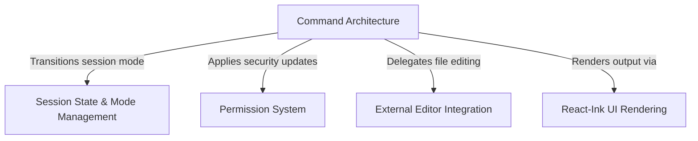

# Tutorial: plan

This module implements a **CLI command** called `plan` that allows users to view or edit a high-level session plan. It orchestrates switching the application's *state* into "plan mode," automatically adjusting security **permissions**, and renders a rich terminal interface using **React components** or hands off editing tasks to an **external text editor**.

## Chapters

1. [Command Architecture](01_command_architecture.md)
2. [Session State & Mode Management](02_session_state___mode_management.md)
3. [React-Ink UI Rendering](03_react_ink_ui_rendering.md)
4. [External Editor Integration](04_external_editor_integration.md)
5. [Permission System](05_permission_system.md)

---

Generated by [Code IQ](https://github.com/adityasoni99/Code-IQ)