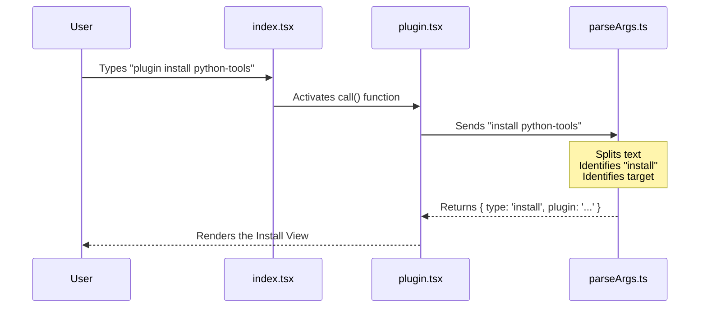

# Chapter 1: Command Interface

Welcome to the **Plugin System** tutorial! In this first chapter, we are going to explore the **Command Interface**.

## The Receptionist Analogy

Imagine walking into a large office building. You don't just wander into random rooms hoping to find what you need. Instead, you stop at the front desk.

The receptionist asks: *"How can I help you?"*
You reply: *"I'm here to **install** a new coffee machine."*

The receptionist understands your intent (`install`) and directs you to the maintenance department.

The **Command Interface** is the receptionist of our application. It sits at the front door, listens to what the user types, and routes them to the correct logic.

### The Central Use Case

Throughout this chapter, we will focus on this simple command that a user might type into their terminal:

```bash
plugin install python-tools
```

Our goal is to understand how the code takes this raw string of text and realizes:
1.  The user wants the `plugin` tool.
2.  The action is `install`.
3.  The target is `python-tools`.

---

## 1. The Entry Point

First, we need to tell the CLI tool that our plugin exists. We do this by defining a `Command` object. This is like putting a sign on the front door that says "Reception".

**File:** `index.tsx`

```typescript
const plugin = {
  type: 'local-jsx',
  name: 'plugin',         // The command keyword
  aliases: ['plugins', 'marketplace'], // Shortcuts
  description: 'Manage Claude Code plugins',
  // When this command is called, load the logic file
  load: () => import('./plugin.js')
} satisfies Command;

export default plugin;
```

**What is happening here?**
*   **`name`**: This tells the system to wake up when the user types `plugin`.
*   **`aliases`**: The system also wakes up for `plugins` or `marketplace`.
*   **`load`**: This is a lazy-loader. We only load the heavy code inside `plugin.js` if the user actually calls this command.

## 2. The Hand-off

Once the entry point is triggered, it hands the phone to the logic handler. This function receives the raw arguments the user typed.

**File:** `plugin.tsx`

```typescript
import { PluginSettings } from './PluginSettings.js';

// The main function called by the CLI
export async function call(onDone, _context, args?: string) {
  // We pass the raw 'args' (e.g., "install python-tools")
  // directly to our settings component.
  return <PluginSettings onComplete={onDone} args={args} />;
}
```

**What is happening here?**
*   The `call` function receives `args`. If the user typed `plugin install python-tools`, the value of `args` is `"install python-tools"`.
*   It immediately renders a React component called `PluginSettings` and passes those arguments along.
*   We will cover how this component draws to the screen in [UI Rendering Components](04_ui_rendering_components.md).

---

## 3. The Brains: Parsing Arguments

Now comes the most important part: understanding the user's intent. The raw string `"install python-tools"` needs to be converted into structured data that our code can easily read.

We use a helper function called `parsePluginArgs`.

### Step A: Splitting the Input

First, we chop the sentence into words.

**File:** `parseArgs.ts`

```typescript
export function parsePluginArgs(args?: string): ParsedCommand {
  // If user typed nothing, go to the main menu
  if (!args) { return { type: 'menu' }; }

  // Split "install python-tools" into ["install", "python-tools"]
  const parts = args.trim().split(/\s+/);
  
  // The first word is the command ("install")
  const command = parts[0]?.toLowerCase();
  
  // ... switch statement follows ...
}
```

### Step B: The Router (Switch Statement)

Next, we look at that first word (`command`) and decide what to do. This acts like a railway switch.

**File:** `parseArgs.ts`

```typescript
  switch (command) {
    case 'install':
    case 'i': {
      // Get the second word ("python-tools")
      const target = parts[1];
      
      // Return a structured object
      return { type: 'install', plugin: target };
    }
    
    // ... other cases like 'manage', 'help' ...
  }
```

**The Result:**
Input string: `"install python-tools"`
Output object: `{ type: 'install', plugin: 'python-tools' }`

Now the rest of the application doesn't have to parse text; it just checks `obj.type === 'install'`.

---

## Internal Flow

Here is a visual summary of how the Command Interface processes a request.



## Handling Complex Scenarios

Sometimes the "Receptionist" needs to handle more complex requests, like managing the marketplace itself.

**Example Input:** `plugin marketplace add http://my-repo.com`

The parser handles this by looking at the *second* word if the first word is `marketplace`.

**File:** `parseArgs.ts`

```typescript
    case 'marketplace': {
      // parts[1] is the action (e.g., "add", "remove")
      const action = parts[1]?.toLowerCase();
      
      // parts[2] is the URL/Target
      const target = parts.slice(2).join(' ');

      return { type: 'marketplace', action: 'add', target };
    }
```

This logic prepares us for the complex work we will discuss in [Marketplace Operations](02_marketplace_operations.md).

## Summary

In this chapter, we learned:
1.  **Entry Point (`index.tsx`):** How to register the `plugin` command.
2.  **Hand-off (`plugin.tsx`):** How to pass user input to our logic.
3.  **Parsing (`parseArgs.ts`):** How to convert raw text strings into structured intent objects.

Now that our application knows *what* the user wants to do, we need to actually perform those actions.

[Next Chapter: Marketplace Operations](02_marketplace_operations.md)

---

Generated by [Code IQ](https://github.com/adityasoni99/Code-IQ)