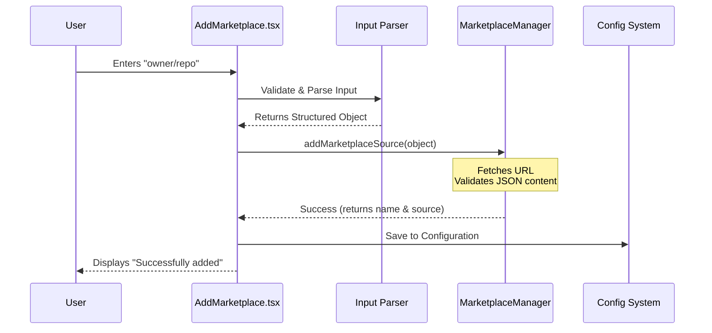

# Chapter 2: Marketplace Operations

In the previous chapter, [Command Interface](01_command_interface.md), we acted as the "Receptionist." We learned how to listen to a user's command (like `plugin marketplace add`) and route them to the right place.

Now, we are entering the **Operations Department**. This department handles the "Supply Chain" of our plugin system.

## The Supply Chain Analogy

Imagine a grocery store. Before a product ends up on the shelf, the store manager needs to:
1.  **Identify a Supplier:** Find a farm or factory (a GitHub repository or URL).
2.  **Verify the Paperwork:** Ensure the address exists and looks correct (Parsing).
3.  **Stock the Shelves:** Add the items to the inventory system.
4.  **Safety Warning:** Put a sign up saying "We didn't bake this bread ourselves" (Trust Warning).

**Marketplace Operations** manages this entire flow.

### The Central Use Case

We will focus on this specific action a user performs to add a new source of plugins:

```bash
plugin marketplace add claudecode/core-plugins
```

Our goal is to understand how the system takes that short text (`claudecode/core-plugins`), finds the actual code on the internet, and safely adds it to our configuration.

---

## 1. The Controller: `AddMarketplace`

When the user runs the command above, the system renders the `AddMarketplace` component. Think of this component as a form wizard that manages the whole process.

**File:** `AddMarketplace.tsx`

This component has "memory" (State) to keep track of what is happening.

```typescript
export function AddMarketplace({ inputValue, setResult, setError }: Props) {
  // Is the system currently working?
  const [isLoading, setLoading] = useState(false);
  
  // What should we tell the user right now?
  const [progressMessage, setProgressMessage] = useState<string>('');
  
  // ... logic continues ...
}
```

**What is happening here?**
*   **`useState`**: React hooks act as the component's short-term memory.
*   **`isLoading`**: Remembers if we are currently fetching data from the internet.
*   **`progressMessage`**: Stores updates like "Downloading..." or "Verifying..." to show the user.

---

## 2. The Translator: Parsing Input

Users are lazy. They might type a full URL, a simplified GitHub path, or a local file path. We need to standardize this input before we can use it.

In our code, we call a helper function `parseMarketplaceInput`.

**File:** `AddMarketplace.tsx` (Inside `handleAdd`)

```typescript
    const input = inputValue.trim();
    
    // 1. The Translator Step
    const parsed = await parseMarketplaceInput(input);
    
    if (!parsed) {
      setError('Invalid format. Try: owner/repo or https://...');
      return;
    }
```

**What is happening here?**
*   **Input:** `claudecode/core-plugins`
*   **Output (Conceptual):**
    ```json
    {
      "type": "github",
      "owner": "claudecode",
      "repo": "core-plugins",
      "url": "https://github.com/claudecode/core-plugins"
    }
    ```
*   The `parseMarketplaceInput` function (imported helper) does the hard work of detecting if the string looks like a URL, a GitHub shortcut, or a file path.

---

## 3. The Execution: Adding the Source

Once the input is translated into a valid object, we attempt to actually add it to our system. This involves network requests to see if the marketplace actually exists.

**File:** `AddMarketplace.tsx` (Inside `handleAdd`)

```typescript
    try {
      setLoading(true); // Turn on the "Loading" spinner
      
      // 2. The Heavy Lifting
      const { name, resolvedSource } = await addMarketplaceSource(
        parsed, 
        (msg) => setProgressMessage(msg) // Update UI with progress
      );

      // 3. Save to Settings
      saveMarketplaceToSettings(name, { source: resolvedSource });
      
      setResult(`Successfully added marketplace: ${name}`);
    } catch (err) {
      setError(err.message); // Something went wrong!
    }
```

**What is happening here?**
1.  **`setLoading(true)`**: We tell the UI to show a spinner so the user knows something is happening.
2.  **`addMarketplaceSource`**: This function connects to the internet to fetch the plugin list. It calls our callback `(msg) => ...` to provide live updates like "Fetching JSON..." or "Validating schema...".
3.  **`saveMarketplaceToSettings`**: If successful, we permanently save this new shop to our config.

---

## 4. The Safety Label: Trust Warnings

One of the most critical parts of Marketplace Operations is Security. Installing plugins allows third-party code to run on your machine. We must warn the user.

We use a dedicated component for this called `PluginTrustWarning`.

**File:** `PluginTrustWarning.tsx`

```typescript
export function PluginTrustWarning() {
  const customMessage = getPluginTrustMessage();

  return (
    <Box marginBottom={1}>
      <Text color="claude">{figures.warning} </Text>
      <Text dimColor italic>
        Make sure you trust a plugin before installing...
        {customMessage}
      </Text>
    </Box>
  );
}
```

**What is happening here?**
*   **`figures.warning`**: Renders a warning icon (⚠) in the terminal.
*   **`dimColor italic`**: Styles the text to look like a disclaimer footer.
*   **Motivation**: This ensures that every time a user interacts with a new marketplace, they are visually reminded that Anthropic does not verify every 3rd party plugin.

---

## Internal Flow

Here is the step-by-step process of what happens when a user adds a marketplace.



---

## 5. Handling CLI Mode (Auto-Add)

Sometimes the user provides the input immediately (e.g., `plugin marketplace add foo/bar`). They don't want to type it again in a text box.

We handle this with a `useEffect` hook that runs immediately when the component loads.

**File:** `AddMarketplace.tsx`

```typescript
  // Run this once when component mounts
  useEffect(() => {
    // If we already have input (from CLI args), do it automatically
    if (inputValue && !hasAttemptedAutoAdd.current) {
      hasAttemptedAutoAdd.current = true;
      void handleAdd(); // Trigger the logic we defined above
    }
  }, []);
```

**What is happening here?**
*   **`inputValue`**: If the Command Interface (Chapter 1) passed arguments down, this variable will already be filled.
*   **`handleAdd()`**: We skip waiting for the user to press "Enter" and trigger the addition logic immediately.

---

## Summary

In this chapter, we explored **Marketplace Operations**. We learned how the system:
1.  **Translates** messy user strings into structured data (Parsing).
2.  **Validates** the existence of the marketplace via the network.
3.  **Communicates** progress and errors back to the UI.
4.  **Warns** the user about trust and security risks.

Now that we have successfully added and saved a marketplace, where does that data go? How is it stored permanently?

We will find out in the next chapter.

[Next Chapter: Configuration System](03_configuration_system.md)

---

Generated by [Code IQ](https://github.com/adityasoni99/Code-IQ)