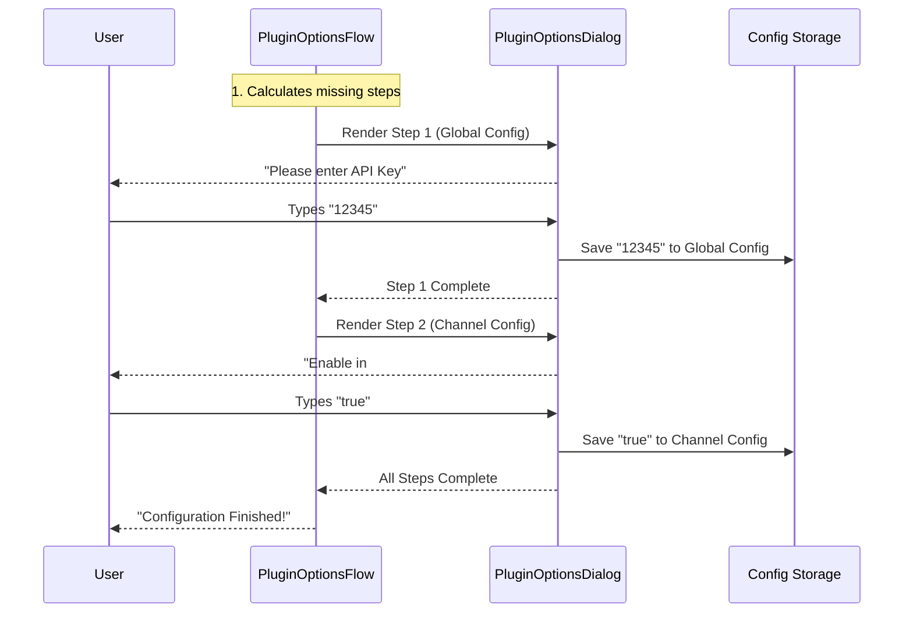

# Chapter 3: Configuration System

Welcome to the **Configuration System** chapter.

In the previous chapter, [Marketplace Operations](02_marketplace_operations.md), we acted as the "Supply Chain Manager," finding and downloading plugins from the internet.

Now, we move to **HR and Onboarding**.

## The Onboarding Analogy

Imagine you just hired a new employee (installed a plugin). They are in the building, but they can't start working yet. Why?
*   They don't have their ID badge.
*   They don't know the Wi-Fi password.
*   They haven't chosen their desk preference.

If you don't give them this information, they just sit there.

The **Configuration System** is the automated onboarding wizard. It checks exactly what the new plugin needs (API keys, preferences, URLs) and politely asks the user to fill in the blanks before letting the plugin run.

### The Central Use Case

We will focus on what happens immediately after a user installs a plugin that requires an API key.

**Scenario:**
1.  User installs a `weather-plugin`.
2.  The plugin needs a `weather_api_key` to function.
3.  The system automatically detects this missing requirement.
4.  It launches an interactive "Setup Wizard" in the terminal.

---

## 1. The Checklist: The Schema

Before the system can ask questions, it needs to know what to ask. Plugins define their needs using a **Schema**. Think of this as the "New Hire Form."

While the schema definition happens inside the plugin, our system reads it to generate the UI.

**Example Schema (Conceptual):**
```json
{
  "apiKey": {
    "type": "string",
    "description": "Your OpenWeatherMap Key",
    "sensitive": true,
    "required": true
  },
  "unit": {
    "type": "string",
    "default": "celsius"
  }
}
```

Our Configuration System reads this and knows: "I need to ask for a secret key, and a unit preference."

## 2. The Orchestrator: `PluginOptionsFlow`

The brain of this operation is a component called `PluginOptionsFlow`. Its job is to figure out **what is missing**.

Plugins can have two types of settings:
1.  **Global Settings:** Apply everywhere (e.g., the API Key).
2.  **Channel Settings:** Apply to specific servers/channels (e.g., enabling the weather bot only in `#general`).

The `PluginOptionsFlow` creates a "To-Do List" of configuration steps.

**File:** `PluginOptionsFlow.tsx`

```typescript
export function PluginOptionsFlow({ plugin, pluginId, onDone }: Props) {
  // We calculate the necessary steps ONCE when the component mounts
  const [steps] = React.useState<ConfigStep[]>(() => {
    const result: ConfigStep[] = [];

    // 1. Check for missing Global Options
    const unconfigured = getUnconfiguredOptions(plugin);
    if (Object.keys(unconfigured).length > 0) {
       // Add a step to configure global settings
       result.push({ key: 'top-level', /* ... */ });
    }

    // 2. Check for missing Channel Options
    // ... logic for channels ...

    return result;
  });
  
  // ... rendering logic ...
}
```

**What is happening here?**
*   **`getUnconfiguredOptions`**: This helper looks at what the plugin needs vs. what is currently saved in the database.
*   **`result.push`**: If something is missing, we add a "Step" to our wizard.
*   **`steps`**: This state variable now holds a list of screens we need to show the user.

---

## 3. The Interviewer: `PluginOptionsDialog`

Once the Orchestrator knows *what* to ask, it delegates the actual interaction to the `PluginOptionsDialog`. This component renders the text boxes and handles user input.

This component is designed to be **secure** and **interactive**. It handles:
*   Hiding sensitive text (typing `***` instead of `abc`).
*   Navigating fields with `Tab`.
*   Saving with `Enter`.

**File:** `PluginOptionsDialog.tsx`

```typescript
export function PluginOptionsDialog({ configSchema, onSave, ...props }) {
  // Track which field acts as the "active" input
  const [currentFieldIndex, setCurrentFieldIndex] = useState(0);
  
  // Track the text the user is typing right now
  const [currentInput, setCurrentInput] = useState('');

  // Handle the "Next" action (Tab or Enter)
  const handleConfirm = useCallback(() => {
     // If this is the last field, save everything.
     // Otherwise, move to the next question.
     if (currentFieldIndex === fields.length - 1) {
        onSave(finalValues);
     } else {
        moveToNextField();
     }
  }, [/* deps */]);

  // ... render UI ...
}
```

### Handling Secrets securely

A critical part of configuration is handling passwords or API keys. We use a helper function `buildFinalValues` to ensure we handle data cleanly.

**File:** `PluginOptionsDialog.tsx`

```typescript
export function buildFinalValues(fields, collected, schema, initialValues) {
  const finalValues = {};
  
  for (const key of fields) {
    const isSensitive = schema[key]?.sensitive;
    const userInput = collected[key] || '';

    // SAFETY CHECK:
    // If it's a password field, and the user left it blank,
    // keep the OLD password (don't overwrite it with empty string).
    if (isSensitive && userInput === '' && initialValues[key]) {
      continue; 
    }
    
    finalValues[key] = userInput;
  }
  return finalValues;
}
```

**Why is this important?**
If a user goes back to edit their settings, we don't show them their old API Key for security reasons (the field appears blank). If they press "Save" on that blank field, we shouldn't wipe out the key they saved last week. This logic prevents that accident.

---

## Internal Flow

Here is how the system orchestrates the setup wizard.



---

## 4. Cycling Through Steps

The `PluginOptionsFlow` is responsible for moving from one screen to the next. It uses a simple index tracker.

**File:** `PluginOptionsFlow.tsx`

```typescript
  const [index, setIndex] = React.useState(0);
  const currentStep = steps[index];

  function handleSave(values) {
    // 1. Save the data for the current step
    currentStep.save(values);
    
    // 2. Move index to the next step
    const next = index + 1;
    if (next < steps.length) {
      setIndex(next);
    } else {
      // 3. If no steps left, we are done!
      onDone('configured');
    }
  }
```

**Concept:**
This logic turns a potentially complex configuration process (configuring 5 different servers and 1 global key) into a simple, linear series of screens for the user.

---

## Summary

In this chapter, we learned how the **Configuration System** acts as the setup wizard for our plugins.

1.  **The Schema:** Defines what the plugin needs.
2.  **`PluginOptionsFlow`:** Creates the to-do list of what needs to be configured (Global vs. Channel).
3.  **`PluginOptionsDialog`:** Provides the interactive UI to collect data securely.
4.  **`buildFinalValues`:** Ensures sensitive data isn't accidentally deleted during updates.

Now that our plugin is installed (Chapter 2) and fully configured (Chapter 3), it is ready to actually *show* things to the user.

How does a plugin draw buttons, text, or tables in the terminal? We will explore this in the next chapter.

[Next Chapter: UI Rendering Components](04_ui_rendering_components.md)

---

Generated by [Code IQ](https://github.com/adityasoni99/Code-IQ)