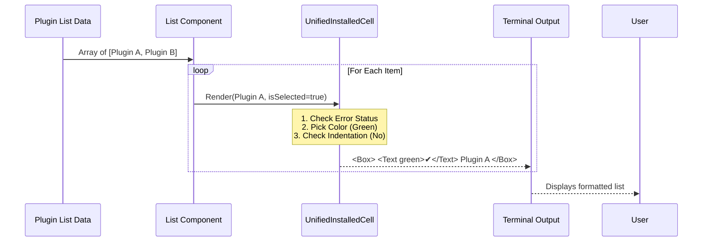

# Chapter 4: UI Rendering Components

Welcome to the **UI Rendering Components** chapter.

In the previous chapter, [Configuration System](03_configuration_system.md), we acted as the "HR Department," onboarding our plugins by filling out their settings and API keys.

Now, we enter the **Art Department**.

## The Dashboard Analogy

Imagine the dashboard of a car. Under the hood, the engine sends raw data: `oil_pressure: 12`, `speed: 65`, `check_engine: true`.

If the driver saw that raw text while driving, they would crash. Instead, the dashboard translates that data into visual cues:
*   **Speed:** A dial pointing to 65.
*   **Check Engine:** A glowing red light.
*   **Oil:** A neutral gauge.

**UI Rendering Components** are the gauges and lights of our terminal application. They take the complex state of a plugin (is it loading? is it broken? is it a child of another plugin?) and render a clean, readable line of text with icons and colors.

### The Central Use Case

We will focus on the main "Plugin List" view. When a user runs `plugin list`, they see this:

```text
> python-tools      · enabled
  └ file-server     · connected
  broken-plugin     · x 1 error
```

Our goal is to understand the component responsible for drawing **one single row** of this list, handling the icons, colors, and indentation automatically.

---

## 1. The Atom: `UnifiedInstalledCell`

The smallest unit of our list UI is the "Cell". It represents one row.

The component `UnifiedInstalledCell` is a "dumb" component. It doesn't fetch data; it just dresses up the data it is given.

**File:** `UnifiedInstalledCell.tsx`

It takes two main inputs:
1.  **`item`**: The data object (Name, Status, Type).
2.  **`isSelected`**: A boolean (Is the user's cursor currently on this row?).

```typescript
type Props = {
  item: UnifiedInstalledItem;
  isSelected: boolean; // Is the cursor here?
};

export function UnifiedInstalledCell({ item, isSelected }: Props) {
  const [theme] = useTheme();
  
  // Logic to determine icons and text goes here...
  
  return <Box>...</Box>;
}
```

## 2. Visual Logic: Status Icons

The most complex part of rendering is deciding what icon to show. A plugin might be `enabled`, `disabled`, `pending`, or `broken`.

We use a series of checks to pick the right color and symbol.

**File:** `UnifiedInstalledCell.tsx` (Logic simplified)

```typescript
  let statusIcon;
  let statusText;

  // 1. Check for Errors first
  if (item.errorCount > 0) {
    statusIcon = color("error", theme)(figures.cross); // Red X
    statusText = `${item.errorCount} error`;
  } 
  // 2. Check if Disabled
  else if (!item.isEnabled) {
    statusIcon = color("inactive", theme)(figures.radioOff); // Grey Circle
    statusText = "disabled";
  } 
  // 3. Default to Success
  else {
    statusIcon = color("success", theme)(figures.tick); // Green Check
    statusText = "enabled";
  }
```

**What is happening here?**
*   **`figures`**: A library that provides cross-platform symbols (like `✔`, `✖`, `●`).
*   **`color`**: A helper that applies terminal ANSI colors (Red, Grey, Green) based on our current theme.
*   **Priority**: We check for errors *before* checking if it's enabled. A broken plugin takes priority over a standard one.

## 3. Hierarchy: Handling Indentation

Some items in our list are "children" of other items. For example, an MCP Server running inside a Plugin. We need to show this relationship visually using an "L" shaped bracket (`└`).

**File:** `UnifiedInstalledCell.tsx`

```typescript
  // Check if this item is a child node
  if (item.indented) {
    return (
      <Box>
        {/* The Selection Pointer (> ) */}
        <Text color={isSelected ? 'suggestion' : undefined}>
           {isSelected ? figures.pointer : '  '} 
        </Text>

        {/* The Tree Indentation Symbol (└ ) */}
        <Text dimColor>└ </Text> 
        
        {/* The Name */}
        <Text>{item.name}</Text>
      </Box>
    );
  }
```

**The Visual Result:**
*   **Normal:** `> My Plugin`
*   **Indented:** `> └ My Sub-Feature`

This simple logic allows users to understand complex parent-child relationships at a glance without reading documentation.

---

## Internal Flow

Here is how the Rendering System converts data into pixels (or characters) on the screen.



---

## 4. User Guidance: Shortcut Hints

A good UI doesn't just show data; it tells the user what they can *do* with it.

At the bottom of our list, we render a "Context Bar" that changes based on what is selected. If a user selects an installed plugin, they might see "Press **i** to install".

**File:** `pluginDetailsHelpers.tsx`

```typescript
export function PluginSelectionKeyHint({ hasSelection }) {
  return (
    <Box marginTop={1}>
      <Text dimColor italic>
        <Byline>
          {/* Only show 'install' hint if an item is selected */}
          {hasSelection && (
            <ConfigurableShortcutHint 
              fallback="i" 
              description="install" 
            />
          )}
          
          <ConfigurableShortcutHint 
             fallback="Enter" 
             description="details" 
          />
        </Byline>
      </Text>
    </Box>
  );
}
```

**Why is this important?**
Beginners often don't know keyboard shortcuts. By conditionally rendering `<ConfigurableShortcutHint />`, we act as a tour guide, revealing available actions only when they are relevant.

## 5. Visual Polish: The "Pointer"

In a terminal, you don't have a mouse cursor. You have a "Selection State". We need to visually indicate which row is currently active.

We achieve this by conditionally rendering the `figures.pointer` (usually a `>`) based on the `isSelected` prop.

**File:** `UnifiedInstalledCell.tsx` (Snippet)

```typescript
    const pointer = isSelected ? `${figures.pointer} ` : "  ";
    const nameColor = isSelected ? "suggestion" : undefined;

    return (
      <Box>
        <Text color={nameColor}>{pointer}</Text>
        <Text color={nameColor}>{item.name}</Text>
      </Box>
    )
```

**Logic:**
1.  If selected: Draw `> ` and color the text Blue (suggestion color).
2.  If NOT selected: Draw `  ` (two spaces) and keep text white.
3.  **Crucial:** We draw spaces when *not* selected so the text aligns perfectly with the row above it.

## Summary

In this chapter, we learned how **UI Rendering Components** translate raw data into a user-friendly interface.

1.  **`UnifiedInstalledCell`:** The atomic unit that draws a single row.
2.  **Visual Logic:** Using `if/else` to determine if we show a Green Tick or a Red Cross.
3.  **Indentation:** Using visual prefixes (`└`) to imply hierarchy.
4.  **Hints:** Using conditional rendering to show relevant keyboard shortcuts.

At this point, we have a fully functional application. We can command it (Chapter 1), fetch plugins (Chapter 2), configure them (Chapter 3), and view them (Chapter 4).

But what happens when things go wrong deep inside the system? How do we verify that the plugin is behaving correctly behind the scenes?

[Next Chapter: Validation & Diagnostics](05_validation___diagnostics.md)

---

Generated by [Code IQ](https://github.com/adityasoni99/Code-IQ)