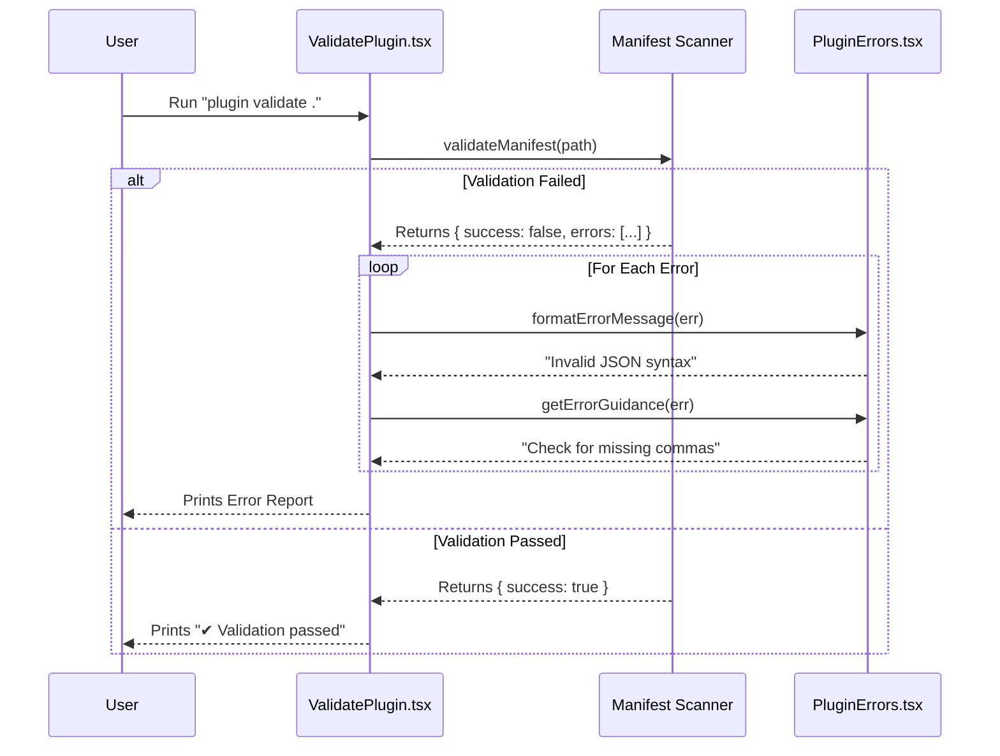

# Chapter 5: Validation & Diagnostics

Welcome to the **Validation & Diagnostics** chapter.

In the previous chapter, [UI Rendering Components](04_ui_rendering_components.md), we learned how to draw beautiful lists and icons in the terminal. We assumed everything was working perfectly.

But in the real world, things break. Files go missing. WiFi disconnects. Typos happen.

## The Health Inspector Analogy

Imagine a restaurant. Before it can open, a **Health Inspector** visits. They don't cook the food; they check the kitchen.
*   Is the fridge cold enough?
*   Are the ingredients expired?
*   is the floor clean?

If they find a violation, they don't just say "Code 503." They write a report: *"The fridge is broken. Please fix it."*

**Validation & Diagnostics** is the Health Inspector of our plugin system. It scans plugin files to ensure they are healthy, and if they aren't, it translates confusing computer errors into helpful human advice.

### The Central Use Case

We will focus on a specific command a developer runs when their plugin isn't showing up:

```bash
plugin validate ./my-new-plugin
```

Our goal is to understand how the system scans that folder, finds a typo in the `plugin.json` file, and prints:
`✖ Invalid manifest: Missing required field 'version'`

---

## 1. The Inspector: `ValidatePlugin`

The entry point for this process is the `ValidatePlugin` component. Just like our other commands, this is a React component that runs inside the terminal.

It doesn't wait for user input; it starts working immediately using `useEffect`.

**File:** `ValidatePlugin.tsx`

```typescript
export function ValidatePlugin({ onComplete, path }: Props) {
  
  // 1. Start the inspection immediately
  useEffect(() => {
    async function runValidation() {
      // Logic goes here...
    }
    runValidation();
  }, [path]);

  return <Text>Running validation...</Text>;
}
```

**What is happening here?**
*   **`path`**: The folder the user wants to check (e.g., `./my-new-plugin`).
*   **`useEffect`**: This hook fires as soon as the command starts.
*   **`<Text>`**: While the code runs, we show a simple "Running validation..." message.

## 2. The Examination: Checking the Manifest

Inside `runValidation`, we perform the actual check. We call a helper function `validateManifest`. This function opens the file, reads the JSON, and compares it against our rules (Schema).

**File:** `ValidatePlugin.tsx` (Inside `runValidation`)

```typescript
      try {
        // 1. The actual test
        const result = await validateManifest(path);

        let output = "";
        
        // 2. Did we find errors?
        if (result.errors.length > 0) {
           output += `${figures.cross} Found ${result.errors.length} errors:\n`;
           
           // 3. List them out
           result.errors.forEach(error => {
             output += `  ${figures.pointer} ${error.path}: ${error.message}\n`;
           });
        }
```

**What is happening here?**
*   **`validateManifest`**: This is the "thermometer." It returns a report card (`result`) containing lists of `errors` and `warnings`.
*   **`figures.cross`**: Renders a red `✖` symbol.
*   **Looping**: We iterate through every error found so the user sees all issues at once, rather than fixing one, running it again, and finding another.

---

## 3. The Translator: Formatting Errors

Sometimes, errors happen deeper in the system, like a network failure or a Git authentication issue. These produce internal "Error Codes" that look like `git-auth-failed` or `network-error`.

We need to translate these into English sentences. We use a function called `formatErrorMessage`.

**File:** `PluginErrors.tsx`

```typescript
export function formatErrorMessage(error: PluginError): string {
  switch (error.type) {
    case 'path-not-found':
      return `${error.component} path not found: ${error.path}`;
      
    case 'network-error':
      return `Network error accessing ${error.url}`;

    case 'git-auth-failed':
      return `Git ${error.authType} authentication failed`;
      
    // ... many other cases ...
  }
}
```

**The Transformation:**
*   **Input (Code):** `{ type: 'path-not-found', path: '/usr/bin/python' }`
*   **Output (Human):** `"Interpreter path not found: /usr/bin/python"`

This ensures that even if the error is technical, the message describes *what* happened in plain language.

---

## 4. The Guide: Actionable Advice

Knowing *what* broke is good. Knowing *how to fix it* is better.

We have a separate layer called `getErrorGuidance`. This acts like the "Solution" section of a troubleshooting manual. It looks at the error type and suggests a specific next step.

**File:** `PluginErrors.tsx`

```typescript
export function getErrorGuidance(error: PluginError): string | null {
  switch (error.type) {
    case 'network-error':
      return 'Check your internet connection and try again';

    case 'manifest-validation-error':
      return 'Check manifest file follows the required schema';

    case 'plugin-not-found':
      return `Plugin may not exist in marketplace "${error.marketplace}"`;
      
    // ... many other cases ...
  }
}
```

**Why separate the Message from the Guidance?**
*   **Message:** Describes the reality ("Connection refused").
*   **Guidance:** Describes the solution ("Check your WiFi").
*   Separating them allows the UI to style them differently (e.g., Red for the error, Grey Italics for the tip).

---

## Internal Flow

Here is how a validation request travels through the system.



---

## 5. Handling Complex Scenarios (Policies)

Sometimes an error isn't due to broken code, but due to corporate rules. For example, a plugin might be valid, but blocked by the IT department.

Our Diagnostics system handles this gracefully using the `marketplace-blocked-by-policy` error type.

**File:** `PluginErrors.tsx`

```typescript
    case 'marketplace-blocked-by-policy':
      if (error.blockedByBlocklist) {
        return 'This marketplace source is explicitly blocked by your administrator';
      }
      return 'Contact your administrator to configure allowed sources';
```

This prevents user frustration. Instead of thinking the plugin is broken, they immediately know it is a permission issue.

## Summary

In this final chapter, we explored **Validation & Diagnostics**. We learned:

1.  **The Inspector (`ValidatePlugin`):** How we scan files for structural health.
2.  **The Translator (`formatErrorMessage`):** How we turn code words (`git-auth-failed`) into sentences.
3.  **The Guide (`getErrorGuidance`):** How we provide actionable steps to fix problems.

### Conclusion of the Tutorial

Congratulations! You have navigated the entire architecture of the **Plugin System**.

1.  You started at the **Reception Desk** ([Command Interface](01_command_interface.md)).
2.  You visited the **Supply Chain** ([Marketplace Operations](02_marketplace_operations.md)).
3.  You worked with **HR** to onboard plugins ([Configuration System](03_configuration_system.md)).
4.  You designed the **Dashboard** ([UI Rendering Components](04_ui_rendering_components.md)).
5.  And finally, you learned how to maintain **System Health** (Validation & Diagnostics).

You now possess a complete mental map of how this application installs, configures, runs, and monitors plugins. Happy coding!

---

Generated by [Code IQ](https://github.com/adityasoni99/Code-IQ)