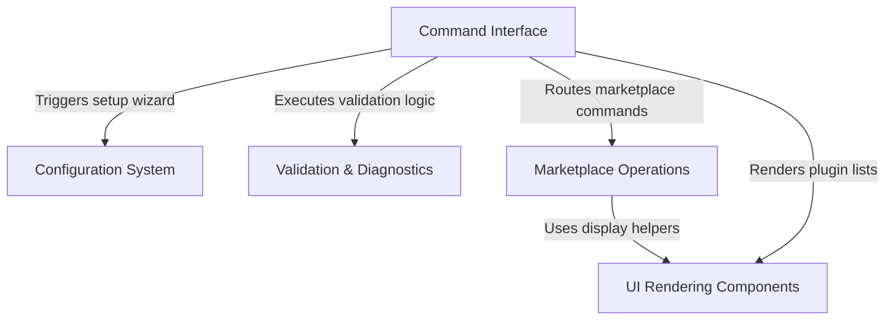

# Tutorial: plugin

This project implements a comprehensive **CLI and Terminal UI** for managing the lifecycle of plugins. It acts as a central hub to **discover, install, and configure** plugins from various marketplaces, ensuring they are correctly set up via interactive **wizards** and validated against strict **schemas** to maintain ecosystem health.

## Chapters

1. [Command Interface](01_command_interface.md)
2. [Marketplace Operations](02_marketplace_operations.md)
3. [Configuration System](03_configuration_system.md)
4. [UI Rendering Components](04_ui_rendering_components.md)
5. [Validation & Diagnostics](05_validation___diagnostics.md)

---

Generated by [Code IQ](https://github.com/adityasoni99/Code-IQ)