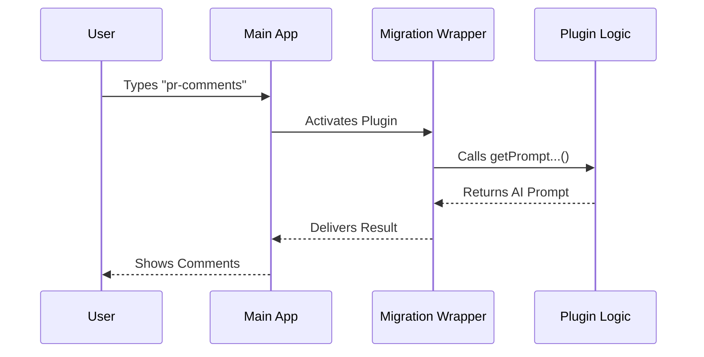

# Chapter 1: Plugin Migration Wrapper

Welcome to the first chapter of our tutorial! We are going to build a feature called `pr-comments`. This tool helps fetch and summarize comments from GitHub Pull Requests using AI.

Before we write the logic to fetch data, we need a place to put that code. We need a "container" that allows our code to plug into the main application.

## 1. Motivation: The Shipping Container Analogy

Imagine you have built a custom machine that reads comments. You want to ship this machine to a factory (the main application) so it can be used there.

If you build the machine directly into the factory's wall, it becomes hard to remove, upgrade, or move later. This is called **tight coupling**.

Instead, we use a **Plugin Migration Wrapper**. Think of this like a standard **Shipping Container**.
1. You put your machine inside the container.
2. You label the container.
3. The factory knows exactly how to load standard containers.

In our code, the function `createMovedToPluginCommand` is that shipping container. It wraps your specific logic so the main system can load it easily as a plugin.

## 2. Key Concepts

To use this wrapper, we need to understand two simple parts:

1.  **The Box (The Wrapper Function):** This is `createMovedToPluginCommand`. It takes your settings and logic and bundles them up.
2.  **The Contents (The Configuration Object):** This is the information you pass *into* the function, such as the command name and what the command actually does.

## 3. How to Use the Wrapper

Let's look at `index.ts`. This file is the entry point for our plugin. We will break it down into small steps.

### Step 1: Importing the Container
First, we need to import the tool that creates our wrapper.

```typescript
// index.ts
import { createMovedToPluginCommand } from '../createMovedToPluginCommand.js'
```
**Explanation:** We are grabbing the "shipping container builder" from our tools folder.

### Step 2: Creating the Bundle
Next, we export the result of calling this function.

```typescript
export default createMovedToPluginCommand({
  // We will fill this with settings in the next steps
  name: 'pr-comments',
  description: 'Get comments from a GitHub pull request',
  // ... more settings
})
```
**Explanation:**
- `export default`: We are sending this package out to the main system.
- `createMovedToPluginCommand({...})`: We are creating the container.
- Inside the curly braces `{}`, we define our plugin.

### Step 3: Defining Command Details
Inside the wrapper, we provide labels so the system knows what this plugin does.

```typescript
  // Inside the object...
  progressMessage: 'fetching PR comments',
  pluginName: 'pr-comments',
  pluginCommand: 'pr-comments',
```
**Explanation:**
- These fields tell the system how to identify our command.
- We will cover these details in depth in [Command Configuration](02_command_configuration.md).

### Step 4: The Logic
Finally, we put the actual "machine" inside the container. This function runs when the user types the command.

```typescript
  async getPromptWhileMarketplaceIsPrivate(args) {
    return [
      {
        type: 'text',
        text: `You are an AI assistant... (logic continues)`
      },
    ]
  },
```
**Explanation:**
- `getPromptWhileMarketplaceIsPrivate`: This is a specific spot in the wrapper where we define our behavior.
- It returns the instructions for the AI. We will explore how to write this in [AI Prompt Generation](03_ai_prompt_generation.md).

## 4. Internal Implementation Walkthrough

What actually happens when the application runs your code? Let's visualize the flow.

### The Flow
1.  The Main Application starts up.
2.  It looks for plugins.
3.  It finds our `index.ts` and sees the **Wrapper**.
4.  The Wrapper registers our command (`pr-comments`) with the system.
5.  When a user runs `pr-comments`, the Wrapper executes our logic.

### Sequence Diagram

Here is a simplified view of the interaction:



### Under the Hood
The `createMovedToPluginCommand` helper abstracts away complex system requirements.

Instead of writing:
*   "Register command X"
*   "Listen for input Y"
*   "Handle errors Z"

The wrapper says: **"Just give me an object with a `name` and a `getPrompt...` function, and I will handle the rest."**

This architecture allows us to focus entirely on fetching GitHub data (which we will learn in [GitHub Data Retrieval Strategy](04_github_data_retrieval_strategy.md)) and formatting it (covered in [Output Formatting Specification](05_output_formatting_specification.md)), without worrying about how the CLI application works internally.

## Conclusion

In this chapter, we learned that the **Plugin Migration Wrapper** is a utility that allows us to package our code modularly. It decouples our logic from the main system, making our feature portable and easy to manage.

Now that we have our container ready, we need to label it correctly.

[Next Chapter: Command Configuration](02_command_configuration.md)

---

Generated by [Code IQ](https://github.com/adityasoni99/Code-IQ)