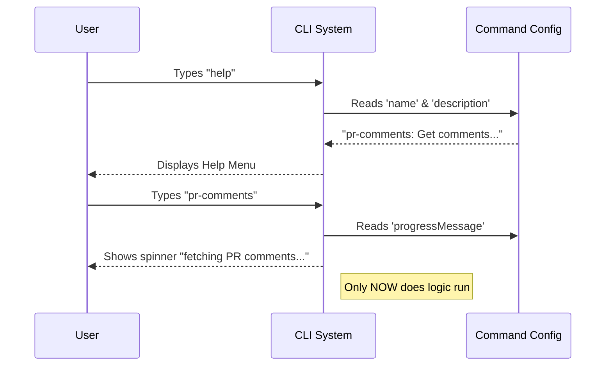

# Chapter 2: Command Configuration

In [Chapter 1: Plugin Migration Wrapper](01_plugin_migration_wrapper.md), we built a "shipping container" for our code. We learned that the wrapper holds our logic so it can be moved into the main application.

However, a shipping container without a label is useless. The factory doesn't know what is inside or where it should go.

In this chapter, we will learn about **Command Configuration**. This is the process of labeling our container so the system knows exactly what our tool is called and how to introduce it to the user.

## 1. Motivation: The "ID Card" Analogy

Imagine you are hiring a new employee for a company. Before they can start working, they need an **ID Card**.

This ID card contains:
1.  **Name:** So people know what to call them.
2.  **Job Description:** So people know what they do.
3.  **Status:** So people know if they are busy working.

Without this ID card, the security guard (the CLI system) won't let them in, and other employees (the users) won't know they exist.

In our code, the **Command Configuration** is that ID card. It defines the identity of our plugin before any code actually runs.

## 2. Key Concepts

We define this identity using a simple Javascript object (a list of key-value pairs). Here are the three most important fields on our ID card:

### A. The Identifier (`name`)
This is the unique keyword the user will type to run your tool. It should be short, lowercase, and use dashes instead of spaces.
*   *Example:* `pr-comments`

### B. The Human Description (`description`)
This is the text that appears in the "Help" menu. It explains to the user what the tool does in plain English.
*   *Example:* "Get comments from a GitHub pull request"

### C. The Status Update (`progressMessage`)
When your tool is working (fetching data from the internet), it might take a few seconds. This message keeps the user patient so they know the system hasn't frozen.
*   *Example:* "fetching PR comments"

## 3. How to Configure the Command

Let's look at how we write this in `index.ts`. We pass these settings directly into our wrapper function.

### Step 1: Naming and Describing
First, we set the name and the description. This is what the user sees when they list available commands.

```typescript
// index.ts
export default createMovedToPluginCommand({
  name: 'pr-comments',
  description: 'Get comments from a GitHub pull request',
  // ... (more settings follow)
})
```
**Explanation:**
- `name`: When the user types `pr-comments`, this tool activates.
- `description`: If the user types `help`, they will see this sentence next to the command name.

### Step 2: Setting the Loading State
Next, we tell the system what to display while the tool is "thinking."

```typescript
// index.ts continued...
  progressMessage: 'fetching PR comments',
  pluginName: 'pr-comments',
  pluginCommand: 'pr-comments',
  // ... (logic follows)
```
**Explanation:**
- `progressMessage`: A spinner will appear with the text "fetching PR comments..." while the AI runs.
- `pluginName` and `pluginCommand`: These are internal fields required by the wrapper to ensure the wiring connects correctly to the main system. We usually keep them the same as the `name`.

## 4. Internal Implementation Walkthrough

What happens when the application reads this configuration? It does not run your code immediately. It performs a **Registration Phase**.

### The Registration Process
1.  **Startup:** The CLI application turns on.
2.  **Scanning:** It looks at our `index.ts` file.
3.  **Reading:** It reads the `name` and `description` from our configuration object.
4.  **Menu Building:** It adds "pr-comments" to the list of things it can do.
5.  **Waiting:** It waits for the user.

Your actual logic (fetching GitHub data) is asleep until the user actually types the name.

### Sequence Diagram: The ID Check

Here is how the System uses the Configuration Object to interact with the User.



### Deep Dive: The Wrapper's Job
The function `createMovedToPluginCommand` (which we imported) acts as the registrar.

When we pass our object:
```typescript
{
  name: 'pr-comments',
  description: 'Get comments...',
  // ...
}
```

The wrapper takes this object and standardizes it. It ensures that even if the main application changes how it handles commands in the future, our plugin doesn't break because the wrapper handles the translation.

This separation allows us to define **"What I am"** (Configuration) separately from **"What I do"** (Logic).

## Conclusion

In this chapter, we created the "ID Card" for our feature. We learned that:
1.  `name` is what the user types.
2.  `description` is what shows in the help menu.
3.  `progressMessage` is what shows while loading.

Now the system knows *who* our tool is. Next, we need to tell the tool exactly *what* to ask the AI when it wakes up.

[Next Chapter: AI Prompt Generation](03_ai_prompt_generation.md)

---

Generated by [Code IQ](https://github.com/adityasoni99/Code-IQ)