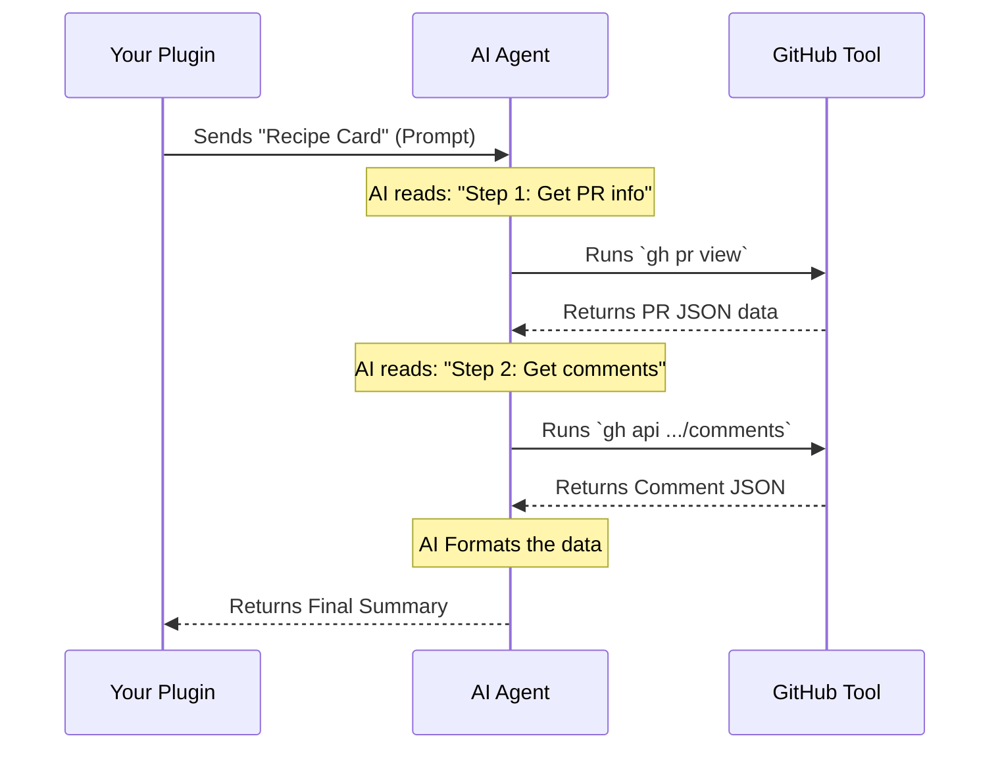

# Chapter 3: AI Prompt Generation

In the previous chapter, [Command Configuration](02_command_configuration.md), we gave our plugin an identity (an "ID Card"). The system now knows the command `pr-comments` exists.

However, right now, our plugin is just an empty shell. It doesn't know *what* to do.

In this chapter, we will write the logic. But instead of writing complex computer code, we are going to write **English**. We will learn about **AI Prompt Generation**.

## 1. Motivation: The Head Chef Analogy

To understand this concept, let's look at two ways to cook a meal.

### The Old Way (Imperative Code)
You are the line cook. You have to do everything manually:
1.  Walk to the fridge.
2.  Open the door.
3.  Find the carrots.
4.  Chop the carrots into 1cm cubes.
5.  ...and so on.

In programming, this means writing code to open network connections, parse JSON, handle errors, and format strings manually. It is hard work.

### The New Way (AI Prompts)
You are the **Head Chef**. You have a highly intelligent Sous-Chef (the AI).

You simply write a **Recipe Card**:
> "Make a carrot soup. Find the carrots in the fridge, chop them, and cook them until soft."

The AI figures out *how* to open the fridge and *how* to chop the carrots. You just define the **goal**.

In our project, the function `getPromptWhileMarketplaceIsPrivate` is that Recipe Card.

## 2. Key Concepts

We need to understand two parts of this abstraction:

1.  **The Trigger:** The function `getPromptWhileMarketplaceIsPrivate`. This is called automatically when your command runs.
2.  **The Script:** The text string we return. This is the set of instructions (the recipe) the AI will read.

## 3. How to Write the Recipe

Let's look at `index.ts`. We are going to build the prompt step-by-step inside our configuration object.

### Step 1: The Function Definition
Inside our `createMovedToPluginCommand` object, we add this specific function.

```typescript
// index.ts
async getPromptWhileMarketplaceIsPrivate(args) {
  return [
    {
      type: 'text',
      // We will add the instructions in the next step
      text: `...`, 
    },
  ]
},
```
**Explanation:**
- `args`: This holds any extra text the user typed (like flags or options).
- `return [...]`: We return a list of messages.
- `type: 'text'`: We are sending a text instruction to the AI.

### Step 2: Setting the Persona (Context)
The first part of our prompt sets the stage. We tell the AI who it is.

```typescript
// Inside the backticks `...`
text: `You are an AI assistant integrated into a 
git-based version control system. 

Your task is to fetch and display comments 
from a GitHub pull request.
```
**Explanation:**
- By telling the AI it is "integrated into git," it prepares to use git-related tools.
- We clearly state the **Goal**: "Fetch and display comments."

### Step 3: Defining the Steps (The Logic)
Next, we list the specific actions the AI should take. This acts as our logic flow.

```typescript
Follow these steps:

1. Use \`gh pr view\` to get the PR number.
2. Use \`gh api .../issues/{number}/comments\` for general comments.
3. Use \`gh api .../pulls/{number}/comments\` for code reviews.
4. Format all comments in a readable way.
```
**Explanation:**
- Instead of writing `fetch('https://api.github.com...')`, we just tell the AI to use the `gh` tool.
- We list the order of operations: Get the PR details -> Get general comments -> Get review comments.
- *Note:* We will dive deep into exactly *which* API calls to use in [GitHub Data Retrieval Strategy](04_github_data_retrieval_strategy.md).

### Step 4: Formatting Rules (The Presentation)
Finally, we tell the AI exactly how the output should look.

```typescript
Format the comments as:
## Comments
- @author file.ts#line:
  > quoted comment text

Remember:
1. Only show the actual comments.
2. Preserve threading/nesting.
3. Use jq to parse JSON.
```
**Explanation:**
- We give a template (like `@author file.ts#line`).
- We give **Constraints**: "Only show actual comments." This prevents the AI from saying "Here is what I found:" and just makes it output the data.
- We will refine these rules in [Output Formatting Specification](05_output_formatting_specification.md).

### Step 5: Handling User Input
At the very end of the string, we inject the user's input.

```typescript
${args ? 'Additional user input: ' + args : ''}
` // End of template string
```
**Explanation:**
- If the user types `pr-comments --verbose`, the `args` variable allows the AI to see that request and adjust its behavior dynamically.

## 4. Internal Implementation Walkthrough

What actually happens when you return this string? How does text become action?

### The Flow
1.  **Generation:** Your code runs and generates the big text string (the prompt).
2.  **Hand-off:** The Plugin Wrapper sends this text to the **Agent Loop**.
3.  **Thinking:** The AI reads the text. It sees "Step 1: Use `gh pr view`".
4.  **Action:** The AI pauses, runs that command on your computer, reads the result, and moves to "Step 2".

### Sequence Diagram



### Under the Hood
The `getPromptWhileMarketplaceIsPrivate` abstraction hides the complexity of the **Agent Loop**.

Normally, to build an AI agent, you need:
1.  A Chat History loop.
2.  Tool definitions (how to run terminal commands).
3.  Context window management.

By using this wrapper, you skip all that. You simply provide the **Initial System Prompt**. The underlying system takes your string, creates a new AI session, and feeds it your instructions as the "System Message." The AI then "wakes up" knowing exactly what its job is.

## Conclusion

In this chapter, we learned that we don't need to write low-level code to fetch data. Instead, we act as a **Head Chef**, writing a detailed **AI Prompt** that instructs the agent on what to do.

Our prompt had three main parts:
1.  **Persona:** "You are a git assistant."
2.  **Steps:** "Get PR info, then get comments."
3.  **Format:** "Make it look like this."

However, saying "Get comments" is easy, but actually getting the *right* data from GitHub can be tricky. We need to be very specific about which tools the AI should use.

[Next Chapter: GitHub Data Retrieval Strategy](04_github_data_retrieval_strategy.md)

---

Generated by [Code IQ](https://github.com/adityasoni99/Code-IQ)