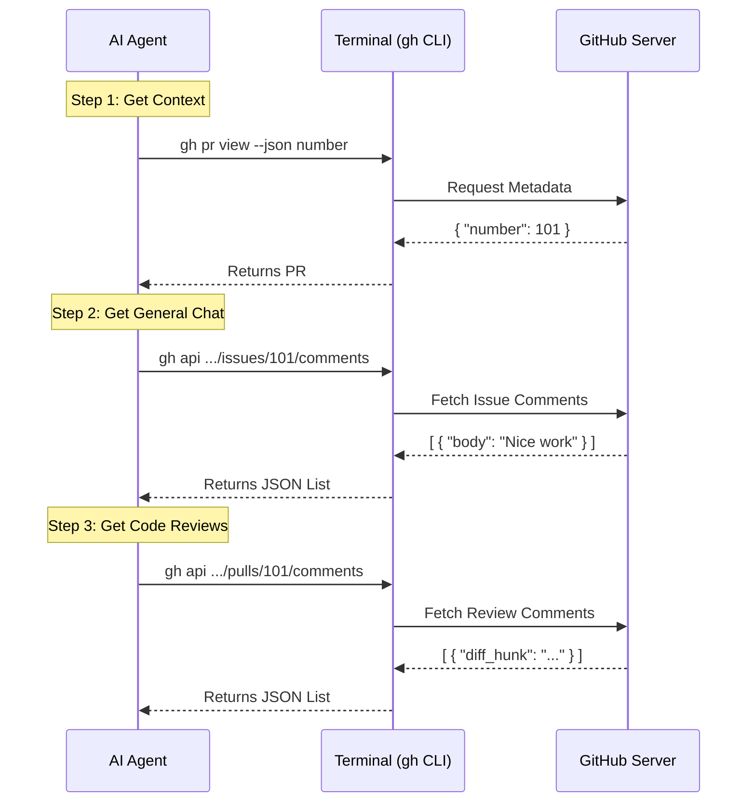

# Chapter 4: GitHub Data Retrieval Strategy

In the previous chapter, [Chapter 3: AI Prompt Generation](03_ai_prompt_generation.md), we acted as the "Head Chef." We wrote a recipe (the Prompt) telling the AI *what* to do: "Fetch the comments."

But there is a problem. The AI is smart, but it doesn't inherently know where your files are or how to access GitHub's private servers. It needs a tool to reach the outside world.

In this chapter, we will define the **GitHub Data Retrieval Strategy**. We will give the AI a "Remote Control" (the GitHub CLI) and a specific set of buttons to press to get the data we need.

## 1. Motivation: The Librarian Analogy

Imagine you go to a massive library to find a specific quote in a specific book.

If you just tell the librarian: "Get me the quote," they won't know where to look. You need to provide a **Retrieval Strategy**:
1.  "Go to the computer catalog to find the Book ID."
2.  "Go to Aisle 4, Shelf B to get the book."
3.  "Open to page 42."

In our project:
*   **The Library** is GitHub.
*   **The Librarian** is the AI.
*   **The Strategy** is the list of `gh` commands we put in our prompt.

Without this strategy, the AI acts blindly. With it, the AI becomes a surgical tool that extracts exactly the data we need.

## 2. Key Concepts

To execute this strategy, we use two main concepts:

### A. The Tool: GitHub CLI (`gh`)
We don't ask the AI to write complex HTTP network requests. Instead, we ask it to use the **GitHub CLI** (`gh`).
This is a command-line tool installed on your computer. It handles authentication and connection details automatically. It is our "Remote Control" for GitHub.

### B. The Two Buckets of Comments
GitHub stores comments in two different "buckets," and we need to look in both:
1.  **Issue Comments:** These are general conversation comments (e.g., "Nice work!", "Ready to merge?").
2.  **Review Comments:** These are tied to specific lines of code (e.g., "Change `var` to `const` on line 10").

## 3. The Strategy Steps

We implement this strategy by writing specific instructions inside our AI Prompt (in `index.ts`). Let's break down the three steps we command the AI to take.

### Step 1: "Who am I?" (Getting Metadata)
First, the AI needs to know which Pull Request (PR) it is currently looking at. It needs the PR number and the repository owner.

**The Instruction:**
```typescript
1. Use `gh pr view --json number,headRepository`...
```

**What it does:**
This command asks GitHub: "Tell me about the PR I am currently in."
*   **Output:** It gets a JSON object containing the `number` (e.g., #42) and the `repository` name.

### Step 2: Fetching General Conversation
Now that the AI knows the PR number (let's say #42), it can fetch the general discussion.

**The Instruction:**
```typescript
2. Use `gh api /repos/{owner}/{repo}/issues/{number}/comments`...
```

**Why `/issues/`?**
In GitHub's internal database, every Pull Request is technically also an "Issue." The general conversation lives in the "Issues" bucket.

### Step 3: Fetching Code Reviews
Finally, we need the technical comments attached to specific lines of code.

**The Instruction:**
```typescript
3. Use `gh api /repos/{owner}/{repo}/pulls/{number}/comments`...
```

**Why `/pulls/`?**
Code-specific comments (reviews) only exist on Pull Requests, not regular Issues. So we switch to the "Pulls" bucket to find them.

## 4. Internal Implementation Walkthrough

How does the AI actually execute this? It's a conversation between the AI and your Terminal.

### The Execution Flow
1.  **Start:** The AI reads your prompt.
2.  **Discovery:** It runs the "Step 1" command to find the PR Number.
3.  **Substitution:** It takes that number and inserts it into the "Step 2" and "Step 3" commands.
4.  **Collection:** It runs those commands and collects the raw JSON data.

### Sequence Diagram

Here is a simplified view of the AI gathering the ingredients:



### Deep Dive: The Code Implementation

Let's look at `index.ts` again to see exactly how these commands are embedded in the text string we return.

**The Prompt Construction:**

```typescript
// index.ts
async getPromptWhileMarketplaceIsPrivate(args) {
  return [
    {
      type: 'text',
      text: `...
Follow these steps:

1. Use \`gh pr view --json number,headRepository\` to get the PR number...
```

**Explanation:**
We literally type the command inside backticks (\`). The AI recognizes this pattern and knows it is a terminal command it should execute.

**The Advanced Fetch (Optional):**

Sometimes a comment says "Change this line," but we can't see the line. We give the AI a strategy for that too:

```typescript
// index.ts continued...
3. ...If the comment references some code, consider fetching it using:
   \`gh api .../contents/{path}?ref={branch} | jq .content ...\`
```

**Explanation:**
*   `gh api .../contents`: This tells GitHub to send the actual file content.
*   `| jq ...`: This pipes the result into a tool called `jq` to clean up the data.
*   This instruction is conditional ("If the comment references..."). The AI decides when to use it.

## Conclusion

In this chapter, we defined the **GitHub Data Retrieval Strategy**.

We learned that:
1.  We use the **`gh` CLI** as our remote control.
2.  We fetch **Metadata** first to get the PR Number.
3.  We fetch **General Comments** from the `/issues/` endpoint.
4.  We fetch **Review Comments** from the `/pulls/` endpoint.

Now the AI has all the raw data it needs! But raw data is messy. It's just a giant pile of JSON text. We need to tell the AI how to present this information beautifully to the user.

[Next Chapter: Output Formatting Specification](05_output_formatting_specification.md)

---

Generated by [Code IQ](https://github.com/adityasoni99/Code-IQ)