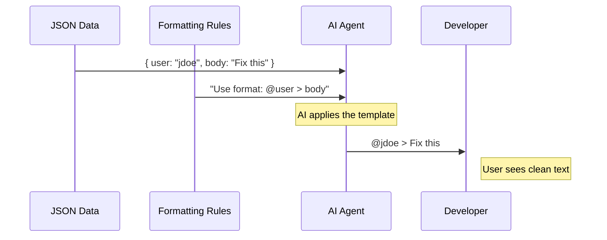

# Chapter 5: Output Formatting Specification

Welcome to the final chapter of our tutorial!

In [Chapter 4: GitHub Data Retrieval Strategy](04_github_data_retrieval_strategy.md), we taught the AI how to use the "Remote Control" (the GitHub CLI) to fetch raw data. We now have a pile of data representing comments, authors, and file paths.

However, raw data usually looks like this:
`{"author": "user1", "body": "typo here", "path": "src/index.ts", "line": 42...}`

If we show this directly to the user, it looks like a wall of text. It is hard to read and hard to understand.

In this chapter, we will define the **Output Formatting Specification**. This is the "Style Guide" we give the AI to transform that messy raw data into a clean, readable conversation.

## 1. Motivation: The Interior Decorator Analogy

Imagine you have just moved into a new house. You have boxes of stuff (the raw data) everywhere. You have chairs, books, and plates scattered on the floor.

If you invite a guest over, they won't know where to sit or how to eat.

You need an **Interior Decorator** (the Output Specification). You give them a rulebook:
1.  "Put the chairs around the table."
2.  "Put the books on the shelf."
3.  "Set the plates on the table."

In our code, the **Output Formatting Specification** tells the AI exactly how to arrange the data so the developer can review the code comments easily.

## 2. Key Concepts

To create a good specification, we need to define three things:

### A. The Structure (The Layout)
We need to decide what information is most important. For a code review, we usually need:
1.  **Who** said it? (Author)
2.  **Where** is it? (File and Line Number)
3.  **What** is the code? (The Diff/Context)
4.  **What** did they say? (The Comment Body)

### B. The Syntax (Markdown)
Since our users are developers, we want the output to be in **Markdown**. This allows us to use bold text, code blocks, and lists to make the output pretty in the terminal.

### C. The Constraints (The "Don'ts")
AI likes to be chatty. It might say, *"Here are the comments I found for you!"* or *"I hope this helps."*
For a command-line tool, we want to ban this small talk. We want **Data Only**.

## 3. How to Define the Specification

We write these rules directly into the `text` field of our prompt in `index.ts`. Let's break down the rules we added.

### Step 1: Defining the Header
We start by telling the AI how to title the section.

```typescript
// index.ts (inside the prompt string)
Format the comments as:

## Comments
```
**Explanation:**
- We explicitly state the header should be `## Comments`.
- This creates a clear visual start to the output.

### Step 2: The Comment Template
Next, we provide a visual template for every single comment thread.

```typescript
[For each comment thread:]
- @author file.ts#line:
  ```diff
  [diff_hunk from the API response]
  ```
  > quoted comment text
```
**Explanation:**
- `@author`: This tells the AI to put the username here (e.g., `@octocat`).
- `file.ts#line`: This combines the file path and line number (e.g., `src/main.ts#10`).
- `diff_hunk`: This puts the actual code snippet inside a code block so it looks like code.
- `>`: This uses the blockquote format for the comment text.

### Step 3: Handling Replies
Comments on GitHub are often conversations (threads). We need to handle replies.

```typescript
  [any replies indented]
```
**Explanation:**
- By asking for indentation, we ensure that if "User B" replies to "User A," it looks visually connected, rather than a flat list.

### Step 4: The Negative Constraints
Finally, we strictly tell the AI what *not* to do.

```typescript
Remember:
1. Only show the actual comments, no explanatory text.
2. Return ONLY the formatted comments.
```
**Explanation:**
- This is crucial. Without this, the AI might output: *"Okay, I fetched the data. Here it is: ..."*
- We want the tool to feel like a machine, not a chatbot, so we strip away the personality.

## 4. Example: Before and After

Let's see the transformation in action.

### The Input (Raw Data)
This is what the AI fetches from GitHub (simplified):

```json
[
  {
    "user": { "login": "jdoe" },
    "path": "utils.ts",
    "line": 45,
    "diff_hunk": "const x = 1;",
    "body": "Should this be a const?"
  }
]
```

### The Output (Formatted Specification)
This is what the AI generates for the user because of our rules:

```markdown
## Comments

- @jdoe utils.ts#45:
  ```diff
  const x = 1;
  ```
  > Should this be a const?
```

## 5. Internal Implementation Walkthrough

What happens inside the "brain" of the agent when it follows these rules?

### The Formatting Flow
1.  **Collection:** The AI has a list of JSON objects from the commands we ran in [Chapter 4](04_github_data_retrieval_strategy.md).
2.  **Mapping:** It picks up the first object.
3.  **Extraction:** It pulls out `user.login`, `path`, `line`, and `body`.
4.  **Template Filling:** It fills in the template we defined in Step 2.
5.  **Looping:** It repeats this for every comment.
6.  **Finalizing:** It removes any "Hello" or "Goodbye" text and sends the result.

### Sequence Diagram



### Deep Dive: The Code
Here is the exact block in `index.ts` where we combine the Fetching Strategy (Chapter 4) with the Formatting Strategy.

```typescript
// index.ts
    text: `...
    3. Use \`gh api ...\` to get comments.
    4. Parse and format all comments in a readable way.
    5. Return ONLY the formatted comments...
    
    Format the comments as:
    - @author file.ts#line:
      > quoted comment text
    `
```
**Explanation:**
- Lines 3-5 are the logic instructions.
- The lines following are the **Visual Specification**.
- By combining them in one string, the AI treats formatting as part of the job, not an afterthought.

## Conclusion

In this chapter, we learned that fetching data is only half the battle. To make a tool useful, we must present that data clearly.

We used an **Output Formatting Specification** to:
1.  Create a visual template (`@author file#line`).
2.  Group related information (threading).
3.  Remove unnecessary noise (negative constraints).

### Project Wrap-Up
Congratulations! You have completed the `pr-comments` tutorial.

You have built a full plugin that:
1.  **Plugs in** using the Migration Wrapper ([Chapter 1](01_plugin_migration_wrapper.md)).
2.  **Identifies itself** via Command Configuration ([Chapter 2](02_command_configuration.md)).
3.  **Thinks** using AI Prompt Generation ([Chapter 3](03_ai_prompt_generation.md)).
4.  **Acts** using the GitHub Data Retrieval Strategy ([Chapter 4](04_github_data_retrieval_strategy.md)).
5.  **Communicates** using the Output Formatting Specification (Chapter 5).

You now have the knowledge to build your own AI-powered CLI tools. Happy coding!

---

Generated by [Code IQ](https://github.com/adityasoni99/Code-IQ)