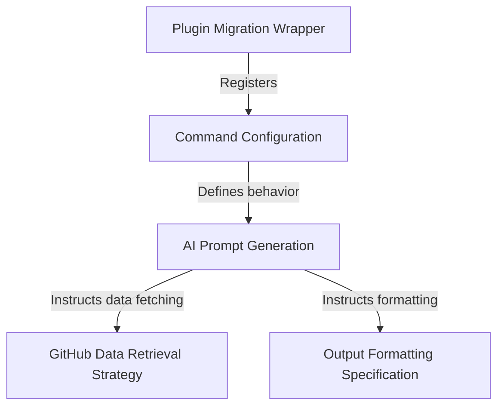

# Tutorial: pr_comments

This project serves as a **modular plugin** designed to fetch and display review comments from a *GitHub Pull Request*. Instead of using traditional hard-coded logic, it acts as a bridge that generates a **natural language prompt**, instructing an AI assistant to retrieve raw data using the `gh` CLI tool and present it in a readable, **formatted Markdown** conversation thread.

## Chapters

1. [Plugin Migration Wrapper](01_plugin_migration_wrapper.md)
2. [Command Configuration](02_command_configuration.md)
3. [AI Prompt Generation](03_ai_prompt_generation.md)
4. [GitHub Data Retrieval Strategy](04_github_data_retrieval_strategy.md)
5. [Output Formatting Specification](05_output_formatting_specification.md)

---

Generated by [Code IQ](https://github.com/adityasoni99/Code-IQ)