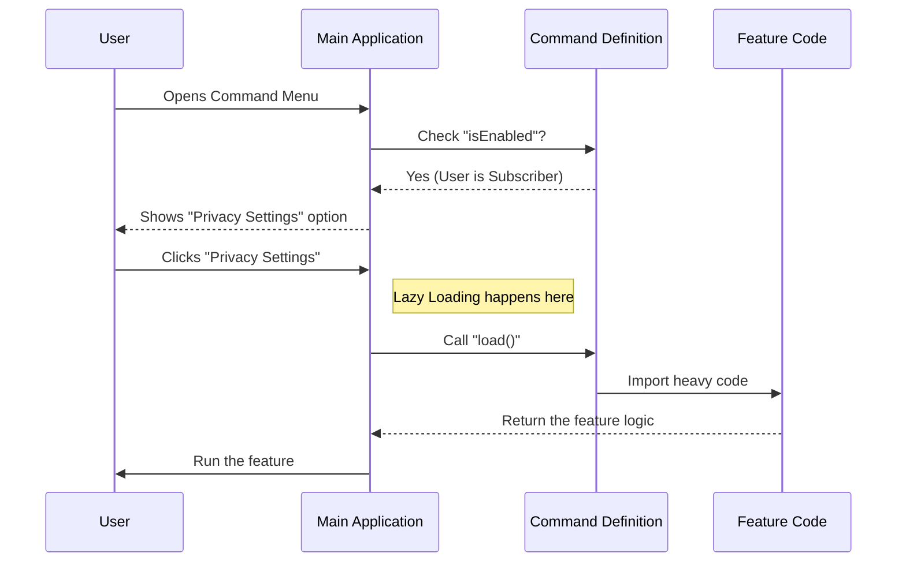

# Chapter 1: Command Definition

Welcome to the first chapter of the **Privacy Settings** project! 

Before we can build the complex logic of managing privacy, we need to answer a simple question: **How does the user actually find and start our feature?**

## Motivation: The "Menu" Problem

Imagine you have just built a brand new room in a house (our Privacy Settings feature). It has nice furniture and cool capabilities. However, you forgot to put a door in the hallway! No one knows the room exists, and no one can enter it.

In software, a **Command Definition** is that door. 

### The Use Case
We want a user to be able to open the application's command palette (a menu of actions), type "privacy", and see an option to **"View and update your privacy settings."**

Without a Command Definition, our code is just a ghost—it exists in the files, but the application doesn't know how to run it.

## Key Concepts

To solve this, we create a specific object that acts like a registration form. It tells the main application three main things:

1.  **Identity:** What is my name and description?
2.  **Permissions:** Who is allowed to see me?
3.  **Action:** What happens when I am selected?

Let's break down how to implement this in `index.ts`.

### 1. Identity (Name and Description)

First, we need to label our command so humans can read it and the system can identify it.

```typescript
const privacySettings = {
  // 'local-jsx' means this command renders UI locally
  type: 'local-jsx', 
  
  // The unique ID for the system
  name: 'privacy-settings',
  
  // The text the user sees in the menu
  description: 'View and update your privacy settings',
  
  // ... more properties to come
}
```

**Explanation:**
- `name`: This is the internal ID.
- `description`: This is what appears in the search bar when the user looks for commands.

### 2. Permissions (Conditional Enabling)

We don't want just *anyone* to change settings. For this project, we only want "Consumer Subscribers" to access this feature. We use the `isEnabled` property to enforcing this.

```typescript
import { isConsumerSubscriber } from '../../utils/auth.js'

const privacySettings = {
  // ... previous identity properties
  
  // The app runs this function before showing the command
  isEnabled: () => {
    // Returns true if user is a subscriber, false otherwise
    return isConsumerSubscriber()
  },
}
```

**Explanation:**
If `isEnabled` returns `false`, the command effectively disappears from the menu. It's like a "VIP Only" sign—if you aren't on the list, you don't even see the door.

### 3. Action (Lazy Loading)

This is the most important part for performance. Our privacy feature might contain heavy code. We don't want to load all that code just because the user opened the app. We want to load it **only** when they click the command.

```typescript
import type { Command } from '../../commands.js'

const privacySettings = {
  // ... previous properties

  // This imports the heavy code ONLY when triggered
  load: () => import('./privacy-settings.js'),
  
} satisfies Command

export default privacySettings
```

**Explanation:**
- `load`: This function uses a dynamic `import`. It tells the app: "Go fetch the code in `./privacy-settings.js` right now."
- `satisfies Command`: This is a TypeScript check. It ensures we didn't forget any required fields in our definition.

## Under the Hood: The Discovery Process

How does the main application process this file? Let's visualize the flow from the moment a user opens the command palette.



### Internal Implementation Detail

When you define the object in `index.ts`, you are essentially creating a contract. 

1.  **Registration:** On startup, the Main Application scans for files ending in `index.ts` in the commands directory.
2.  **Validation:** It checks the `satisfies Command` type to ensure the object is valid.
3.  **Execution:** When `load()` is called, the application receives the module from `./privacy-settings.js`. 

The code inside that loaded file usually contains the logic to start the user interface. We will define that logic in the [Workflow Orchestrator](02_workflow_orchestrator.md).

## Putting It All Together

Here is the complete, minimal definition found in `index.ts`. It combines identity, security, and performance into one small configuration object.

```typescript
import type { Command } from '../../commands.js'
import { isConsumerSubscriber } from '../../utils/auth.js'

const privacySettings = {
  type: 'local-jsx',
  name: 'privacy-settings',
  description: 'View and update your privacy settings',
  isEnabled: () => {
    return isConsumerSubscriber()
  },
  load: () => import('./privacy-settings.js'),
} satisfies Command

export default privacySettings
```

**Output/Result:**
By saving this file, the main application now has a registered command `privacy-settings`. When a subscribed user selects it, the application will download and run the code inside `./privacy-settings.js`.

## Conclusion

We have successfully installed the "door" to our feature! 
- We named it (`privacy-settings`).
- We secured it (`isEnabled`).
- We made it efficient (`load`).

However, right now, if a user walks through this door, they enter a void. We haven't defined what happens *after* the code loads. We need a way to manage the flow of the feature.

In the next chapter, we will build the "brain" that runs once this command is triggered.

[Next Chapter: Workflow Orchestrator](02_workflow_orchestrator.md)

---

Generated by [Code IQ](https://github.com/adityasoni99/Code-IQ)