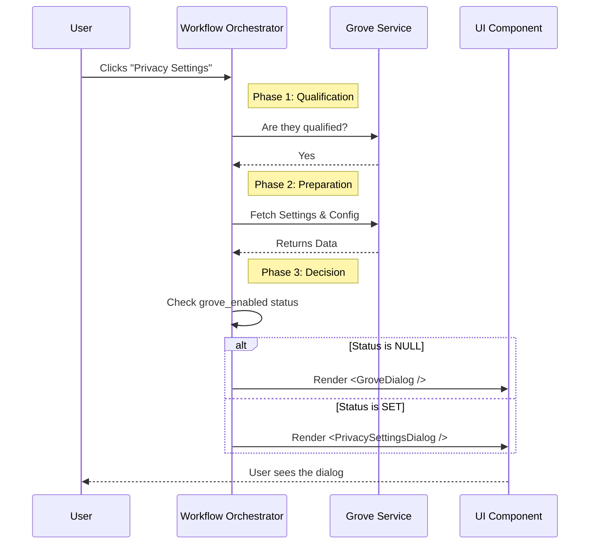

# Chapter 2: Workflow Orchestrator

Welcome to the second chapter of the **Privacy Settings** project!

In the previous chapter, [Command Definition](01_command_definition.md), we built the "door" to our feature. We registered the command so it appears in the menu. Now, we need to decide what happens when the user actually walks through that door.

## Motivation: The Movie Director

Imagine a movie set. When the director yells "Action!", a lot of things happen before the actors start speaking.
1.  **Security:** Ensure the set is secure.
2.  **Props:** Make sure the furniture is in place.
3.  **Scene Selection:** Decide if we are shooting the "Intro" scene or the "Conclusion" scene based on the script.

In our code, the **Workflow Orchestrator** is that director.

It lives in a function named `call`. It doesn't draw the pixels on the screen itself; instead, it prepares the data and decides *which* component (actor) should appear on screen.

### The Use Case
When a user clicks "Privacy Settings":
1.  **Check:** Is this user allowed to use this feature right now?
2.  **Fetch:** Download their current settings from the server.
3.  **Decide:**
    *   **Scenario A:** If they have never seen the privacy notice, show the **Terms of Service** dialog.
    *   **Scenario B:** If they have already accepted/rejected it, show the **Settings Toggle** dialog.

## Key Concepts

To implement this "Director," we use an asynchronous function called `call`. Let's break down its responsibilities.

### 1. The Bouncer (Qualification Check)

Before we fetch data or show UI, we do a quick check to see if the user is qualified for this feature (e.g., based on their region or account type).

```typescript
import { isQualifiedForGrove } from '../../services/api/grove.js';

// The 'onDone' function is how we tell the app we are finished
export async function call(onDone: LocalJSXCommandOnDone) {
  
  // Ask the API: Is this user allowed?
  const qualified = await isQualifiedForGrove();

  if (!qualified) {
    // If not, show a message and exit immediately
    onDone('Please manage settings via the web dashboard.');
    return null;
  }
  // ... continue logic
}
```

**Explanation:**
If `qualified` is false, we call `onDone` with a text string. This closes the command palette and shows a small "toast" notification to the user. We return `null` because we aren't showing any visual dialogs.

### 2. The Props Master (Data Fetching)

If the user is allowed in, we need to get their current data. We need two things: their **current settings** and the **configuration** for the notice.

We use `Promise.all` to fetch both at the same time (in parallel) to be faster.

```typescript
import { getGroveSettings, getGroveNoticeConfig } from '../../services/api/grove.js';

// ... inside the call function

// Fetch both pieces of data simultaneously
const [settingsResult, configResult] = await Promise.all([
  getGroveSettings(),
  getGroveNoticeConfig()
]);

// If fetching settings failed, we can't proceed
if (!settingsResult.success) {
  onDone('Error loading settings.');
  return null;
}
```

**Explanation:**
This acts like the "loading" phase. By doing this *before* returning any UI, we ensure the dialog doesn't pop up empty and then suddenly fill with text. We prepare the stage before raising the curtain.

### 3. The Scene Selector (Routing Logic)

This is the core logic of the Orchestrator. We look at the data we just fetched and decide which screen to show.

```typescript
const settings = settingsResult.data;

// settings.grove_enabled is either true, false, or null (not set yet)
if (settings.grove_enabled !== null) {
  
  // Scenario B: User has already chosen. Show the Settings Dialog.
  return <PrivacySettingsDialog settings={settings} onDone={...} />;
}

// Scenario A: User is new. Show the Terms Dialog.
return <GroveDialog showIfAlreadyViewed={true} onDone={...} />;
```

**Explanation:**
*   **Scenario A (`GroveDialog`):** This is the "Intro Scene." We will cover how this communicates with the backend in [Grove Service Integration](03_grove_service_integration.md).
*   **Scenario B (`PrivacySettingsDialog`):** This is the "Maintenance Scene."
*   This logic flow is what we call [Conditional UI Rendering](04_conditional_ui_rendering.md).

## Under the Hood: The Lifecycle

Let's visualize the lifecycle of a user interaction from start to finish using a sequence diagram.



### Handling the "Cut!" (Cleanup)

You might have noticed the `onDone` prop passed to the components. The Orchestrator is also responsible for defining what happens when the user closes the dialog.

We define a helper function inside `call` to handle this. This is where we might send analytics, as described in [Telemetry and Analytics](05_telemetry_and_analytics.md).

```typescript
// Define what happens when the dialog finishes
async function onDoneWithSettingsCheck() {
  
  // Re-fetch to confirm the new state
  const updated = await getGroveSettings();
  
  // Tell the app the command is finished and show a status message
  onDone(`Privacy settings updated.`);
}
```

**Explanation:**
We pass this function *down* to the dialogs. When the user clicks "Save" or "Close" in the UI, the dialog calls this function, which hands control back to the main application.

## Putting It All Together

The `call` function in `privacy-settings.tsx` is the glue holding the feature together. It doesn't look like a UI component itself, but it returns the correct UI component based on logic.

Here is a simplified view of the final file structure:

```typescript
export async function call(onDone) {
  // 1. Qualification
  const qualified = await isQualifiedForGrove();
  if (!qualified) return null;

  // 2. Data Fetching
  const [settingsResult] = await Promise.all([getGroveSettings()]);
  if (!settingsResult.success) return null;

  // 3. Routing / Decision
  const settings = settingsResult.data;

  // If we have a value, show the settings toggle
  if (settings.grove_enabled !== null) {
    return <PrivacySettingsDialog 
             settings={settings} 
             onDone={onDoneWithSettingsCheck} // Pass the cleanup handler
           />;
  }

  // Otherwise, show the acceptance dialog
  return <GroveDialog 
           onDone={onDoneWithDecision} // Pass the cleanup handler
         />;
}
```

## Conclusion

We have successfully built the brain of our feature! The Workflow Orchestrator:
1.  Protects the feature (Qualification).
2.  Prepares the data (Fetching).
3.  Directs the user to the correct screen (Routing).

However, our Orchestrator relies heavily on talking to the outside world (the API) to get settings and configurations. How does that communication actually work?

In the next chapter, we will dive into the layer that handles these external conversations.

[Next Chapter: Grove Service Integration](03_grove_service_integration.md)

---

Generated by [Code IQ](https://github.com/adityasoni99/Code-IQ)