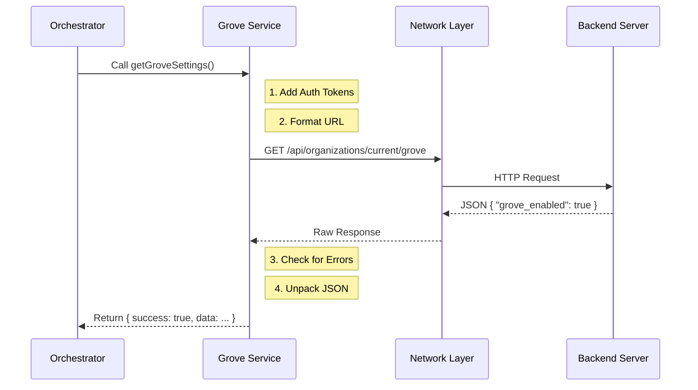

# Chapter 3: Grove Service Integration

Welcome to the third chapter of the **Privacy Settings** project!

In the previous chapter, [Workflow Orchestrator](02_workflow_orchestrator.md), we built the "Director" that decides which screen to show the user. However, that Director has a problem: it needs a script. It needs to know the user's current settings and permissions, but that data lives on a server far away, not on the user's computer.

## Motivation: The Restaurant Waiter

Imagine you are at a restaurant (the User Interface). You want to know if the "Special of the Day" is still available (the Data).

You do not walk into the noisy, chaotic kitchen yourself to ask the chef. That would be dangerous and inefficient. Instead, you ask a **Waiter**. The waiter takes your simple question, navigates the kitchen, talks to the chef in "kitchen lingo," and brings you back a simple "Yes" or "No."

In our code, the **Grove Service** is that waiter.

### The Use Case
The Workflow Orchestrator needs to ask: **"Is this user allowed to use Grove?"** and **"What are their current settings?"**

Instead of writing complex network code inside our UI components, we use simple helper functions.

## Key Concepts

We abstract the complex "kitchen" work into three main helper functions.

### 1. Qualification (`isQualifiedForGrove`)

This is the Bouncer. Before we fetch heavy data, we check if the user is even allowed to use the feature (e.g., are they in the right country? Are they a paid subscriber?).

```typescript
import { isQualifiedForGrove } from '../../services/api/grove.js';

// Inside our async function
const qualified = await isQualifiedForGrove();

if (!qualified) {
  // Stop right here if the answer is no
  return null;
}
```

**Explanation:**
The Orchestrator just awaits a `true` or `false`. It doesn't know *how* the system checked (via API, local cache, or magic). It just trusts the result.

### 2. Configuration (`getGroveNoticeConfig`)

This retrieves the static rules for the privacy notice, such as which specific domains are excluded or what text to display.

```typescript
import { getGroveNoticeConfig } from '../../services/api/grove.js';

const configResult = await getGroveNoticeConfig();

if (configResult.success) {
  console.log("Excluded domains:", configResult.data.domain_excluded);
}
```

**Explanation:**
This data usually doesn't change often. It tells the UI *how* to behave.

### 3. User Settings (`getGroveSettings`)

This is the most critical function. It fetches the user's personal choices.

```typescript
import { getGroveSettings } from '../../services/api/grove.js';

const settingsResult = await getGroveSettings();

// Check if the network call succeeded
if (!settingsResult.success) {
  console.error("Kitchen is closed!"); 
  return;
}
```

**Explanation:**
This returns the user's "Truth." For example: Has the user already disabled data training? We need this to show the toggle switch in the correct position.

## Handling Responses

You might have noticed `settingsResult.success`. The Grove Service doesn't just return raw data; it returns a **Structured Result**.

This is like the waiter bringing your food on a tray. The tray tells you two things:
1.  **Status:** Did the chef cook it successfully? (`success: true`)
2.  **Payload:** The actual food. (`data: { ... }`)

```typescript
// Example of the data structure we receive
const settings = settingsResult.data;

// .grove_enabled might be true, false, or null (not set)
const currentStatus = settings.grove_enabled;
```

**Explanation:**
By wrapping the data this way, our Orchestrator never crashes if the internet goes down. It just sees `success: false` and shows an error message.

## Under the Hood: The Request Lifecycle

What actually happens when we call `getGroveSettings()`? Let's look at the flow.



### Internal Implementation Detail

While you don't need to write this file for this tutorial, it helps to understand what the "Waiter" is doing internally. It typically uses the browser's `fetch` command but adds necessary security headers (like your login cookie).

Here is a simplified simulation of what `services/api/grove.js` looks like:

```typescript
// SIMULATION of the hidden service file
export async function getGroveSettings() {
  try {
    // 1. The raw network call
    const response = await fetch('/api/organizations/current/grove');
    
    // 2. Parsing the JSON
    const data = await response.json();

    // 3. Returning the "Tray" (Structured Result)
    return { success: true, data: data };
  } catch (error) {
    return { success: false, error: error };
  }
}
```

**Explanation:**
This hidden logic protects the rest of the app. If the API URL changes next week, we only have to update this one file, not every component in the app.

## Putting It Into Practice

Now let's look at how we used this in our actual `privacy-settings.tsx` file from the previous chapter.

We use `Promise.all` to ask the waiter for the **Settings** and the **Config** at the exact same time. This is faster than asking for one, waiting, and then asking for the other.

```typescript
// From privacy-settings.tsx

// 1. Fetch both at once
const [settingsResult, configResult] = await Promise.all([
  getGroveSettings(),
  getGroveNoticeConfig()
]);

// 2. Safety Check
if (!settingsResult.success) {
  onDone('Error: Could not load settings.');
  return null;
}

// 3. Extract Data
const settings = settingsResult.data;
```

**Explanation:**
1.  **Efficiency:** We parallelize the network requests.
2.  **Safety:** If we can't get the settings, we abort. We cannot show a privacy toggle if we don't know the current state.
3.  **Usage:** Now the variable `settings` holds the data we need to pass to our visual components.

## Conclusion

We have successfully established a line of communication with our backend!
1.  We used **Service Functions** (`getGroveSettings`) to act as our "Waiter."
2.  We handled **Structured Results** to ensure our app doesn't crash on network errors.
3.  We prepared the data for display.

Now that we have the data (the "ingredients"), it is time to cook the meal. We need to decide exactly which visual components to render based on this data.

In the next chapter, we will learn how to take this data and dynamically build the user interface.

[Next Chapter: Conditional UI Rendering](04_conditional_ui_rendering.md)

---

Generated by [Code IQ](https://github.com/adityasoni99/Code-IQ)