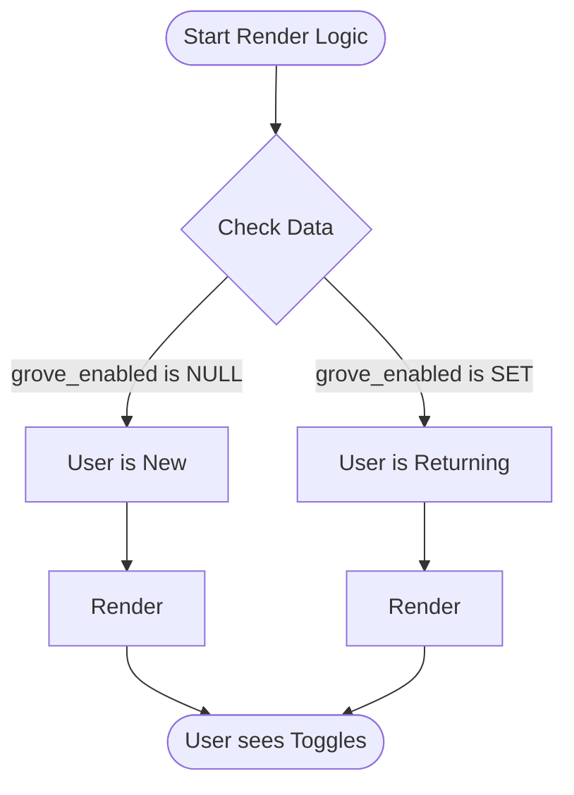

# Chapter 4: Conditional UI Rendering

Welcome to the fourth chapter of the **Privacy Settings** project!

In the previous chapter, [Grove Service Integration](03_grove_service_integration.md), we learned how to fetch the user's data (the "ingredients") from the server. Now, we have the raw data, but the screen is still blank.

We need to decide how to present this data to the user. This brings us to the concept of **Conditional UI Rendering**.

## Motivation: The Hotel Receptionist

Imagine you are walking into a hotel. There is a receptionist at the front desk.

1.  **Scenario A (New Guest):** If you have never been there before, the receptionist hands you a registration form to sign.
2.  **Scenario B (Returning Guest):** If you are already registered, the receptionist simply hands you your room key.

If the receptionist gave the registration form to the returning guest, it would be annoying. If they gave the room key to a stranger, it would be a security risk.

In software, **Conditional UI Rendering** is that receptionist. It looks at the user's status and decides which "screen" to hand them.

### The Use Case
*   **New Users:** Must see the **Grove Dialog** (Terms of Service). They cannot change settings until they accept or decline.
*   **Existing Users:** Should skip the terms and go straight to the **Privacy Settings Dialog** (Toggle Switches).

## Key Concepts

To build this logic, we rely on checking the "State" of the user.

### 1. The State Check

We look at a specific piece of data we fetched in the previous chapter: `grove_enabled`.

*   If `grove_enabled` is **True** or **False**: The user has already made a choice.
*   If `grove_enabled` is **Null**: The user has never made a choice (they are new).

### 2. The "If" Statement (The Switch)

In React (our UI library), we use standard JavaScript logic to control what appears on the screen.

```typescript
// Inside our 'call' function from Chapter 2 & 3

// Check if the user has a history
if (settings.grove_enabled !== null) {
  
  // They have a history! Show the settings manager.
  return <PrivacySettingsDialog settings={settings} />;
}

// They have no history. Show the onboarding terms.
return <GroveDialog />;
```

**Explanation:**
This is the core of Conditional Rendering. The code hits the `if` statement. If it matches, it returns the first component and **stops**. The code below it never runs. If it doesn't match, it skips to the second component.

### 3. Prop Passing (Giving Instructions)

When we render a component, we pass it data using "Props" (properties). This is like giving the actor their specific script.

```typescript
// Render the Settings Dialog
return (
  <PrivacySettingsDialog 
    settings={settings}            // Pass the current data
    domainExcluded={config.domain} // Pass configuration rules
    onDone={onDoneWithSettings}    // Pass the exit strategy
  />
);
```

**Explanation:**
*   `settings`: The component needs to know if the toggle should start at "On" or "Off".
*   `onDone`: The component needs to know which function to call when the user clicks "Save".

## Under the Hood: The Rendering Flow

How does the application process this decision? Let's look at the flow.



### Internal Implementation Detail

When you write `<PrivacySettingsDialog />`, you aren't drawing pixels yourself. You are creating a **React Element**.

1.  **Evaluation:** JavaScript evaluates your `if` condition.
2.  **Selection:** It selects the correct Component function.
3.  **Mounting:** React takes that component and "mounts" it into the application window (the DOM).

If the user interacts with the dialog (e.g., they click "Accept" in the `GroveDialog`), the data changes. If we were to run this logic again, `grove_enabled` would no longer be null, and they would see the other screen.

## Putting It Into Practice

Let's look at the actual implementation in `privacy-settings.tsx`. We combine the data fetching from [Chapter 3](03_grove_service_integration.md) with this rendering logic.

### Step 1: Handling the "Returning User"

We check for the returning user first. This is often called the "Happy Path" or the "Early Return."

```typescript
// settings comes from our API service
if (settings.grove_enabled !== null) {
  
  return (
    <PrivacySettingsDialog 
      settings={settings} 
      domainExcluded={config?.domain_excluded} 
      onDone={onDoneWithSettingsCheck} 
    />
  );
}
```

**Output:**
If the user previously clicked "Yes" or "No", they see the control panel to change that decision.

### Step 2: Handling the "New User"

If the code didn't return above, we know the user is new. We render the onboarding dialog.

```typescript
// We don't need an 'else' because the previous 'if' returned.
return (
  <GroveDialog 
    showIfAlreadyViewed={true} 
    onDone={onDoneWithDecision} 
    location={'settings'} 
  />
);
```

**Output:**
The user sees a modal window explaining data privacy with "Accept" and "Decline" buttons.

## Conclusion

We have successfully built a smart interface! 
*   We used **Conditional Logic** to act as a switchboard.
*   We directed new users to **Onboarding** (`GroveDialog`).
*   We directed existing users to **Settings** (`PrivacySettingsDialog`).

This ensures a smooth user experience where people only see what is relevant to them.

But wait—when the user clicks "Accept" or changes a toggle, how do we know if it worked? How do we track if users are confused or if they love the feature?

In the final chapter, we will learn how to listen to these actions and record them for analysis.

[Next Chapter: Telemetry and Analytics](05_telemetry_and_analytics.md)

---

Generated by [Code IQ](https://github.com/adityasoni99/Code-IQ)