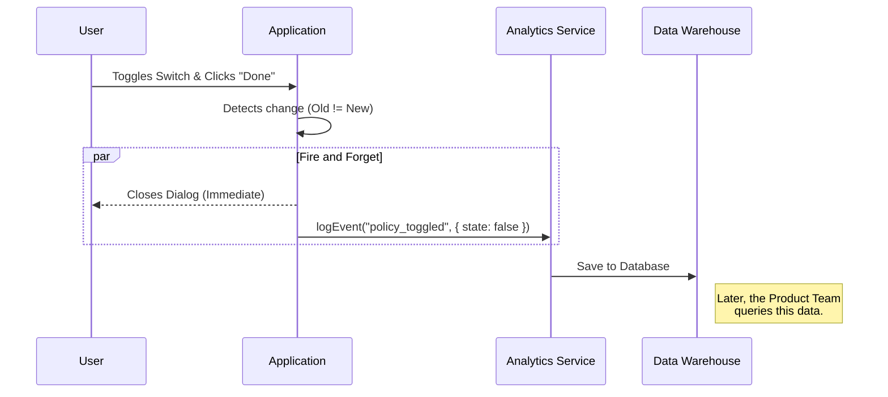

# Chapter 5: Telemetry and Analytics

Welcome to the fifth and final chapter of the **Privacy Settings** project!

In the previous chapter, [Conditional UI Rendering](04_conditional_ui_rendering.md), we finished building the user interface. We successfully fetched data, decided which screen to show, and allowed the user to make changes.

However, we have one final problem. Once we release this feature to the world, **how do we know if anyone is actually using it?** Are users turning the setting ON or OFF?

## Motivation: The Ballot Box

Imagine you are running an election. You built the voting booth (the UI) and you verified the voters are registered (the Logic). But if you don't actually count the votes after they are cast, you have no idea who won.

In software, **Telemetry** is the process of counting those votes. It allows the engineering and product teams to answer questions like:
*   "How many people opened the privacy settings today?"
*   "Did most users accept or reject the data training policy?"

### The Use Case
When a user changes their "Help improve Claude" setting from **On** to **Off** (or vice versa), we want to record that specific event. We want to send a message to our analytics system saying: *"A user just toggled the Grove Policy to [New State] from the Settings menu."*

## Key Concepts

To implement this, we use a tool called `logEvent`.

### 1. The Observer (`logEvent`)

This function is like a court stenographer. It sits quietly in the background, and when something important happens, it writes it down. It doesn't interfere with the user; it just records history.

### 2. The Trigger (Change Detection)

We don't want to log an event every time the user simply *looks* at the menu. We only want to log when a decision is made.

To do this, we compare the **Old Setting** (what they had when they opened the dialog) with the **New Setting** (what they had when they closed it).

### 3. The Payload (Structured Data)

A log entry needs details. We don't just say "Something changed." We send specific data points, called the payload:
*   **Event Name:** `tengu_grove_policy_toggled` (A unique ID for this action).
*   **State:** The new value (`true` or `false`).
*   **Location:** Where did this happen? (`settings`).

## Implementing the Logic

Let's look at how to add this to our `privacy-settings.tsx` file. This logic lives inside the `onDoneWithSettingsCheck` function, which runs when the user closes the dialog.

### Step 1: Detect the Change

First, we check if the setting actually changed. If the user opened the settings but changed nothing, we do nothing.

```typescript
// 'settings' is the original data
// 'updatedSettings' is the data after the dialog closes

if (
  settings.grove_enabled !== null &&
  settings.grove_enabled !== updatedSettings.grove_enabled
) {
  // The user changed the value!
  // We need to log this.
}
```

**Explanation:**
We compare `settings.grove_enabled` (Old) against `updatedSettings.grove_enabled` (New). If they are different (`!==`), we proceed to log.

### Step 2: Record the Event

Now that we know a change occurred, we call `logEvent`.

```typescript
import { logEvent } from '../../services/analytics/index.js';

// Inside the 'if' block from above...
logEvent('tengu_grove_policy_toggled', {
  
  // We explicitly cast types to ensure data quality
  state: updatedSettings.grove_enabled as AnalyticsMetadata,
  
  location: 'settings' as AnalyticsMetadata
});
```

**Explanation:**
*   We pass the event name string.
*   We pass an object containing the new `state` and the `location`.
*   Note: The `as AnalyticsMetadata` part is TypeScript syntax. It acts as a quality control check, ensuring we don't accidentally send data that our analytics system doesn't understand.

## Under the Hood: The Data Journey

What happens when `logEvent` is called? It is a "fire-and-forget" action. We don't make the user wait for the log to upload before they can continue using the app.



### Internal Implementation Detail

The `logEvent` function is usually a wrapper around a third-party analytics provider (like Segment, Google Analytics, or an internal tool).

Here is a simplified visualization of what that service file might look like:

```typescript
// internal/services/analytics.ts (Simplified)

export function logEvent(eventName: string, payload: object) {
  // 1. Add timestamp
  const event = {
    name: eventName,
    data: payload,
    timestamp: Date.now()
  };

  // 2. Send to server (without 'await' so UI doesn't freeze)
  navigator.sendBeacon('/api/logs', JSON.stringify(event));
}
```

**Explanation:**
*   **Timestamp:** The system adds the exact time the event occurred.
*   **Non-blocking:** We send the data asynchronously. This ensures the user experience remains fast and snappy, even if the internet connection is slow.

## Putting It All Together

Here is the final version of our cleanup function in `privacy-settings.tsx`. It combines the UI feedback (showing a toast message) with the telemetry.

```typescript
// Inside onDoneWithSettingsCheck

// 1. Show the user a visual confirmation message
const statusText = updatedSettings.grove_enabled ? 'true' : 'false';
onDone(`"Help improve Claude" set to ${statusText}.`);

// 2. Send the telemetry data silently
if (settings.grove_enabled !== updatedSettings.grove_enabled) {
  logEvent('tengu_grove_policy_toggled', {
    state: updatedSettings.grove_enabled,
    location: 'settings'
  });
}
```

## Conclusion

Congratulations! You have completed the **Privacy Settings** project.

Let's review what you have built across these five chapters:
1.  **Command Definition:** You created the "door" so users can find the feature.
2.  **Workflow Orchestrator:** You built the "brain" to manage the logic.
3.  **Grove Service:** You connected the "wires" to fetch data from the server.
4.  **Conditional UI:** You designed the "face" that adapts to the user's status.
5.  **Telemetry:** You installed the "monitor" to track usage and adoption.

You have taken a feature from a blank file to a fully functional, secure, and measurable part of the application. This architecture ensures that the feature is maintainable, scalable, and provides a great user experience.

Thank you for following this tutorial series!

---

Generated by [Code IQ](https://github.com/adityasoni99/Code-IQ)