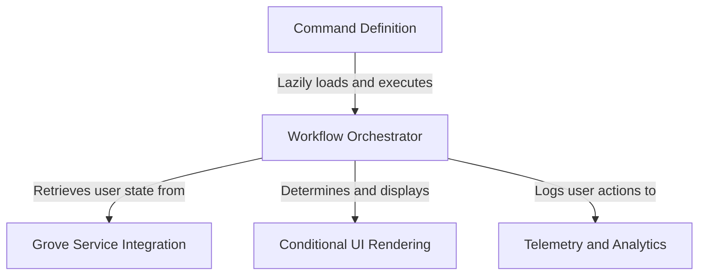

# Tutorial: privacy-settings

This project implements a **privacy control system** (internally named "Grove") that allows users to manage their data settings. It features a **command-based entry point** that lazily loads the necessary logic only when needed. A central *workflow orchestrator* coordinates fetching user data from the backend, determining whether to show an onboarding screen or the main settings dialog, and logging key user interactions for analytics.

## Chapters

1. [Command Definition](01_command_definition.md)
2. [Workflow Orchestrator](02_workflow_orchestrator.md)
3. [Grove Service Integration](03_grove_service_integration.md)
4. [Conditional UI Rendering](04_conditional_ui_rendering.md)
5. [Telemetry and Analytics](05_telemetry_and_analytics.md)

---

Generated by [Code IQ](https://github.com/adityasoni99/Code-IQ)