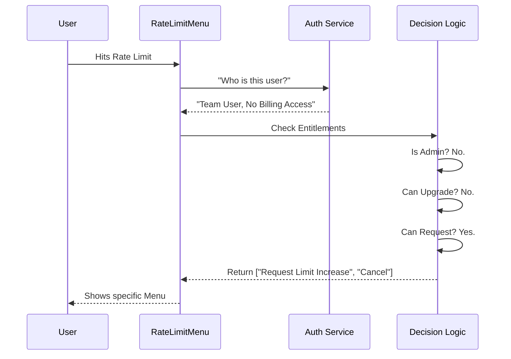

# Chapter 1: User Entitlement Context

Welcome to the **Rate Limit Options** project! This is the first chapter of our journey.

Before we can show a user a menu to "Upgrade" or "Buy More Credits," we need to know who they are. Imagine walking into a theme park. If you have a standard ticket, you might be offered a "Fast Pass" upgrade. If you already have the VIP pass, offering you another one doesn't make sense!

This logical layer is what we call the **User Entitlement Context**.

## The Problem: One Size Does Not Fit All

When a user runs out of messages (hits a "rate limit"), we want to help them get back to work. However, different users have different rules:

1.  **Free Users:** Should see an "Upgrade to Pro" button.
2.  **Team Members:** Might need to "Request limit increase from Admin" (since they don't own the billing).
3.  **Enterprise Users:** Might simply need to wait because their company spend cap is hit.

If we blindly showed an "Upgrade" button to an Enterprise user, it wouldn't work. The **User Entitlement Context** solves this by gathering all necessary data *before* deciding what buttons to render.

## Key Concepts

To build this context, we gather three main "badges" of identity:

1.  **Subscription Type:** Are you `free`, `pro`, `team`, or `enterprise`?
2.  **Rate Limit Tier:** Do you already have the highest tier (`max`)?
3.  **Billing Access:** Do you have the authority to spend money (credit card access)?

## How It Works in Code

Let's look at how `rate-limit-options.tsx` builds this context. We use React Hooks to grab this data instantly.

### Step 1: Gathering Intelligence
First, we retrieve the raw data about the current user.

```typescript
// Inside RateLimitOptionsMenu component
const claudeAiLimits = useClaudeAiLimits();
const subscriptionType = getSubscriptionType(); 
const rateLimitTier = getRateLimitTier();
```
*   `useClaudeAiLimits`: Tells us *why* they are blocked (e.g., "out_of_credits").
*   `getSubscriptionType`: Tells us the plan (e.g., "team").
*   `getRateLimitTier`: Tells us their current power level.

### Step 2: Defining Identity Flags
Next, we convert that raw data into easy-to-read `boolean` (true/false) flags. This makes our logic much cleaner later.

```typescript
// Is this a high-end Max user?
const isMax = subscriptionType === "max";

// Is this a corporate user?
const isTeamOrEnterprise = subscriptionType === "team" || subscriptionType === "enterprise";

// Can this user actually pay for things?
const hasBillingAccess = hasClaudeAiBillingAccess();
```
*   **Why do this?** Instead of checking `subscriptionType === "team" || subscriptionType === "enterprise"` every time, we just check `isTeamOrEnterprise`.

### Step 3: The Decision Logic
Now comes the "Security Guard" logic. We decide which options go into our menu based on the flags above.

```typescript
const actionOptions = [];

// If not already a Max user and not a corporate user...
if (!isMax && !isTeamOrEnterprise && upgrade.isEnabled()) {
  actionOptions.push({
    label: "Upgrade your plan",
    value: "upgrade"
  });
}
```
*   **Translation:** "If you aren't a super-user and you aren't in a corporate team, you are allowed to see the Upgrade button."

## Internal Implementation Flow

To understand what happens under the hood when this code runs, let's visualize the flow.



### Handling "Extra Usage"
A complex part of the context is handling "Extra Usage" (paying per message). This requires checking if the user's organization has run out of funds.

```typescript
// Check if the organization is completely out of money/credits
const isOrgSpendCapDepleted = 
  claudeAiLimits.overageDisabledReason === "out_of_credits" || 
  claudeAiLimits.overageDisabledReason === "org_level_disabled_until";
```

If `isOrgSpendCapDepleted` is true, and the user is *not* an admin, we might hide the "Extra Usage" button entirely because there is nothing they can do about it!

## Summary

In this chapter, we learned that we cannot simply show the same menu to everyone. We created a **User Entitlement Context** to act as a filter.

1.  We **fetched** user details (Subscription, Tier).
2.  We **calculated** permissions (Is Team? Has Billing?).
3.  We **generated** a specific list of allowed actions (`actionOptions`).

Now that we know *what* the user is allowed to do, we need to package this into a command that the application can understand.

[Next Chapter: Command Definition](02_command_definition.md)

---

Generated by [Code IQ](https://github.com/adityasoni99/Code-IQ)