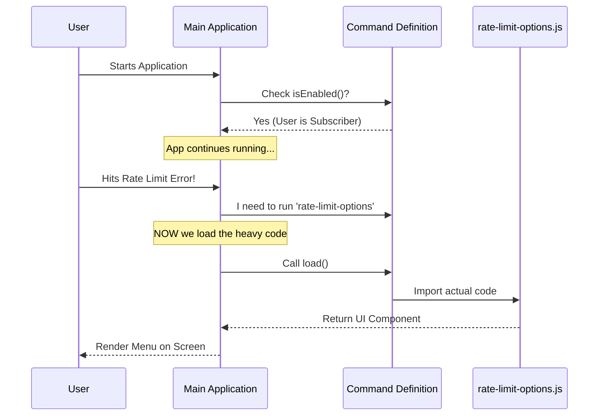

# Chapter 2: Command Definition

Welcome to Chapter 2!

In the previous chapter, [User Entitlement Context](01_user_entitlement_context.md), we learned how to figure out *who* the user is and what rights they have.

But here is the problem: currently, our logic is just a loose collection of code. The main application (the Command Line Interface or CLI) doesn't know this feature exists yet.

It’s like writing a great song but never putting it on Spotify. If you don't list it, no one can play it. In this chapter, we will create that listing. We call this the **Command Definition**.

## The Motivation: The "Plugin" Approach

Modern applications are often built like a puzzle. The main app is the board, and features are the puzzle pieces. To make a piece fit, it needs a specific shape.

We need to define a "Manifest" or an "ID Card" for our Rate Limit feature that tells the main application three things:
1.  **Identity:** What is my name?
2.  **Rules:** When am I allowed to run?
3.  **Efficiency:** Where is my heavy code located?

## Key Concepts

To solve this, we define a standard JavaScript object. Let's break down the properties of this object one by one.

### 1. Identity (Name and Type)
First, we tell the system what we are.

```typescript
const rateLimitOptions = {
  // 'local-jsx' means this command renders a visual UI
  type: 'local-jsx',
  
  // The unique ID for this command
  name: 'rate-limit-options',
  
  // A human-readable explanation
  description: 'Show options when rate limit is reached',
  // ... more properties coming up
}
```
*   **Type:** We use `local-jsx`. This tells the app, "I am not just text; I draw boxes and buttons on the screen." (We will cover this deeply in [Local JSX Interface](04_local_jsx_interface.md)).
*   **Name:** This is the internal keyword used to trigger this feature.

### 2. The Gatekeeper (`isEnabled`)
We don't want just anyone running this command. For example, if a user isn't even logged in, showing them "Rate Limit Options" makes no sense.

The `isEnabled` function acts like a bouncer at a club.

```typescript
import { isClaudeAISubscriber } from '../../utils/auth.js'

// ... inside the object
  isEnabled: () => {
    // If user is not a subscriber, return false (Block access)
    if (!isClaudeAISubscriber()) {
      return false
    }

    // Otherwise, come on in!
    return true
  },
```
If this function returns `false`, the command is completely disabled. The application acts like it doesn't exist.

### 3. Visibility (`isHidden`)
Sometimes, a command exists, but we don't want users to type it manually.

The `rate-limit-options` command is **reactive**. It only pops up when an error happens (like hitting a limit). We don't want users typing `> rate-limit-options` manually just for fun.

```typescript
// ... inside the object
  isHidden: true, // Hidden from the "Help" menu
```
*   **True:** The command works, but it won't show up in the list when the user types `--help`. It is an "internal-only" tool.

### 4. Lazy Loading (`load`)
This is the most important part for performance.

The code for our menu (the buttons, logic, and text) might be large. We don't want to load *all* that code when the app starts up—that would make the app slow. We only want to load it **if** the rate limit is actually hit.

```typescript
// ... inside the object
  // Only import the file when the command is actually executed
  load: () => import('./rate-limit-options.js'),
}
```
*   **The Analogy:** This is like ordering a pizza. You don't keep a pizza in your pocket all day "just in case." You only call the pizza place (`import`) when you are hungry (`load`).

## Internal Implementation Flow

How does the application use this definition? Let's visualize the lifecycle.



1.  **Startup:** The app checks `isEnabled`. If true, it registers the command in memory.
2.  **Wait:** The app waits. It has NOT loaded the UI code yet.
3.  **Trigger:** Something (like an error handler) triggers the command by name.
4.  **Load:** The `load()` function fires, fetching the heavy code from disk.

## The Final Code Structure

Here is how `index.ts` looks when we put it all together. It serves as the bridge between the main system and our specific feature.

```typescript
// index.ts
import type { Command } from '../../commands.js'
import { isClaudeAISubscriber } from '../../utils/auth.js'

const rateLimitOptions = {
  type: 'local-jsx',
  name: 'rate-limit-options',
  description: 'Show options when rate limit is reached',
  
  // The Gatekeeper
  isEnabled: () => {
    if (!isClaudeAISubscriber()) return false
    return true
  },

  // The Visibility
  isHidden: true, 
  
  // The Lazy Loader
  load: () => import('./rate-limit-options.js'),
} satisfies Command

export default rateLimitOptions
```

By exporting this object, we have successfully "plugged in" our feature.

## Summary

In this chapter, we learned that a feature needs a **Command Definition** to exist within the application.

1.  We gave it a **Name**.
2.  We set **Rules** (`isEnabled`) so only subscribers can use it.
3.  We set **Visibility** (`isHidden`) so it doesn't clutter the help menu.
4.  We used **Lazy Loading** (`load`) to keep the app fast.

Now that the application knows *how* to load our feature, we need to design what the user actually sees when it loads.

[Next Chapter: Rate Limit Menu UI](03_rate_limit_menu_ui.md)

---

Generated by [Code IQ](https://github.com/adityasoni99/Code-IQ)