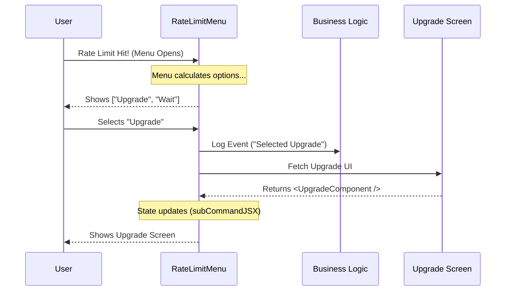

# Chapter 3: Rate Limit Menu UI

Welcome to Chapter 3!

In the previous chapter, [Command Definition](02_command_definition.md), we registered our command with the application. We gave it a name and told the system *when* to trigger it.

Now, we need to build the actual "face" of the feature. When the command runs, what does the user see?

This component is called the **Rate Limit Menu UI**.

## The Motivation: The "Smart Waiter"

Imagine you are at a restaurant and order the "Daily Special," but the kitchen has run out. A bad waiter would just say, "No." A **smart waiter** would look at who you are and offer alternatives:

*   **To a regular customer:** "Would you like to see the standard menu?"
*   **To a VIP:** "We can make you a special off-menu item instead."

The `RateLimitOptionsMenu` component is that smart waiter. It doesn't just show a generic error. It functions as a **decision engine** that dynamically calculates the best path forward for the user.

## Key Concepts

To build this UI, we use **React**. If you are new to React, think of it as a way to build custom HTML tags that have their own brain.

### 1. The Setup (Props and State)
Our component receives two important tools (props) from the main application:
1.  `context`: The ID card of the user (who they are).
2.  `onDone`: A remote control to close the menu when finished.

```typescript
// Inside RateLimitOptionsMenu
function RateLimitOptionsMenu({ onDone, context }) {
  // This state holds the "Next Screen" if the user chooses an option
  const [subCommandJSX, setSubCommandJSX] = useState(null);

  // If a sub-command (like Upgrade) is active, show that instead!
  if (subCommandJSX) {
    return subCommandJSX;
  }
  // ... rest of the code
}
```
*   **Why `subCommandJSX`?** If the user clicks "Upgrade," we don't want to close the menu immediately. We want to swap the current menu for the Upgrade screen right inside the same window.

### 2. Building the "Menu" (The Logic)
We don't hard-code the buttons. We build a list called `actionOptions` based on the user's entitlements (which we learned about in [User Entitlement Context](01_user_entitlement_context.md)).

```typescript
const actionOptions = [];

// 1. Can they buy per-message usage?
if (extraUsage.isEnabled()) {
  actionOptions.push({
    label: "Switch to extra usage",
    value: "extra-usage"
  });
}

// 2. Can they upgrade their monthly plan?
if (upgrade.isEnabled()) {
  actionOptions.push({
    label: "Upgrade your plan",
    value: "upgrade"
  });
}
```
*   **The Result:** A list that might look like `['Upgrade', 'Cancel']` for a Free user, or `['Extra Usage', 'Cancel']` for a Pro user.

### 3. Handling the Click (`handleSelect`)
When a user selects an option, we need to route them to the correct logic.

```typescript
function handleSelect(value) {
  if (value === 'upgrade') {
    // 1. Log that they clicked it
    logEvent('rate_limit_menu_select_upgrade', {});
    
    // 2. Call the Upgrade logic and wait for the new UI
    upgradeCall(onDone, context).then(newScreen => {
       setSubCommandJSX(newScreen);
    });
  }
}
```
*   **Note:** We use `upgradeCall`. This is a concept called **Workflow Delegation**, which we will cover in [Workflow Delegation](05_workflow_delegation.md).

### 4. The Visuals (The Dialog)
Finally, we return the visual code (JSX). We use a `Dialog` (a popup box) and a `Select` (a list of choices).

```typescript
return (
  <Dialog title="What do you want to do?" onCancel={handleCancel}>
    <Select 
      options={options} 
      onChange={handleSelect} 
      visibleOptionCount={options.length} 
    />
  </Dialog>
);
```

## Internal Implementation Flow

How does the user interact with this component? Let's look at the lifecycle of a user hitting a rate limit.



## The Entry Point

You might be wondering, "How does the non-React part of the app start this React component?"

At the very bottom of our file, we export a generic JavaScript function called `call`. This is the bridge between the "System" and the "UI".

```typescript
// The bridge function
export async function call(onDone, context) {
  // Simply return the React component
  return <RateLimitOptionsMenu onDone={onDone} context={context} />;
}
```

This simple function is what we imported back in Chapter 2 inside our `load` function!

## Summary

In this chapter, we built the **Rate Limit Menu UI**.

1.  We accepted **Props** to communicate with the outside world.
2.  We used **Logic** to dynamically build a list of options based on user rights.
3.  We handled **Interactions** to swap screens when a user makes a choice.
4.  We rendered a **Dialog** to display the interface.

But wait—React usually runs in a web browser. How are we rendering `<Dialog>` and `<Select>` inside a text-based Command Line Interface?

This magic happens via the **Local JSX Interface**.

[Next Chapter: Local JSX Interface](04_local_jsx_interface.md)

---

Generated by [Code IQ](https://github.com/adityasoni99/Code-IQ)