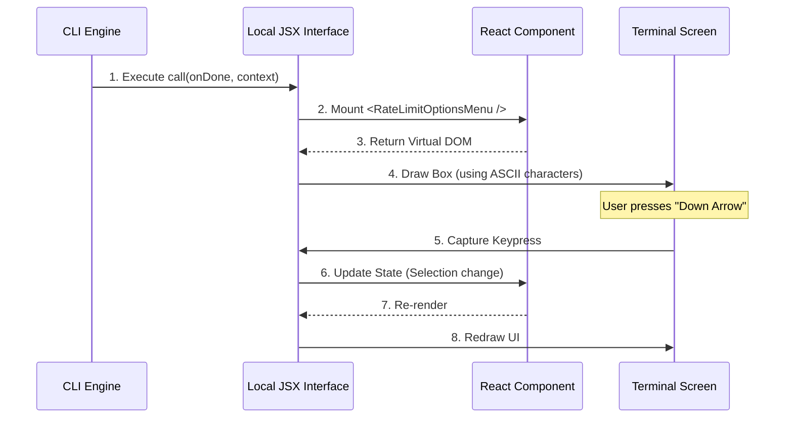

# Chapter 4: Local JSX Interface

Welcome to Chapter 4!

In the previous chapter, [Rate Limit Menu UI](03_rate_limit_menu_ui.md), we designed a beautiful interactive menu using React. We built a component that has buttons, logic, and state.

But here is the mystery: **React is designed for Web Browsers.** It outputs HTML tags like `<div>` and `<span>`. Your terminal (Command Line) only understands text. If you tried to put a `<div>` in a terminal, it would just print the text "<div>", not draw a box.

How do we bridge this gap? This is where the **Local JSX Interface** comes in.

## The Motivation: The Universal Translator

Imagine you have a video game console (The React UI) that outputs HDMI signals, but you only have an old TV that accepts an Antenna cable (The Terminal). You cannot plug them in directly. You need a **Converter Box**.

The **Local JSX Interface** is that converter box.

1.  **Input:** Rich React components (Dialogs, Select lists).
2.  **Processing:** Translates "clicks" into "keyboard presses" and "HTML styles" into "text characters."
3.  **Output:** A visual interface running inside your black-and-white terminal window.

## Key Concepts

To make this translation work, our code must follow a specific contract.

### 1. The Entry Point (`call`)
Standard React apps start with `ReactDOM.render()`. Our CLI system doesn't work that way. Instead, it looks for a specific function named `call`.

```typescript
// The system looks for this specific function name
export async function call(onDone, context) {
  // Return the UI to be rendered
  return <RateLimitOptionsMenu ... />;
}
```
The system treats this function as the "Start Button" for your UI.

### 2. The Context (`LocalJSXCommandContext`)
When the system starts your command, it hands you a backpack full of tools called the **Context**.

This includes things like:
*   **Theme:** Should the UI be dark mode or light mode?
*   **Capabilities:** Does this terminal support colors?
*   **User Info:** Who is logged in?

We pass this context down to our component so it knows how to behave.

### 3. The Exit Strategy (`onDone`)
A website stays open until you close the tab. A command line tool **must** finish and return control to the user.

Since React doesn't know when to stop, the system gives us a remote control called `onDone`.

```typescript
// When the user selects "Cancel"...
const handleCancel = () => {
  // We press the "Off" button provided by the system
  onDone(); 
}
```
Calling `onDone` destroys the UI and returns the user to the standard command prompt.

## How to Use It

In [Chapter 2: Command Definition](02_command_definition.md), we told the system to load our file. When the file loads, the Local JSX Interface executes the `call` function.

Here is the exact code at the bottom of `rate-limit-options.tsx` that enables this:

### The Bridge Function

```typescript
// We export 'call' so the external system can find it
export async function call(
  onDone: LocalJSXCommandOnDone, 
  context: ToolUseContext & LocalJSXCommandContext
): Promise<React.ReactNode> {
  
  // We simply render the component we built in Chapter 3
  return <RateLimitOptionsMenu onDone={onDone} context={context} />;
}
```

*   **Input:** It receives `onDone` (the exit switch) and `context` (the data).
*   **Output:** It returns a `Promise` containing the React Node (the UI).

## Internal Implementation Flow

What happens "under the hood" when this runs? It uses a specialized renderer (similar to a library called *Ink*) that converts React Virtual DOM into ANSI Escape Codes (the "pixels" of a terminal).



1.  **Mounting:** The system calls our function.
2.  **Rendering:** The Interface takes the `<Dialog>` and draws borders using characters like `─` and `│`.
3.  **Event Loop:** The Interface listens for keyboard events (Arrows, Enter) and translates them into React events (like `onChange` or `onClick`).

## Why "Local"?

We call this **Local** JSX because the rendering happens on the user's machine.

Sometimes, commands run remotely on a server. But for a UI like a menu or a dialog box to be snappy and interactive, it must run **locally** in the user's immediate environment. This interface ensures the UI feels instant.

## Connecting the Pieces

Let's look at how the `onDone` function flows from this Interface into the UI we built in Chapter 3.

```typescript
// inside RateLimitOptionsMenu (Chapter 3 Component)
function RateLimitOptionsMenu({ onDone }) {
  
  function handleSelect(value) {
    if (value === 'cancel') {
      // The component triggers the function passed by the Interface
      onDone(undefined, { display: 'skip' });
    }
  }
  
  // ...
}
```

The `Local JSX Interface` passes the power to close the app (`onDone`) into the React component via **props**. This allows a button click deep inside the UI to signal the entire program to stop.

## Summary

In this chapter, we learned how to bridge the gap between React and the Terminal.

1.  We exposed a **`call` function** as the entry point.
2.  We accepted the **Context** to understand our environment.
3.  We used **`onDone`** to allow the UI to close itself.
4.  We learned that the **Local JSX Interface** acts as a translator, converting React components into text-based graphics.

Now that our UI is rendering and the user can select an option (like "Upgrade"), we need to actually *perform* that action. Sometimes, that action requires handing off work to a completely different system.

[Next Chapter: Workflow Delegation](05_workflow_delegation.md)

---

Generated by [Code IQ](https://github.com/adityasoni99/Code-IQ)