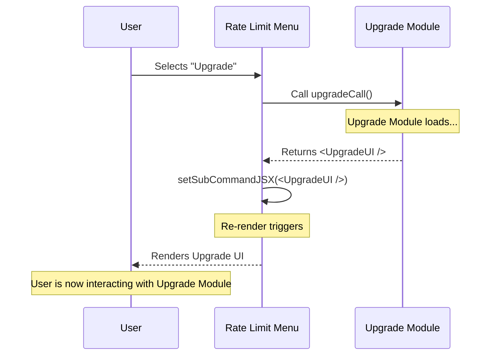

# Chapter 5: Workflow Delegation

Welcome to the final chapter of our series!

In the previous chapter, [Local JSX Interface](04_local_jsx_interface.md), we learned how to make React render inside a terminal window. We built a nice menu that asks the user, "What do you want to do?"

However, asking the question is the easy part. Doing the work is harder. If the user selects **"Upgrade your plan,"** our current menu doesn't know how to process credit cards or change database records.

We need a way to hand this task off to a specialist. This pattern is called **Workflow Delegation**.

## The Motivation: The General Contractor

Imagine you are a General Contractor building a house. You know how to manage the project, but you don't pour the concrete or wire the electricity yourself. When it's time for wiring, you call an **Electrician**.

*   **You (Rate Limit Menu):** "The client wants lights."
*   **Electrician (Upgrade Module):** "Okay, I will take over the job site, install the lights, and tell you when I'm done."

In our code, we don't want the `RateLimitOptionsMenu` to be 5,000 lines long containing every possible feature (Billing, Settings, Upgrades). Instead, we want it to be a clean "Router" that delegates work to other modules.

## Key Concepts

To make this work in React, we use three specific techniques.

### 1. The Specialist (`upgradeCall`)
We import the "Start Button" of another module. Notice we rename it to be descriptive.

```typescript
// We import the generic 'call' function from the upgrade file
// but we rename it to 'upgradeCall' so we know what it does.
import { call as upgradeCall } from '../upgrade/upgrade.js';
```

### 2. The Placeholder (`subCommandJSX`)
We need a spot in our memory to hold the "Electrician's" tools. If this spot is empty, we show the main menu. If it's full, we show the specialist's interface.

```typescript
// Inside RateLimitOptionsMenu
// Initially null (empty)
const [subCommandJSX, setSubCommandJSX] = useState(null);
```

### 3. The Switch
We check our placeholder before rendering anything else.

```typescript
// If the specialist gave us a screen to show, show that!
if (subCommandJSX) {
  return subCommandJSX;
}

// Otherwise, show the standard Rate Limit Menu...
return <Dialog ... />
```

## How It Works in Code

Let's look at the exact moment the user clicks "Upgrade." We use the `handleSelect` function we hinted at in [Chapter 3: Rate Limit Menu UI](03_rate_limit_menu_ui.md).

### Step 1: Triggering the Delegation
When the user selects 'upgrade', we call the specialist.

```typescript
function handleSelect(value) {
  if (value === 'upgrade') {
    // 1. Log the analytics event
    logEvent('rate_limit_menu_select_upgrade', {});
    
    // 2. Call the specialist module
    // We pass 'onDone' so they can close the app when finished
    upgradeCall(onDone, context).then(handleNewScreen);
  }
}
```

### Step 2: Receiving the New Interface
The `upgradeCall` returns a **Promise**. This means it says, "Give me a millisecond to load my graphics, and I will send you a UI component."

When that UI arrives, we save it into our State.

```typescript
// This runs when upgradeCall returns
const handleNewScreen = (newJSX) => {
  // If we got a valid screen back...
  if (newJSX) {
    // ...replace our current menu with this new one
    setSubCommandJSX(newJSX);
  }
};
```

### Step 3: The Re-Render
Because we called `setSubCommandJSX`, React detects a change. It runs the component code again.

1.  React asks: "Is `subCommandJSX` null?"
2.  Answer: "No, it contains the Upgrade Screen."
3.  Result: The Rate Limit Menu disappears, and the Upgrade Screen appears instantly in the terminal.

## Internal Implementation Flow

Let's visualize this hand-off. It is very similar to navigating pages on a website, but it happens inside a single command.



## Why This is Powerful

This **Workflow Delegation** pattern is powerful for three reasons:

1.  **Memory Efficiency:** We don't load the heavy Upgrade code until the user actually asks for it (Lazy Loading).
2.  **Organization:** The person working on the "Billing" code doesn't need to touch the "Rate Limit" file. They just expose a `call` function.
3.  **Shared Context:** We pass the `context` and `onDone` tools to the sub-module.
    *   If the user finishes upgrading, the Upgrade module calls `onDone()`.
    *   Because `onDone` came from the main app, it closes the *entire* program successfully.

## Conclusion

Congratulations! You have completed the **Rate Limit Options** tutorial.

Let's review what we built together:
1.  **Context:** We figured out who the user is ([Chapter 1](01_user_entitlement_context.md)).
2.  **Definition:** We told the CLI how and when to load our command ([Chapter 2](02_command_definition.md)).
3.  **UI Design:** We built a reactive menu using React ([Chapter 3](03_rate_limit_menu_ui.md)).
4.  **Rendering:** We learned how to draw that React menu in a terminal ([Chapter 4](04_local_jsx_interface.md)).
5.  **Delegation:** We learned how to seamlessly hand off control to other features (Chapter 5).

You now understand the architecture of a complex, interactive CLI feature. You can use these patterns—**Context**, **Command Definition**, and **Delegation**—to build any feature, from simple prompts to complex billing systems, right inside the terminal.

Happy coding!

---

Generated by [Code IQ](https://github.com/adityasoni99/Code-IQ)