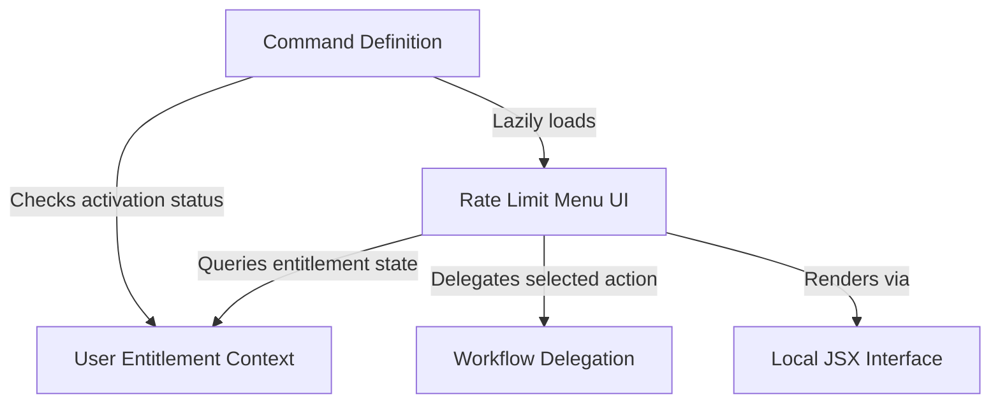

# Tutorial: rate-limit-options

This project implements an interactive **Rate Limit Menu** that appears when a user exceeds their usage quotas. It dynamically evaluates the user's *entitlement context* (such as subscription tier and billing status) to offer relevant resolutions like **upgrading** or enabling **extra usage**, rendering these choices via a **Local JSX** interface within the CLI.

## Chapters

1. [User Entitlement Context](01_user_entitlement_context.md)
2. [Command Definition](02_command_definition.md)
3. [Rate Limit Menu UI](03_rate_limit_menu_ui.md)
4. [Local JSX Interface](04_local_jsx_interface.md)
5. [Workflow Delegation](05_workflow_delegation.md)

---

Generated by [Code IQ](https://github.com/adityasoni99/Code-IQ)