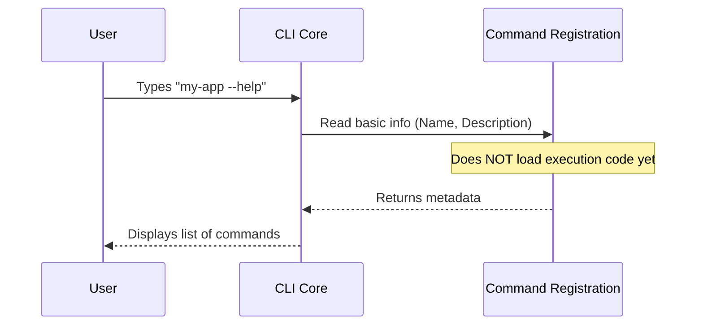

# Chapter 1: Command Registration

Welcome to the first chapter of the `release-notes` project tutorial! Here, we are going to learn how to introduce a new command to our Command Line Interface (CLI) application.

## The Motivation: The Restaurant Menu

Imagine walking into a restaurant. Before you order food, you look at a menu. The menu tells you the **name** of the dish and a short **description** of what it is.

Crucially, the chef does **not** cook every single dish on the menu the moment you walk in. They only cook the specific dish you ask for.

If the chef tried to cook everything at once, the restaurant would be:
1.  **Slow** to open.
2.  **Wasteful** of resources (memory/ingredients).

**Command Registration** solves this exact problem for software. It allows our application to show a "menu" of available commands (like `release-notes`) without actually loading the heavy code required to execute them.

## Key Concepts

To register a command, we create a lightweight "identity card" for it. This includes:

1.  **Name:** What the user types (e.g., `release-notes`).
2.  **Description:** What appears in the help list.
3.  **Settings:** Rules about how the command behaves (e.g., can it run without a human present?).
4.  **The Pointer:** A way to locate the actual code later (like a page number in the menu).

## How to Register a Command

Let's look at how we define the identity of our command in the file `index.ts`. We use a specific structure (or "Type") called `Command` to ensure we provide all the necessary details.

### Step 1: Defining the Identity

First, we define the basic metadata. This is the text that shows up when a user types `--help`.

```typescript
// --- File: index.ts ---
import type { Command } from '../../commands.js'

// We create an object that follows the 'Command' rules
const releaseNotes: Command = {
  description: 'View release notes',
  name: 'release-notes',
  type: 'local',
  // ... more settings coming next
}
```

**Explanation:**
*   We import the `Command` type definition. This acts like a template form we have to fill out.
*   We give it a `name` ('release-notes').
*   We give it a `description`. This is lightweight text that is very fast to load.

### Step 2: Configuring Settings

Next, we add configuration flags. These tell the CLI how to treat the command without running it.

```typescript
// --- File: index.ts (continued) ---

// Adding specific settings to our object
const releaseNotes: Command = {
  // ... previous properties
  supportsNonInteractive: true,
  // ...
}
```

**Explanation:**
*   `supportsNonInteractive`: This tells the CLI, "It is safe to run this command in a script (CI/CD) where no human can press keys."

### Step 3: Connecting the Logic

Finally, we tell the registration where the *actual* code lives, but we don't run it yet.

```typescript
// --- File: index.ts (continued) ---

const releaseNotes: Command = {
  // ... previous properties
  // The 'load' function acts as a pointer
  load: () => import('./release-notes.js'),
}

export default releaseNotes
```

**Explanation:**
*   `load`: This is a function. Note that we are **not** importing `release-notes.js` at the top of the file.
*   We are using a dynamic import inside a function. This file will only be read when this function is actually called. This concept leads us directly into [Lazy Module Loading](02_lazy_module_loading.md), which we will cover in the next chapter.

## Under the Hood

How does the CLI use this registration? Let's visualize the flow.

When you start the application, it needs to build the list of available commands. It scans for these registration files (`index.ts`) because they are small and fast to read.

### Sequence Diagram

Here is what happens when a user asks for help:



### Internal Implementation Details

The core application iterates through folders looking for these `index.ts` files. Because we separated the definition from the execution, the application stays fast.

Here is a simplified look at what the `Command` interface might look like in the core system:

```typescript
// --- File: commands.ts (Simplified) ---

export interface Command {
  name: string;
  description: string;
  // This function returns a Promise containing the logic
  load: () => Promise<unknown>; 
}
```

**Explanation:**
*   The `Command` interface enforces that every command *must* have a name and a `load` function.
*   This contract ensures that the CLI Core knows exactly how to interact with any new command you add, whether it's `release-notes` or something else.

## Conclusion

In this chapter, we learned that **Command Registration** is about defining the "Menu Entry" for our command.

1.  We separated the **Identity** (name, description) from the **Execution** (the code that does the work).
2.  We made the application faster by not loading heavy code until necessary.

But what actually happens when we call that `load` function? How do we efficiently load the heavy code only when the user selects `release-notes`?

Let's find out in the next chapter: [Lazy Module Loading](02_lazy_module_loading.md).

---

Generated by [Code IQ](https://github.com/adityasoni99/Code-IQ)