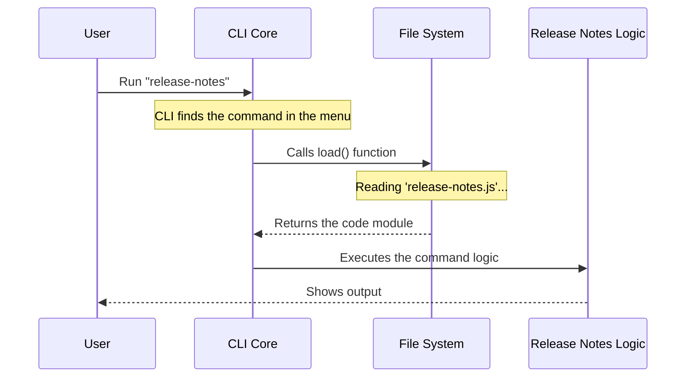

# Chapter 2: Lazy Module Loading

Welcome to the second chapter of the `release-notes` tutorial!

In the previous chapter, [Command Registration](01_command_registration.md), we learned how to create a "menu" for our application. We defined the *identity* of our command without actually running the code.

Now, we need to answer a critical question: **How do we retrieve the actual code only when we need it?**

## The Motivation: The Heavy Toolbox

Imagine you are a repair person. You have a massive toolbox containing a hammer, a drill, a saw, a wrench, and 50 other heavy tools.

You are called to a job to simply tighten one screw.
*   **Without Lazy Loading:** You carry the entire heavy toolbox up five flights of stairs, even though you only need a screwdriver. This is exhausting and slow.
*   **With Lazy Loading:** You walk up the stairs with empty hands. When you see the screw, you ask your assistant to hand you *just* the screwdriver.

In our software:
*   **The Toolbox** is our entire application.
*   **The Tools** are the code files for different commands.
*   **Lazy Loading** means we only load the code file for `release-notes` if the user actually asks for it. This keeps our CLI startup lightning fast.

## Key Concepts

To achieve this "lightweight" behavior, we use a special JavaScript feature called **Dynamic Imports**.

### 1. Static vs. Dynamic Imports

Usually, you see imports at the very top of a file. This is a **Static Import**.

```typescript
// Static Import (The "Heavy" way)
// The computer loads this file IMMEDIATELY, whether we need it or not.
import { run } from './release-notes.js' 
```

A **Dynamic Import** happens inside the code, usually inside a function. It returns a specific file only when that line of code is executed.

```typescript
// Dynamic Import (The "Lazy" way)
// The computer loads this file ONLY when this function runs.
const loadMyFile = () => import('./release-notes.js') 
```

## Implementing Lazy Loading

Let's revisit our `index.ts` file from Chapter 1 and focus specifically on the `load` property. This is where the magic happens.

### The Code

```typescript
// --- File: index.ts ---

const releaseNotes: Command = {
  // ... name and description ...
  
  // This is the Lazy Loading implementation:
  load: () => import('./release-notes.js'),
}
```

**Explanation:**
*   We define a function `() => ...`.
*   Inside that function, we call `import('./release-notes.js')`.
*   Because this is inside a function, the file `./release-notes.js` is **not** read when the application starts. It sits there waiting.
*   The file is only read when the CLI Core decides to call this specific function.

## Under the Hood

What actually happens when a user types `my-app release-notes`?

### The Flow

1.  **Startup:** The CLI starts. It reads `index.ts` to see the command exists, but it ignores `release-notes.js` for now.
2.  **Match:** The CLI sees the user typed `release-notes`.
3.  **Trigger:** The CLI looks at the `load` property we wrote above and executes that function.
4.  **Fetch:** The computer goes to the disk, reads the code inside `release-notes.js`, and brings it into memory.
5.  **Run:** The command executes.

### Sequence Diagram

Here is the process visualized:



### Internal Implementation Details

How does the core system handle this? Since reading a file from the disk (or network) takes a tiny bit of time, the `import()` function returns a **Promise**.

A **Promise** is like a receipt at a fast-food restaurant. It says, "I don't have your burger (code) yet, but hold this receipt, and I will give it to you in a moment."

Here is a simplified view of how the CLI Core handles this receipt:

```typescript
// --- File: core-runner.ts (Simplified) ---

async function runCommand(command: Command) {
  // 1. We call the load function we defined in index.ts
  // The 'await' keyword means "wait for the file to finish loading"
  const module = await command.load()

  // 2. Once loaded, we look for the main function inside that file
  // (We will write this 'run' function in the next chapter)
  const runFunction = module.default
  
  // 3. Execute the logic!
  await runFunction()
}
```

**Explanation:**
*   `await command.load()`: This triggers our lazy loader. The system pauses here for a split second to fetch the code.
*   `module.default`: When we import a file, we usually get the `default` export from it.
*   This pattern ensures that if the user runs a different command, `release-notes.js` is never touched, saving memory.

## Conclusion

In this chapter, we learned that **Lazy Module Loading** is about efficiency.

1.  We avoided carrying the "Heavy Toolbox."
2.  We used a **Dynamic Import** (`import()`) inside our `load` function.
3.  This ensures the heavy logic file is only loaded when strictly necessary.

Now that we have successfully loaded our code file, we need to define what goes *inside* it. Since our command needs to fetch data from the internet (which takes time), we need to learn how to handle code that doesn't finish immediately.

Let's dive into the logic file in the next chapter: [Asynchronous Command Handler](03_asynchronous_command_handler.md).

---

Generated by [Code IQ](https://github.com/adityasoni99/Code-IQ)