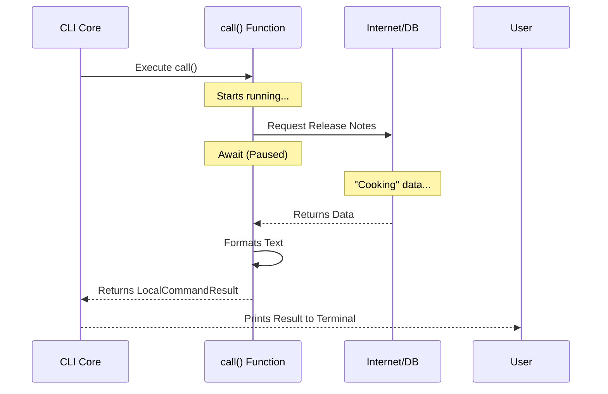

# Chapter 3: Asynchronous Command Handler

Welcome to the third chapter of the `release-notes` tutorial!

In the previous chapter, [Lazy Module Loading](02_lazy_module_loading.md), we learned how to efficiently retrieve the code file from the disk only when needed. We picked up the "tool," but we haven't used it yet.

Now, we are going to look inside that file. We need to write the code that actually **does the work** (fetching data and showing it). This is the job of the **Asynchronous Command Handler**.

## The Motivation: The Chef and the Order

Let's stick with our restaurant analogy.

1.  **Registration:** The menu lists the dish name.
2.  **Lazy Loading:** The waiter walks to the kitchen to tell the chef.
3.  **Command Handler:** The **Chef**.

When you order a meal, the chef has to cook it. Cooking takes time.
*   **Synchronous (Blocking):** If the chef freezes the entire universe while boiling water, nothing else can happen. The restaurant stops.
*   **Asynchronous (Non-Blocking):** The chef puts the water on the stove and waits for it to boil. While waiting, they can chop vegetables or check other pots.

In our CLI, fetching release notes from the internet is like boiling water. It takes time (milliseconds or seconds). We use an **Asynchronous Command Handler** so our program handles this wait time gracefully without freezing up.

## Key Concepts

To be a "Chef" in our CLI, your code must follow two rules:

1.  **The Name:** The main function must be named `call`. This is the specific signal the CLI looks for to start the engine.
2.  **The Promise:** Because "cooking" (fetching data) takes time, the function must be `async`. It returns a **Promise**, which is essentially a guarantee that "I will give you the result when I am done."

## Implementing the Handler

Let's open `release-notes.ts` and build the engine.

### Step 1: Defining the Function

We start by exporting a function named `call`. Note the `async` keyword.

```typescript
// --- File: release-notes.ts ---
import type { LocalCommandResult } from '../../types/command.js'

// 'async' means this function might take some time to finish
export async function call(): Promise<LocalCommandResult> {
  
  // Logic will go here...
  // For now, let's just pretend we are preparing variables
  let notes = ''
  
  return { type: 'text', value: 'Placeholder' } // Temporary return
}
```

**Explanation:**
*   `export`: Makes this function available to the CLI Core (which we loaded in the previous chapter).
*   `async`: Tells JavaScript, "This function performs operations that are not instant."
*   `Promise<LocalCommandResult>`: This defines the "plate" we serve the food on. We promise to return a result in a specific format.

### Step 2: The "Cooking" (Fetching Data)

Now, let's add the logic to get the data. We will rely on some helper functions to do the heavy lifting.

```typescript
// --- File: release-notes.ts (inside the function) ---

// 1. We attempt to fetch the release notes
// 'await' pauses THIS function until the data is ready
// It's like waiting for the timer on the oven
const rawData = await getStoredChangelog()

// 2. We process the raw ingredients into a nice format
const notesList = getAllReleaseNotes(rawData)
```

**Explanation:**
*   `await`: This is the magic word. It pauses the execution of `call()` while the data is being fetched from the disk or network.
*   Crucially, while this is paused, the computer isn't frozen—it's just waiting efficiently.

### Step 3: Serving the Dish (Returning the Result)

Finally, we need to return the data to the user. We don't just `console.log` it; we return a structured object. This ensures the CLI controls *how* it is displayed.

```typescript
// --- File: release-notes.ts (continued) ---

// 3. Create a standardized result object
const finalResult: LocalCommandResult = {
  type: 'text', // Tell the CLI this is plain text
  value: formatReleaseNotes(notesList), // The actual content
}

// 4. Return it to the core system
return finalResult
```

**Explanation:**
*   `LocalCommandResult`: This is a standard shape for answers. It allows the CLI to know if the output is text, a JSON object, or an error.
*   `value`: This is the final string the user will see in their terminal.

## Under the Hood

What happens when the core system runs this handler?

### Sequence Diagram



### Internal Implementation Details

The CLI Core doesn't know *what* your command does. It just knows it has a `call` function. Here is how the core runs your command safely:

```typescript
// --- File: core-runner.ts (Simplified) ---

try {
  // 1. Run the user's command and wait for the Promise to resolve
  const result = await commandModule.call()

  // 2. Handle the output based on the type
  if (result.type === 'text') {
    console.log(result.value)
  }
} catch (error) {
  // 3. If the 'cooking' goes wrong (burnt food), handle the error
  console.error('Command failed:', error)
}
```

**Explanation:**
*   The core wraps your command in a `try/catch` block. If your asynchronous code fails (e.g., the internet is down), the core catches the error so the application doesn't crash completely.
*   It handles the `LocalCommandResult` to decide how to print the output.

## Putting It Together

We have built a simple handler that fetches data and returns it. However, rely strictly on the network can be risky. What if the internet is slow? What if the "cooking" takes 10 seconds? The user will get bored and leave.

We need a strategy to make this feel instant, even if the network is slow.

In the next chapter, we will learn how to implement an **Optimistic Fetching Strategy**—serving a "pre-cooked" meal (cache) while the fresh one cooks in the background.

[Next Chapter: Optimistic Fetching Strategy](04_optimistic_fetching_strategy.md)

---

Generated by [Code IQ](https://github.com/adityasoni99/Code-IQ)