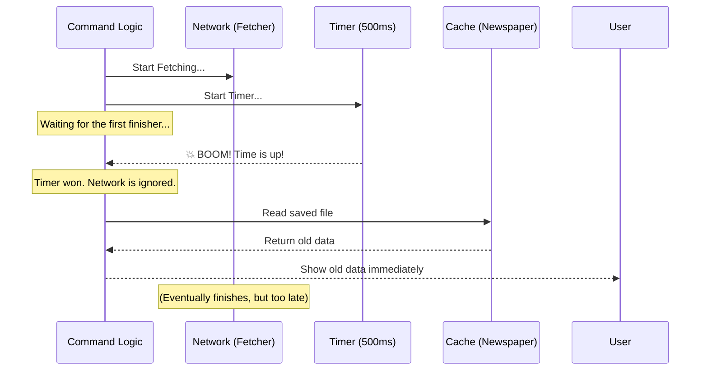

# Chapter 4: Optimistic Fetching Strategy

Welcome to the fourth chapter of the `release-notes` tutorial!

In the previous chapter, [Asynchronous Command Handler](03_asynchronous_command_handler.md), we learned how to write the code that fetches data from the internet. We learned that fetching data takes time, and we used `async/await` to handle that waiting period.

However, there is a problem. What if the user has a slow internet connection? If fetching the data takes 5 seconds, the user stares at a blank screen for 5 seconds. In the world of Command Line Interfaces (CLIs), 5 seconds feels like an eternity.

In this chapter, we will solve this using an **Optimistic Fetching Strategy**.

## The Motivation: Live News vs. The Newspaper

To understand this strategy, let's look at a real-world analogy. You want to know what is happening in the world.

1.  **Live Broadcast (Network):** You can try to tune into a live TV stream. It's the most up-to-date information, but it might buffer, load slowly, or fail to connect.
2.  **The Newspaper (Cache):** You have a newspaper on your table from this morning. It might be a few hours old, but it is **instantly** available.

**The Optimistic Strategy** works like this:
You try to turn on the TV. You give it exactly **500 milliseconds** to connect.
*   **Scenario A:** It connects instantly. Great! You watch the live news.
*   **Scenario B:** It's still loading after 500ms. You immediately give up on the TV and pick up the newspaper instead.

We prioritize **speed** over **freshness**. We prefer showing slightly older data instantly rather than making the user wait for new data.

## Key Concept: The Race

In JavaScript, we implement this time limit using a concept called a **Race**.

Imagine a race track with two runners:
1.  **The Fetcher:** Tries to get data from the internet.
2.  **The Timer:** Runs for exactly 500ms and then stops.

We start both runners at the same time. The rule is simple: **We only listen to the winner.**

### 1. Creating the Timer (The Time Limit)

First, we need to create the "Timer" runner. This is a piece of code that intentionally fails (rejects) after a set time.

```typescript
// Define a timeout limit (500 milliseconds)
const timeoutPromise = new Promise<void>((_, reject) => {
  
  // Set a timer. When time is up, trigger an error.
  setTimeout(() => {
    reject(new Error('Timeout'))
  }, 500)

})
```

**Explanation:**
*   `setTimeout`: A built-in JavaScript function that waits for a specific amount of time.
*   `reject`: This tells the program, "Something went wrong" (in this case, we ran out of time).

### 2. Running the Race

Now we use `Promise.race()`. This function takes a list of promises (tasks) and returns the result of the *first* one to finish.

```typescript
// We need two contestants
const networkTask = fetchAndStoreChangelog() // Tries to get data
const timerTask = timeoutPromise             // Fails after 500ms

try {
  // Start the race!
  await Promise.race([networkTask, timerTask])
  
  // If we reach this line, the Network won!
  // We can confidently use fresh data.
} catch (error) {
  // If we land here, the Timer won (or the network failed).
  // We should switch to the backup plan.
}
```

**Explanation:**
*   `Promise.race([...])`: Starts both tasks simultaneously.
*   If `networkTask` finishes in 100ms, the race is over, and we continue inside the `try` block.
*   If `networkTask` takes 2000ms, `timerTask` will trigger the error at 500ms. The code jumps immediately to the `catch` block.

## Putting It Together: The Logic

Now let's look at how we combine this race with our "Newspaper" (Cache) fallback in our `release-notes.ts` file.

### Step 1: Attempt the Fresh Fetch

We try to get the fresh notes, but we wrap it in our race logic.

```typescript
// --- File: release-notes.ts ---

// 1. Prepare to hold our notes
let freshNotes = []

try {
    // 2. Define the strict 500ms time limit
    const timeout = new Promise((_, rej) => setTimeout(rej, 500))

    // 3. Race the network against the clock
    await Promise.race([fetchAndStoreChangelog(), timeout])
    
    // 4. If successful, load the new data
    freshNotes = await getStoredChangelog()
} catch {
    // 5. If it times out, do nothing here. We handle it below.
}
```

### Step 2: Decide What to Show

After the race is over, we check what we have. Did we get fresh notes? If not, do we have old notes?

```typescript
// --- File: release-notes.ts (continued) ---

// Scenario A: The Network was fast. Show fresh notes.
if (freshNotes.length > 0) {
  return { type: 'text', value: formatReleaseNotes(freshNotes) }
}

// Scenario B: Network was slow. Check the Cache (The Newspaper).
const cachedNotes = await getStoredChangelog()

if (cachedNotes.length > 0) {
  return { type: 'text', value: formatReleaseNotes(cachedNotes) }
}
```

**Explanation:**
*   We prioritize `freshNotes`.
*   If `freshNotes` is empty (because of a timeout or error), we look at `cachedNotes`.
*   This ensures the user sees *something* as fast as possible.

## Under the Hood

What happens internally when the CLI executes this strategy? Let's visualize the "Slow Network" scenario, which is the most interesting one.

### Sequence Diagram: The Timeout Scenario



### Internal Details

It is important to understand that **JavaScript cannot "cancel" the network request easily**.

When the Timer wins the race:
1.  The `await Promise.race` line finishes and throws an error (which we catch).
2.  The code moves on to read the cache and show the result to the user.
3.  **Crucially**, the `fetchAndStoreChangelog` is actually *still running* in the background!
4.  When the network request finally finishes (e.g., 2 seconds later), it will save the new data to the disk silently.

This means that while the user sees old data *now*, the *next* time they run the command, they will see the data we just downloaded in the background. This is often called **"Stale-While-Revalidate"** behavior.

## Conclusion

In this chapter, we implemented an **Optimistic Fetching Strategy**.

1.  We learned that users hate waiting more than they hate slightly old data.
2.  We used `Promise.race` to set a strict time limit (500ms) on our network requests.
3.  We implemented a fallback system: **Live Data -> Cache -> Error**.

Now we have our data, whether it came from the live network or the cache. It is currently just a raw list of strings. We need to make it look professional and readable for the user.

Let's learn how to style our output in the final chapter: [Response Formatting](05_response_formatting.md).

---

Generated by [Code IQ](https://github.com/adityasoni99/Code-IQ)