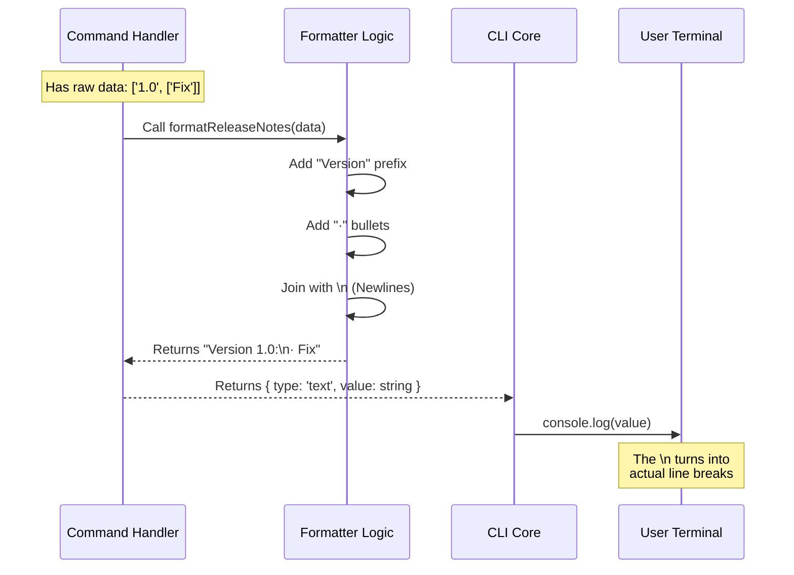

# Chapter 5: Response Formatting

Welcome to the final chapter of the `release-notes` tutorial!

In the previous chapter, [Optimistic Fetching Strategy](04_optimistic_fetching_strategy.md), we successfully retrieved our data. We raced the network against a timer and grabbed the release notes (either from the live internet or our local cache).

However, we have a new problem. The data currently looks like "computer code." It is full of brackets, quotes, and commas. If we show this to a user, they will be confused.

In this chapter, we will learn about **Response Formatting**. This is the art of taking raw data and "plating" it so it looks beautiful for the user.

## The Motivation: Plating the Meal

Let's return to our restaurant analogy one last time.

1.  **Registration:** The menu exists.
2.  **Lazy Loading:** The chef is called to the kitchen.
3.  **Async Handler:** The chef cooks the food.
4.  **Optimistic Strategy:** The food is ready fast.

Now, imagine the chef takes the steak, the potatoes, and the sauce, and throws them all into a blender, then pours the result into a bowl. Technically, the food is there, but it looks terrible.

**Response Formatting** is the step where the chef carefully arranges the steak on the plate, places the potatoes on the side, and drizzles the sauce on top.

*   **Raw Data:** Hard to read, useful for computers.
*   **Formatted Data:** Easy to scan, useful for humans.

## Key Concepts

To format our data, we need to transform a list of computer objects into a single, long text string that contains **Newlines** and **Bullet Points**.

### The Input (Raw Ingredients)

Our data currently looks like a list of "Tuples" (pairs).
*   Item 1: The Version Number (e.g., "1.0.0").
*   Item 2: A list of changes.

```typescript
// This is hard for a human to read quickly
[
  ["1.0.0", ["Fixed login bug", "Added dark mode"]],
  ["0.9.0", ["Initial release"]]
]
```

### The Output (The Plated Meal)

We want to transform that into this:

```text
Version 1.0.0:
· Fixed login bug
· Added dark mode

Version 0.9.0:
· Initial release
```

## Implementing the Formatter

We will write a helper function called `formatReleaseNotes`. We will use two powerful JavaScript tools: `.map()` (transform) and `.join()` (glue).

### Step 1: The Helper Function

Let's define our function in `release-notes.ts`. It takes the raw list as input and returns a single string.

```typescript
// --- File: release-notes.ts ---

// Input: A list of pairs (Version string, Array of notes)
// Output: A single big string
function formatReleaseNotes(notes: Array<[string, string[]]>): string {
  
  // We will transform each pair into a nice block of text
  const formattedBlocks = notes.map(([version, changes]) => {
    
    // Logic continues below...
    return '' // Placeholder
  })

  // Glue all blocks together with a double newline (gap)
  return formattedBlocks.join('\n\n')
}
```

**Explanation:**
*   `.map(...)`: This loops through every release. It says, "Take this raw data and turn it into a text block."
*   `.join('\n\n')`: After we create the blocks, we glue them together. `\n` is a special character that means "New Line." Using two (`\n\n`) creates a visual gap between versions.

### Step 2: Formatting the Header

Inside our loop, we first want to create the header (the version number).

```typescript
// --- File: release-notes.ts (Inside the .map function) ---

    // 1. Create a nice header line
    // Example result: "Version 1.0.0:"
    const header = `Version ${version}:`
```

**Explanation:**
*   We use a template string (backticks) to put the word "Version" before the number and a colon after it.

### Step 3: Formatting the Bullet Points

Next, we need to handle the list of changes. We want a dot (`·`) before each one.

```typescript
// --- File: release-notes.ts (Inside the .map function) ---

    // 2. Add a dot before every note in the list
    const lines = changes.map(note => `· ${note}`)

    // 3. Glue these lines together with a single newline
    // Example result:
    // · Fixed login bug
    // · Added dark mode
    const bulletPoints = lines.join('\n')
```

**Explanation:**
*   We use `.map` again on the *inner* list to add the dot.
*   We use `.join('\n')` (one newline) so the bullet points sit directly on top of each other without a gap.

### Step 4: Assembling the Block

Finally, we combine the Header and the Bullet Points for this specific version.

```typescript
// --- File: release-notes.ts (Inside the .map function) ---

    // 4. Combine header and body
    return `${header}\n${bulletPoints}`
  
  // End of .map function
```

## Integrating into the Command

Now we simply call this function inside our main `call()` handler (which we built in [Chapter 3](03_asynchronous_command_handler.md)).

```typescript
// --- File: release-notes.ts ---

// Inside call() function...

// If we have data (fresh or cached), format it!
if (freshNotes.length > 0) {
  
  // 1. Convert raw data to pretty string
  const prettyString = formatReleaseNotes(freshNotes)

  // 2. Return the result object
  return { 
    type: 'text', 
    value: prettyString 
  }
}
```

**Explanation:**
*   The `call` function doesn't need to know *how* to format. It just delegates the job to `formatReleaseNotes`.
*   The returned object `{ type: 'text', ... }` tells the CLI to print the `value` exactly as we formatted it.

## Under the Hood

How does this string actually get to the screen?

### Sequence Diagram

Here is the flow of data from the raw arrays to the user's eyes.



### Internal Implementation Details

The CLI Core handles the final output. It receives your `LocalCommandResult`.

```typescript
// --- File: core-runner.ts (Simplified) ---

// The CLI receives your result object
const result = await command.call()

if (result.type === 'text') {
  // console.log interprets the special character '\n'
  // as a command to move the cursor to the next line.
  console.log(result.value)
}
```

**Explanation:**
*   Computers see `\n` as just another character (byte).
*   The **Terminal** (the window you type in) is what actually interprets `\n` as "go down one line and go to the start."
*   By calculating this string in our formatter, we take full control of the visual layout.

## Conclusion

Congratulations! You have completed the `release-notes` project tutorial.

In this chapter, we learned that **Response Formatting** is the "Presentation Layer" of our command. We turned raw, ugly data arrays into a clean, readable list using string manipulation (`map`, `join`, and `\n`).

Let's recap what you have built:
1.  **[Command Registration](01_command_registration.md):** You created a menu entry so the CLI knows your command exists.
2.  **[Lazy Module Loading](02_lazy_module_loading.md):** You ensured your code is only loaded when the user asks for it, keeping the app fast.
3.  **[Asynchronous Command Handler](03_asynchronous_command_handler.md):** You wrote the logic to process the command without freezing the computer.
4.  **[Optimistic Fetching Strategy](04_optimistic_fetching_strategy.md):** You implemented a race condition to ensure the user never waits too long.
5.  **Response Formatting:** You styled the output to be human-readable.

You now have a fully functional, high-performance CLI command structure. Happy coding!

---

Generated by [Code IQ](https://github.com/adityasoni99/Code-IQ)