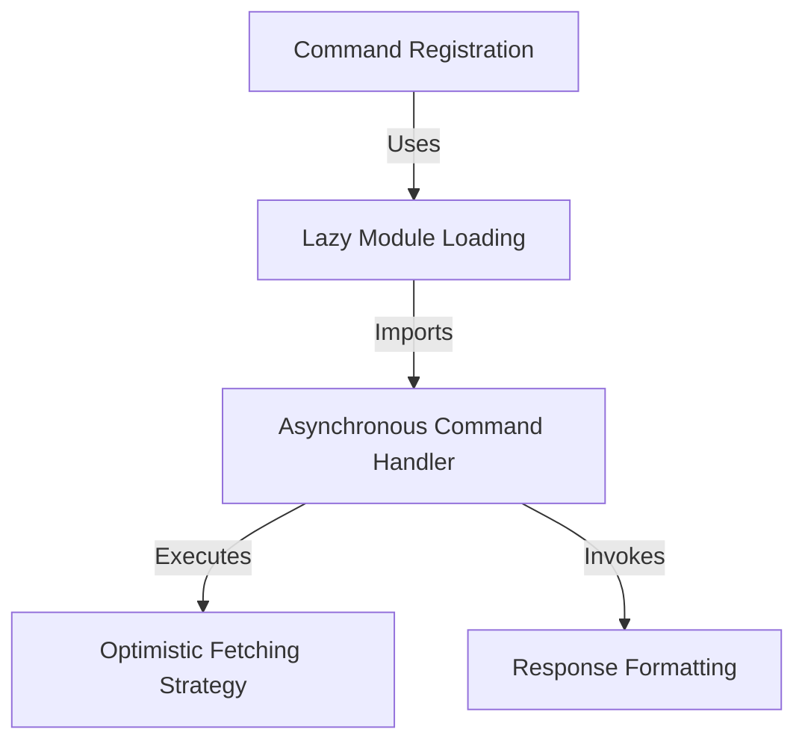

# Tutorial: release-notes

This project implements a **CLI command** designed to display software *release notes* to the user. It prioritizes **performance** and **responsiveness** by loading code only when necessary and using a smart strategy to attempt fetching live updates while instantly falling back to *cached data* if the network is too slow.

## Chapters

1. [Command Registration](01_command_registration.md)
2. [Lazy Module Loading](02_lazy_module_loading.md)
3. [Asynchronous Command Handler](03_asynchronous_command_handler.md)
4. [Optimistic Fetching Strategy](04_optimistic_fetching_strategy.md)
5. [Response Formatting](05_response_formatting.md)

---

Generated by [Code IQ](https://github.com/adityasoni99/Code-IQ)