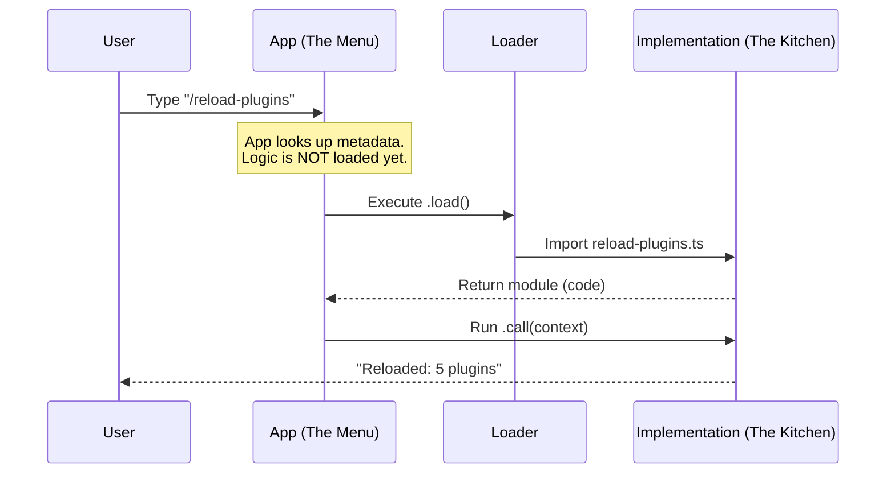

# Chapter 1: Command Architecture & Lazy Loading

Welcome to the first chapter of our deep dive into the `reload-plugins` project! We are going to build an understanding of how a complex CLI application manages its features efficiently.

## Why do we need this?

Imagine you walk into a massive restaurant. The menu has hundreds of options: burgers, sushi, pasta, tacos, and more.

If the kitchen started cooking **every single dish** the moment the restaurant opened, just in case someone ordered it, two things would happen:
1. The restaurant would take forever to open (startup delay).
2. The kitchen would run out of space and energy immediately (memory bloat).

Instead, a restaurant uses a **Menu**. The menu is just a list of names and descriptions. The kitchen only starts cooking a specific dish when you actually order it.

In software, we call this **Lazy Loading**.

### The Use Case
We want to create a command called `/reload-plugins`.
*   **Startup:** We want the application to know this command exists, but we *don't* want to load all the heavy logic required to refresh plugins yet.
*   **Execution:** We only want to import the heavy code when the user explicitly types `/reload-plugins`.

## Key Concepts

To solve this, we split our feature into two files:
1.  **The Menu (`index.ts`):** A tiny file that describes the command.
2.  **The Kitchen (`reload-plugins.ts`):** The heavy file containing the actual code.

## How to Implement Lazy Loading

Let's look at how we define the "Menu Item" for our command. This happens in `index.ts`.

### 1. Defining the Command
We define a lightweight object. Notice we aren't writing the logic here; we are just describing it.

```typescript
// index.ts
import type { Command } from '../../commands.js'

const reloadPlugins = {
  type: 'local',
  name: 'reload-plugins',
  description: 'Activate pending plugin changes in the current session',
  // ... extra metadata ...
} satisfies Command
```

*   **`name`**: This is what the user types (e.g., `/reload-plugins`).
*   **`description`**: What shows up in the help menu.

### 2. The Lazy Switch
Here is the most important part. Instead of importing the logic at the top of the file, we use a `load` function.

```typescript
// index.ts (continued)
const reloadPlugins = {
  // ... previous properties ...
  
  // This function is ONLY called when the user runs the command
  load: () => import('./reload-plugins.js'),
} satisfies Command

export default reloadPlugins
```

*   **`load`**: This is a function that returns a Promise.
*   **`import(...)`**: This tells the runtime to go find the file `./reload-plugins.js` and load it into memory *right now*. Before this line runs, the heavy file effectively doesn't exist to the application.

## Under the Hood: What Happens When You Type?

When you type `/reload-plugins`, the system goes through a specific flow to ensure it only does work when necessary.

### The Flow
1.  **User Input:** You type `/reload-plugins`.
2.  **Lookup:** The app checks its list of commands (the "Menu"). It finds `reload-plugins`.
3.  **Lazy Load:** The app sees the `load()` function and executes it.
4.  **Import:** The system reads `reload-plugins.ts` from the disk.
5.  **Execution:** The app runs the `call` function exported by that file.

### Visualizing the Process



## Deep Dive: The Implementation

Now that the file has been loaded, let's look at the "Kitchen" logic in `reload-plugins.ts`. This file exports a specific function named `call` that the application knows how to run.

### The Call Function
This function receives arguments and context (like the current state of the app).

```typescript
// reload-plugins.ts
import type { LocalCommandCall } from '../../types/command.js'
// ... other imports ...

export const call: LocalCommandCall = async (_args, context) => {
  // Logic to sync settings and refresh plugins goes here...
  
  // ...
}
```

### Returning Feedback
The command doesn't just run silently; it returns a result to show to the user.

```typescript
// reload-plugins.ts (continued)
  // ... inside call() ...

  // Create a success message
  let msg = `Reloaded: ${parts.join(' · ')}`

  // Return the output to the UI
  return { type: 'text', value: msg }
}
```

### Connecting to Logic
Inside this `call` function, we perform several heavy operations that we avoided loading at startup.

1.  **Sync Settings:** We might need to download new configurations.
    *   *Reference:* [Remote Settings Synchronization](02_remote_settings_synchronization.md).
2.  **Refresh State:** We actually reload the plugin files.
    *   *Reference:* [Plugin State Refresh (Layer-3)](04_plugin_state_refresh__layer_3_.md).

## Conclusion

In this chapter, you learned how to use **Command Architecture** and **Lazy Loading** to keep your application fast. By separating the definition (`index.ts`) from the implementation (`reload-plugins.ts`), we ensure that the "Kitchen" only gets messy when someone actually orders a meal.

Once the command is loaded and running, the very first thing it needs to do is ensure it has the latest rules and settings from the server.

[Next Chapter: Remote Settings Synchronization](02_remote_settings_synchronization.md)

---

Generated by [Code IQ](https://github.com/adityasoni99/Code-IQ)