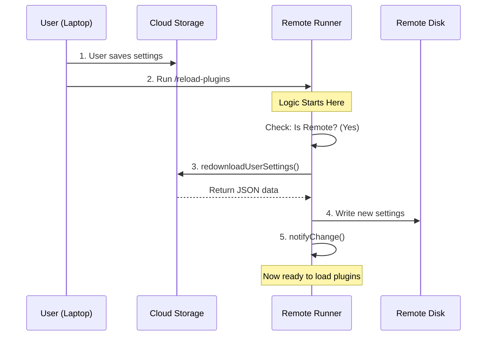

# Chapter 2: Remote Settings Synchronization

In the previous chapter, [Command Architecture & Lazy Loading](01_command_architecture___lazy_loading.md), we learned how to efficiently load our command only when the user asks for it.

Now that our "Kitchen" (the command logic) is open and running, we have a critical problem to solve before we start cooking. We need to make sure we have the right ingredients (settings).

## Why do we need this?

Imagine you are using a streaming service (like Netflix or Spotify).
1.  **On your phone:** You add a movie to your "Watch List".
2.  **On your TV:** You open the app.

If the TV app doesn't immediately check with the server to see your new "Watch List," you won't see the movie you just added. You are looking at outdated information.

### The Use Case

In our `reload-plugins` project, the Command Line Interface (CLI) often runs in a **Remote Environment** (like a cloud server or inside a VS Code extension), while you are typing on your **Local Computer**.

1.  **Local:** You edit your configuration file to enable a cool new plugin.
2.  **Remote:** You run `/reload-plugins`.

If the remote CLI just reloads what is currently on its own disk, nothing happens. It doesn't know you changed the file on your laptop. We need a way to **Synchronize** those settings before we do anything else.

## Key Concepts

To handle this, we use the **Remote Settings Synchronization** abstraction. It consists of three simple steps:

1.  **Environment Check:** Are we running remotely? If we are running locally, we don't need to download anything (we already have the file).
2.  **The Pull:** If we are remote, download the latest settings from the central storage.
3.  **The Notification:** Tell the rest of the system that the file has changed so it can react.

## How to Implement Synchronization

Let's look at how this logic is implemented inside our `reload-plugins.ts` file. We do this at the very top of our function, before we try to load any plugins.

### 1. Checking the Environment

First, we check if we are allowed to download settings and if we are actually in a remote mode.

```typescript
// reload-plugins.ts
import { feature } from 'bun:bundle'
import { getIsRemoteMode } from '../../bootstrap/state.js'
import { isEnvTruthy } from '../../utils/envUtils.js'

// Check if we are in a remote environment (Cloud or VS Code)
const isRemote = isEnvTruthy(process.env.CLAUDE_CODE_REMOTE) 
  || getIsRemoteMode()

const shouldSync = feature('DOWNLOAD_USER_SETTINGS') && isRemote
```

*   **`isRemote`**: This asks, "Am I running on a different machine than the user?"
*   **`shouldSync`**: We combine this with a feature flag to ensure we only sync when safe.

### 2. Downloading the Settings

If `shouldSync` is true, we call the synchronization service. This is the "Dropbox" moment where we pull the latest file.

```typescript
// reload-plugins.ts
import { redownloadUserSettings } from '../../services/settingsSync/index.js'

// Inside the call function...
if (shouldSync) {
  // Go to the server and get the latest JSON config
  const applied = await redownloadUserSettings()
  
  // 'applied' is true if the file was successfully updated
}
```

*   **`redownloadUserSettings()`**: This is an asynchronous function. It reaches out to the network, grabs the settings, and writes them to the remote disk.

### 3. Notifying the System

This is a subtle but crucial step. Just writing the file to disk isn't enough. We need to poke the application and say, "Hey! Read this file again!"

```typescript
// reload-plugins.ts
import { settingsChangeDetector } from '../../utils/settings/changeDetector.js'

if (applied) {
  // Manually trigger the notification system
  settingsChangeDetector.notifyChange('userSettings')
}
```

*   **`notifyChange`**: Usually, a file watcher handles this. But since we just wrote the file ourselves programmatically, we manually trigger the update to ensure it happens immediately.

## Under the Hood: Visualizing the Sync

What exactly happens when this code runs? Let's visualize the flow of data from your Laptop to the Remote Runner.



1.  **User saves settings:** You change the config on your laptop. It syncs to the Cloud Storage automatically (background process).
2.  **Run Command:** You trigger the command on the Runner.
3.  **Download:** The Runner asks the Cloud for the latest version.
4.  **Write:** The Runner updates its own local file system.
5.  **Notify:** The Runner tells its internal systems to respect the new file.

## Deep Dive: The Code Integration

Now, let's look at the actual code block in `reload-plugins.ts` that ties this all together.

We combine the check, the download, and the notification into one clean block.

```typescript
// reload-plugins.ts
if (
  feature('DOWNLOAD_USER_SETTINGS') &&
  (isEnvTruthy(process.env.CLAUDE_CODE_REMOTE) || getIsRemoteMode())
) {
  // 1. Attempt to download the settings
  const applied = await redownloadUserSettings()

  // 2. If we wrote new data, notify the system
  if (applied) {
    settingsChangeDetector.notifyChange('userSettings')
  }
}
```

**Why is this robust?**
*   **Fail-Open:** Notice there is no `try/catch` block here that stops the program. If the download fails (e.g., no internet), `applied` will simply be false. The command continues running with whatever old settings it has. This prevents the tool from breaking completely just because of a network blip.
*   **Performance:** By checking `isRemote`, we skip this network call entirely when running locally, keeping the command instant for local users.

## Conclusion

In this chapter, we learned how to implement **Remote Settings Synchronization**. We ensured that no matter where our CLI is running, it always fetches the latest instructions from the user before taking action.

However, simply downloading the file is only half the battle. Once we call `notifyChange`, the application needs to actually *detect* what specifically changed inside that file.

[Next Chapter: Change Detection & Notification](03_change_detection___notification.md)

---

Generated by [Code IQ](https://github.com/adityasoni99/Code-IQ)