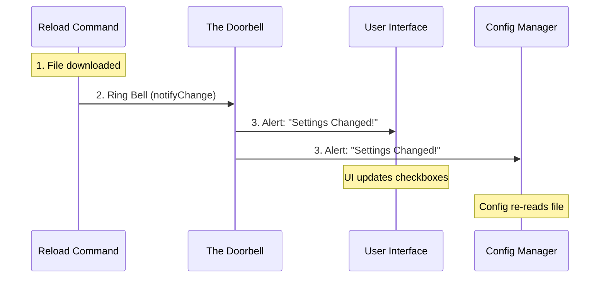

# Chapter 3: Change Detection & Notification

Welcome to Chapter 3! In the previous chapter, [Remote Settings Synchronization](02_remote_settings_synchronization.md), we successfully connected to the cloud and downloaded the latest configuration file to our disk.

But we have a problem. Just because a file changed on the hard drive, it doesn't mean the application *knows* about it yet.

## Why do we need this?

Imagine you order a pizza. The delivery driver arrives and silently places the pizza box on your front porch.

If the driver walks away without doing anything else, two things happen:
1.  **You don't know the pizza is there.** You keep waiting, hungry.
2.  **The pizza gets cold.** The data becomes stale.

To fix this, the driver rings the **Doorbell**.
*   **The Action:** Ringing the bell.
*   **The Result:** You stop what you are doing, go to the door, and get the pizza.

### The Use Case

In our application, when we ran `redownloadUserSettings()` in the previous chapter, we acted like the silent delivery driver. We placed the new settings on the disk.

Now, we need to ring the doorbell so the rest of the application (the UI, the config manager, and the plugin loader) knows that new data has arrived and needs to be processed immediately.

## Key Concepts

We use a system called **Change Detection**. It relies on two main parts:

1.  **The Detector (The Doorbell):** A central object that anyone can "ring" when they make a change.
2.  **The Notification (The Ring):** A specific signal telling the system *which* part of the app changed.

## How to Implement Notification

We need to ring the doorbell specifically for `userSettings`. We do this inside our main command logic in `reload-plugins.ts`.

### 1. Importing the Detector
First, we need to bring in the doorbell. This is a shared utility used across the entire app.

```typescript
// reload-plugins.ts
import { settingsChangeDetector } from '../../utils/settings/changeDetector.js'

// ... (other code)
```

### 2. Ringing the Doorbell
We only want to ring the bell if we actually delivered a pizza. If the download failed or the file didn't change, we shouldn't disturb the house.

```typescript
// reload-plugins.ts inside the call() function

// 'applied' is true only if the file was updated
if (applied) {
  // Ring the bell! 
  // We tell the system: "The 'userSettings' have changed."
  settingsChangeDetector.notifyChange('userSettings')
}
```

*   **`applied`**: Our check to ensure we only notify when necessary.
*   **`notifyChange(...)`**: This function broadcasts the message to all listeners.
*   **`'userSettings'`**: This is the specific "frequency" or channel we are broadcasting on. Only parts of the app that care about user settings will wake up.

## Under the Hood: The Notification Flow

What happens when we call `notifyChange`? It triggers a chain reaction.

Let's visualize this process using the "Pizza Delivery" analogy.



1.  **Command:** The script finishes writing the file.
2.  **Detector:** The command calls `notifyChange`.
3.  **Listeners (UI & Config):** Any part of the code that "subscribed" to this change gets an alert immediately. They re-read the file from the disk to get the fresh data.

## Deep Dive: Why Manual Notification?

You might be asking: *"Doesn't the application usually watch files automatically? Why do we have to manually notify it?"*

That is a great question! Usually, there is a **File Watcher** running in the background. However, when we modify files *programmatically* (inside the code), we often pause the File Watcher specifically to avoid **Infinite Loops**.

### The Infinite Loop Danger
1.  App writes file.
2.  Watcher sees change.
3.  Watcher triggers App to reload.
4.  App writes file again (maybe to format it).
5.  Watcher sees change again... **BOOM**.

To prevent this, our download function `redownloadUserSettings` uses a special mode called `markInternalWrite`. This tells the file watcher: *"Ignore this specific change, I know what I'm doing."*

Because we silenced the automatic watcher, we **must** ring the manual doorbell (`notifyChange`) to ensure the changes are applied.

```typescript
// reload-plugins.ts

// Since we silenced the automatic watcher during download...
if (applied) {
  // ...we MUST manually trigger the update here.
  settingsChangeDetector.notifyChange('userSettings')
}
```

## Conclusion

In this chapter, we learned about **Change Detection & Notification**.

We learned that simply changing a file isn't enough; we have to explicitly tell the application to look at it. By using `notifyChange`, we ensure that our application reacts instantly to new settings, keeping the user interface and internal logic perfectly in sync.

Now that the application has been notified and the settings are fresh, we are finally ready to perform the main task: reloading the plugins.

[Next Chapter: Plugin State Refresh (Layer-3)](04_plugin_state_refresh__layer_3_.md)

---

Generated by [Code IQ](https://github.com/adityasoni99/Code-IQ)