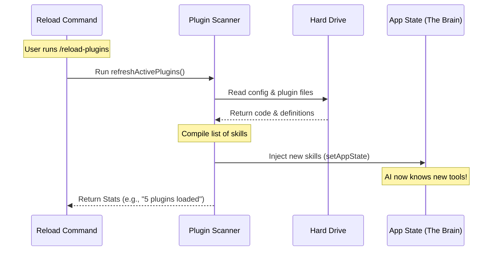

# Chapter 4: Plugin State Refresh (Layer-3)

Welcome to Chapter 4! In the previous chapter, [Change Detection & Notification](03_change_detection___notification.md), we successfully alerted the system that our settings files have changed (we "rang the doorbell").

Now, we need to answer the door.

## Why do we need this?

Imagine you are playing an open-world video game. You pause the game and buy a "DLC Pack" that contains a cool new sword.

*   **The Old Way:** You have to save the game, quit to the desktop, restart the game, wait for the loading screens, and load your save file just to see the sword. This is annoying and breaks your immersion.
*   **The "Layer-3" Way:** You click "buy," close the menu, and the game simply **Refreshes** your inventory. The sword appears instantly in your hand while you are still standing in the game world.

### The Use Case

In our AI assistant, the "Game World" is the current chat session. The "Sword" is a new plugin or skill.

If the user installs a new plugin (like a Calculator or a Weather tool), we don't want to kill the current chat session. We want to **Hot-Swap** the capabilities of the AI so it can use the new tool immediately in the very next message.

## Key Concepts

To achieve this instant update, we use a concept called **State Injection**.

1.  **The Scanner:** A function that looks at your settings and reads all the plugin files on your hard drive to see what commands are available *right now*.
2.  **The State:** The "Brain" of the running application. It holds the list of tools the AI is allowed to use.
3.  **The Injection:** We take the fresh list from the Scanner and force-feed it into the Brain (`setAppState`), overwriting the old list.

## How to Implement State Refresh

This is the core business logic of our command. It happens inside `reload-plugins.ts` immediately after we handle the settings synchronization.

### 1. Importing the Logic
We don't write the complex scanning code inside the command file itself. We import a specialized helper.

```typescript
// reload-plugins.ts
import { refreshActivePlugins } from '../../utils/plugins/refresh.js'
```

### 2. Calling the Refresh
We call the function and pass it a very important key: `context.setAppState`.

```typescript
// reload-plugins.ts - inside the call() function

// ... after settings sync ...

// "context" comes from the command arguments
// This single line does all the heavy lifting!
const r = await refreshActivePlugins(context.setAppState)
```

*   **`refreshActivePlugins`**: This is the "Scanner." It goes out, finds files, loads code, and compiles a list of capabilities.
*   **`context.setAppState`**: This is the key to the "Brain." By passing this function to the scanner, we give the scanner permission to reach into the running application and update its memory directly.
*   **`r`**: This stands for "Result." It contains the statistics of what just happened (how many plugins were found, how many errors occurred, etc.).

## Under the Hood: The Refresh Process

What happens inside that `refreshActivePlugins` black box? Let's visualize the flow.



1.  **Command** kicks off the process.
2.  **Scanner** reads the physical files from the **Disk**.
3.  **Scanner** compiles a new "inventory" of tools.
4.  **Scanner** updates the **Brain** immediately. The AI now effectively has "new memories" of how to use these tools.
5.  **Scanner** reports back to the Command with numbers (Statistics).

## Deep Dive: The Data Structure

The variable `r` (the result) is simple but crucial. We need to capture the output of this operation so we can tell the user what happened.

If we look at the code where we use `r`, we can see what kind of data the Layer-3 refresh returns.

```typescript
// reload-plugins.ts

// 'r' is an object containing counts
const parts = [
  n(r.enabled_count, 'plugin'), // e.g., 5 plugins
  n(r.command_count, 'skill'),  // e.g., 12 skills
  n(r.agent_count, 'agent'),    // e.g., 1 agent
  n(r.hook_count, 'hook'),      // e.g., 2 hooks
]
```

**Why do we need this?**
If the refresh runs silently, the user might think it failed. By capturing the counts (`enabled_count`, `command_count`, etc.), we confirm to the user that:
1.  The system actually did work.
2.  The specific plugin they wanted is included in the count.

### Handling Errors
The refresh process also catches problems. If a plugin file has a syntax error (like a missing bracket), it won't crash the app. Instead, it gets added to an error counter.

```typescript
// reload-plugins.ts

// Check if there were any issues
if (r.error_count > 0) {
  // We will append this to the message later
  // This helps the user debug their custom code
}
```

## Conclusion

In this chapter, you learned about **Plugin State Refresh (Layer-3)**.

We moved beyond just updating settings files. We used `refreshActivePlugins` to scan the disk for new capabilities and injected them directly into the running application's state (`setAppState`). This allows our AI assistant to learn new skills instantly without a restart—just like equipping a new item in a game.

Now that the plugins are reloaded and we have our results (the variable `r`), we need to take those raw numbers and turn them into a nice, readable message for the user.

[Next Chapter: Result Aggregation & Formatting](05_result_aggregation___formatting.md)

---

Generated by [Code IQ](https://github.com/adityasoni99/Code-IQ)