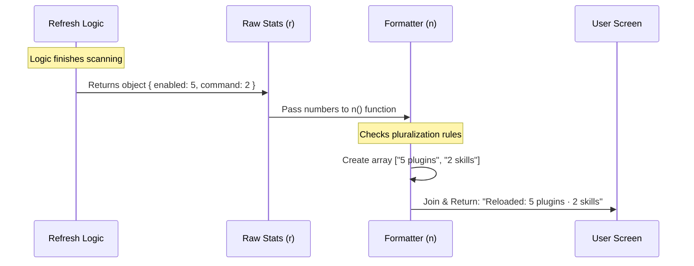

# Chapter 5: Result Aggregation & Formatting

Welcome to the final chapter of our tutorial series! In the previous chapter, [Plugin State Refresh (Layer-3)](04_plugin_state_refresh__layer_3_.md), we successfully scanned the hard drive, loaded new code, and updated the AI's "Brain" with new skills.

The hard work is done. But we have one last crucial step.

## Why do we need this?

Imagine you just finished a huge grocery shopping trip. You bought apples, bananas, milk, and bread.
When you look at your receipt, you **don't** want to see:
*   `Item ID: 99283 processed.`
*   `Item ID: 11234 processed.`
*   `Transaction 0x99 successful.`

You want a summary:
*   **"4 Items Purchased. Total: $15.00"**

### The Use Case

In our `reload-plugins` command, the system just processed potentially dozens of files. It loaded plugins, commands, agents, and hooks.

If we just finished silently, the user might wonder, *"Did it work? Did it load my new tool?"*

We need to take the raw numbers from the refresh operation and turn them into a beautiful, human-readable sentence like:
> **"Reloaded: 5 plugins · 12 skills · 1 agent"**

## Key Concepts

To do this, we use a pattern called **Result Aggregation**. It consists of three simple steps:

1.  **The Counter:** We gather the raw numbers (counts) from the operation.
2.  **The Formatter:** We convert numbers into text, handling "Singular" vs "Plural" (e.g., "1 plugin" vs "2 plugins").
3.  **The Joiner:** We stitch these text pieces together into a single, clean message.

## How to Implement Aggregation

Let's look at how we turn the raw data into a nice message inside `reload-plugins.ts`.

### 1. The Helper Function
Programmers hate repeating themselves. Instead of writing code to check "is this plural?" for every single item type, we define a tiny helper function called `n`.

```typescript
// reload-plugins.ts

// A tiny helper to format "Count + Noun"
function n(count: number, noun: string): string {
  // 'plural' is a utility that adds an 's' if needed
  return `${count} ${plural(count, noun)}`
}
```
*   **Input:** `n(1, 'apple')` -> **Output:** `"1 apple"`
*   **Input:** `n(5, 'apple')` -> **Output:** `"5 apples"`

### 2. Building the Report Card
Now we use our `n` function to build a list of strings. We take `r` (the result object from Chapter 4) and map its numbers to names.

```typescript
// reload-plugins.ts inside the call() function

// Create a list of summary strings
const parts = [
  n(r.enabled_count, 'plugin'),      // "5 plugins"
  n(r.command_count, 'skill'),       // "12 skills"
  n(r.agent_count, 'agent'),         // "1 agent"
  n(r.hook_count, 'hook'),           // "0 hooks"
  // ... extra server counts ...
]
```

### 3. The Joiner
We have a list of strings: `["5 plugins", "12 skills", "1 agent"]`. We want one sentence. We use the `.join()` method with a nice separator.

```typescript
// reload-plugins.ts

// Join the parts with a middle dot for style
let msg = `Reloaded: ${parts.join(' · ')}`

// Result: "Reloaded: 5 plugins · 12 skills · 1 agent"
```

## Under the Hood: The Flow of Data

Let's visualize how the raw numbers travel from the complex logic to the user's screen.



## Deep Dive: Handling Errors

Sometimes, things go wrong. Maybe a user wrote a plugin with a typo. We don't want to hide this, but we also don't want to spam the user with a giant stack trace in the summary.

We use **Conditional Formatting**. We only add the error section if errors actually exist.

### The Code Implementation

```typescript
// reload-plugins.ts

// r.error_count tells us how many files failed to load
if (r.error_count > 0) {
  // Append a warning to our message
  msg += `\n${n(r.error_count, 'error')} during load. Run /doctor for details.`
}
```

*   **If 0 errors:** The code inside the `if` block is skipped. The message stays clean.
*   **If 3 errors:** The message becomes:
    > "Reloaded: 5 plugins · 2 skills
    > **3 errors during load. Run /doctor for details.**"

### Final Output
Finally, we return the message to the CLI framework. This is what actually prints the text to the console.

```typescript
// reload-plugins.ts

// Return the final formatted object
return { 
  type: 'text', 
  value: msg 
}
```

## Conclusion

In this chapter, we learned about **Result Aggregation & Formatting**.

We took a complex object full of raw statistics (`r`) and transformed it into a friendly, readable status update. We used a helper function to handle pluralization and successfully reported both successes and errors without overwhelming the user.

### Project Summary
Congratulations! You have completed the deep dive into `reload-plugins`. Let's recap what we built:

1.  **[Command Architecture & Lazy Loading](01_command_architecture___lazy_loading.md):** We made the command fast by only loading code when needed.
2.  **[Remote Settings Synchronization](02_remote_settings_synchronization.md):** We ensured we always downloaded the latest rules from the cloud.
3.  **[Change Detection & Notification](03_change_detection___notification.md):** We "rang the doorbell" to tell the app that files changed.
4.  **[Plugin State Refresh (Layer-3)](04_plugin_state_refresh__layer_3_.md):** We hot-swapped the AI's skills without restarting.
5.  **Result Aggregation:** We gave the user a clear, helpful summary of what happened.

You now understand how a professional-grade CLI command handles state, files, and user feedback!

---

Generated by [Code IQ](https://github.com/adityasoni99/Code-IQ)