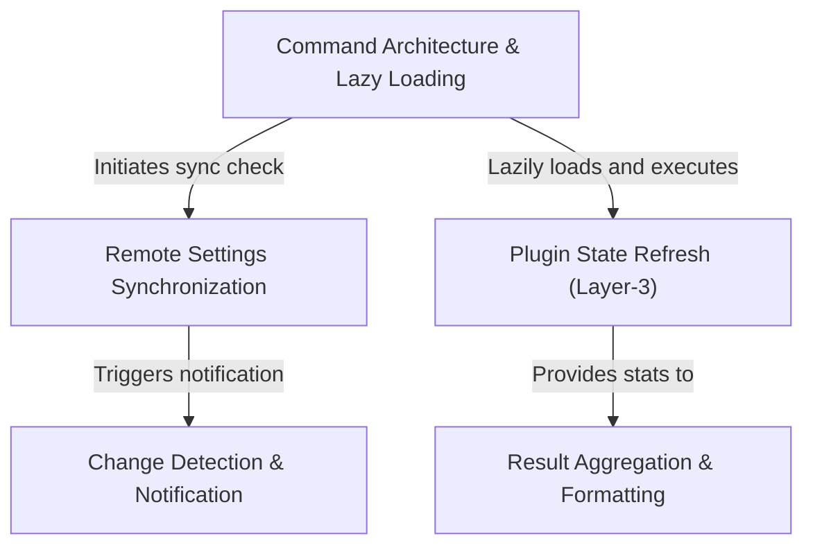

# Tutorial: reload-plugins

This project enables the **hot-swapping** of AI assistant capabilities, allowing users to update skills, agents, and plugins in the running session without a full restart. It utilizes a **lazy-loading** command architecture to keep startup fast and ensures consistency by handling **remote settings synchronization** automatically before applying any changes.

## Chapters

1. [Command Architecture & Lazy Loading](01_command_architecture___lazy_loading.md)
2. [Remote Settings Synchronization](02_remote_settings_synchronization.md)
3. [Change Detection & Notification](03_change_detection___notification.md)
4. [Plugin State Refresh (Layer-3)](04_plugin_state_refresh__layer_3_.md)
5. [Result Aggregation & Formatting](05_result_aggregation___formatting.md)

---

Generated by [Code IQ](https://github.com/adityasoni99/Code-IQ)