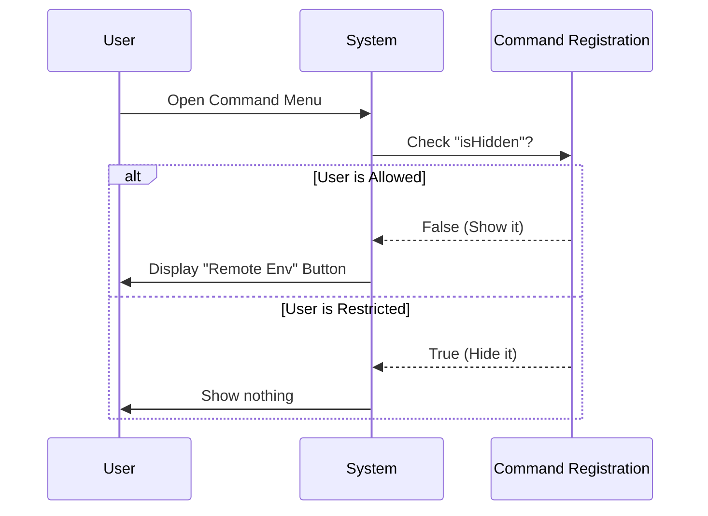

# Chapter 1: Command Registration

Welcome to the `remote-env` project! In this tutorial series, we will build a robust system for managing remote development environments.

We start at the very beginning: **telling the system that a feature exists.**

## Why do we need Command Registration?

Imagine walking into a library. You don't have to carry every single book in the library to know what's available. Instead, you look at the **catalog**. The catalog cards tell you the title, the author, and where to find the book.

In software, **Command Registration** is exactly like that catalog card.

### The Use Case
We want to add a new feature called "Remote Environment" to our application. However, this feature is heavy—it has complex code and UI components. We don't want to load all that heavy code just to show a button in a menu.

**Goal:** Create a lightweight "ID card" for our feature so the system knows:
1.  What it's called.
2.  Who is allowed to see it.
3.  Where to find the real code when the user clicks it.

---

## Defining the "ID Card"

To register a command, we export a simple JavaScript object. We don't write the feature logic here; we just describe it.

### Step 1: Basic Metadata

First, we need to give our command a `name` and a `description`. This is what the user will see in the search bar or menu.

```typescript
// Part of file: index.ts

export default {
  // The unique internal name
  name: 'remote-env',

  // What the user sees
  description: 'Configure the default remote environment',
  
  // Defines how the UI renders (e.g., a local component)
  type: 'local-jsx',
  
  // ... more settings coming up
}
```

**What happens here:**
The system reads this object. It now knows there is a tool called "remote-env". If a user searches for "Configure," the system checks the description and knows this is the right tool.

### Step 2: Safety Checks (Guards)

We don't want everyone to see every command. For example, maybe only paid subscribers should see this feature.

In the registration object, we add two functions: `isEnabled` and `isHidden`.

```typescript
// ... inside the export object

// Can the user click this?
isEnabled: () => 
  isClaudeAISubscriber() && isPolicyAllowed('allow_remote_sessions'),

// Should this be invisible in the menu?
get isHidden() {
  // Hide if not a subscriber OR if policy forbids it
  return !isClaudeAISubscriber() || !isPolicyAllowed('allow_remote_sessions')
},
```

**Explanation:**
*   `isEnabled`: If this returns `false`, the button might appear grayed out.
*   `isHidden`: If this is `true`, the button won't appear at all.
*   **Note:** The logic inside `isPolicyAllowed` is detailed in [Access Control Policies](02_access_control_policies.md).

### Step 3: Pointing to the Real Code

Finally, we need to tell the system where the "Heavy Machinery" is. We use a method called `load`.

```typescript
// ... inside the export object

// The "Link" to the heavy code
load: () => import('./remote-env.js'),

// Type check: ensures our "ID Card" fits the wallet
} satisfies Command
```

**Explanation:**
*   `import('./remote-env.js')`: This is a dynamic import. The system will **not** read the `remote-env.js` file until the user actually runs the command. This keeps our app fast.
*   This concept is covered in depth in [Lazy Module Loading](03_lazy_module_loading.md).

---

## Putting it Together

Here is the complete registration file. Notice how it combines Metadata, Safety Checks, and the Loader.

```typescript
// --- File: index.ts ---
import type { Command } from '../../commands.js'
import { isPolicyAllowed } from '../../services/policyLimits/index.js'
import { isClaudeAISubscriber } from '../../utils/auth.js'

export default {
  type: 'local-jsx',
  name: 'remote-env',
  description: 'Configure the default remote environment for teleport sessions',
  
  // Check if the user is allowed
  isEnabled: () =>
    isClaudeAISubscriber() && isPolicyAllowed('allow_remote_sessions'),
    
  // Hide if not allowed
  get isHidden() {
    return !isClaudeAISubscriber() || !isPolicyAllowed('allow_remote_sessions')
  },
  
  // Point to the real code
  load: () => import('./remote-env.js'),
} satisfies Command
```

---

## Under the Hood: How the System Uses This

When your application starts, it doesn't run the command. It just scans these registration files.

### The Flow
1.  **Boot:** The System finds `index.ts`.
2.  **Register:** It saves the `name` and `description` to a list.
3.  **Render:** It runs `isHidden`. If it returns `false`, it draws a button on the screen.
4.  **Wait:** It does nothing else until the user clicks.

Here is a diagram showing the "Menu" check:



### Why is this abstraction powerful?
By separating the **Registration** (the ID card) from the **Implementation** (the heavy code), our application remains lightweight. The system can check hundreds of commands in milliseconds because it only looks at this small file.

Once the user clicks the command, the system uses the `load` function to fetch the rest. Then, the [UI Command Handler](04_ui_command_handler.md) takes over to display the interface.

---

## Conclusion

You have successfully registered a new command! You've learned how to:
1.  Define a command using a metadata object (the "ID Card").
2.  Add basic guards (`isEnabled`) to control visibility.
3.  Point to the actual logic without loading it immediately.

However, in our code, we saw `isPolicyAllowed`. How does the system decide if a policy allows a remote session?

Let's find out in the next chapter.

[Next: Access Control Policies](02_access_control_policies.md)

---

Generated by [Code IQ](https://github.com/adityasoni99/Code-IQ)