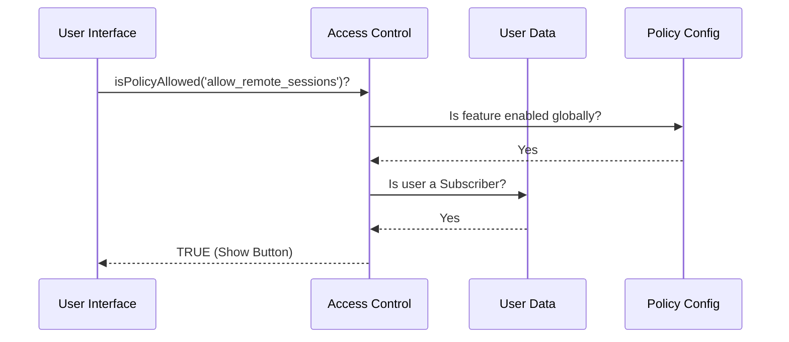

# Chapter 2: Access Control Policies

In the previous chapter, [Command Registration](01_command_registration.md), we learned how to tell the system a command exists. We also briefly touched on "Safety Checks" to hide commands from users who shouldn't see them.

Specifically, we used a function called `isPolicyAllowed`.

In this chapter, we will open the "black box" of that function to understand **Access Control Policies**.

## Why do we need Access Control?

Imagine you run a secure office building.
1.  **The Receptionist:** Knows where every room is (Command Registration).
2.  **The Security Guard:** Checks badges to see who is allowed into those rooms.

**Access Control Policies** are the Security Guard.

### The Use Case
Our "Remote Environment" feature uses expensive cloud servers.
*   **Problem:** We cannot let every user launch a remote session, or we will go bankrupt.
*   **Goal:** Only users who are "ClaudeAI Subscribers" (VIPs) should be able to use this feature.

---

## The Concepts: Predicates

Access control relies on simple questions that return `true` (Allowed) or `false` (Denied). In programming, we call these **Predicates**.

We use two main types of predicates to make decisions.

### 1. User Status Check
First, we need to know **who** the user is. This usually checks the user's login token or account type.

```typescript
// utils/auth.ts

// A simple predicate to check subscription
export function isClaudeAISubscriber(): boolean {
  // In a real app, this checks user data
  return currentUser.plan === 'subscriber'; 
}
```

**Explanation:**
This function looks at the user's badge. If it says "Subscriber," it returns `true`.

### 2. The Policy Check
Next, we check if the **system** allows the action. This is the "Rulebook." Even if you are a subscriber, the feature might be disabled for maintenance.

```typescript
// services/policyLimits/index.js

export function isPolicyAllowed(policyName: string): boolean {
  // 1. Look up the rule for this policy name
  const rule = policies[policyName];
  
  // 2. Return true if the rule allows it
  return rule.enabled === true;
}
```

**Explanation:**
We pass a string ID (like `'allow_remote_sessions'`). The system looks that ID up in a configuration file to see if that specific feature is turned on.

---

## Solving the Use Case

Now, let's combine these concepts to protect our "Remote Environment" command. We want to ensure that **both** conditions are met: the user is a subscriber, AND the policy is active.

### The Guard Logic
We combine these checks inside the `isEnabled` or `isHidden` properties we saw in Chapter 1.

```typescript
// The combined check
const canAccess = isClaudeAISubscriber() && isPolicyAllowed('allow_remote_sessions');

if (canAccess) {
    console.log("Welcome to Remote Env!");
} else {
    console.log("Access Denied.");
}
```

**Example Inputs & Outputs:**

1.  **Input:** User is `Free Tier`, Policy is `on`.
    *   **Output:** `False` (User check fails). Feature is hidden.
2.  **Input:** User is `Subscriber`, Policy is `off` (Maintenance).
    *   **Output:** `False` (Policy check fails). Feature is hidden.
3.  **Input:** User is `Subscriber`, Policy is `on`.
    *   **Output:** `True`. Feature is visible.

---

## Under the Hood: The Decision Flow

When the application tries to render a button, it consults the Access Control system. It doesn't make the decision itself; it asks the "Guard."

Here is how the flow works step-by-step:

1.  **Request:** The UI asks, "Can I show the 'Remote Env' button?"
2.  **Policy Lookup:** The system looks for the rule named `'allow_remote_sessions'`.
3.  **Status Check:** The system checks the user's subscription status.
4.  **Verdict:** If all checks pass, the button appears.



---

## Internal Implementation

Let's look at how we actually implement the `policyLimits` service. We keep it simple by using a configuration object.

### The Policy Configuration
We define a dictionary where every key is a feature, and the value defines the rules.

```typescript
// services/policyLimits/config.ts

export const policies = {
  // The rule for our specific feature
  allow_remote_sessions: {
    requiresSubscription: true,
    globalKillSwitch: false // Set to true to disable for everyone
  },
  
  // Other rules...
  allow_local_terminal: { /* ... */ }
};
```

### The Logic Function
This is the `isPolicyAllowed` function we used in our command registration.

```typescript
// services/policyLimits/index.ts
import { policies } from './config.js';
import { isClaudeAISubscriber } from '../../utils/auth.js';

export function isPolicyAllowed(key: string): boolean {
  const policy = policies[key];
  
  // If policy doesn't exist, block it by default (Safety first!)
  if (!policy) return false;

  // ... logic continues below
```

**Explanation:**
First, we try to find the policy. If we made a typo and the policy doesn't exist, we return `false` immediately. It is safer to accidentally block a feature than to accidentally allow it.

### Applying the Rules
Now we check the specific flags we defined in the config.

```typescript
// ... inside isPolicyAllowed function

  // Check 1: Is the feature turned off globally?
  if (policy.globalKillSwitch) return false;

  // Check 2: Does it require a subscription?
  if (policy.requiresSubscription && !isClaudeAISubscriber()) {
    return false;
  }

  return true;
}
```

**Explanation:**
This function acts as a checklist. If any condition fails (feature is turned off OR user isn't a subscriber), it returns `false`. If it survives all the checks, it returns `true`.

---

## Conclusion

You have now built a security system for your application!

1.  We defined **Policies** in a configuration file (The Rulebook).
2.  We created **Predicates** to check user status (The ID Card).
3.  We combined them in `isPolicyAllowed` to make a final decision.

Now that the user is authorized and has clicked the button, we need to actually run the code. But remember from Chapter 1, the code is "heavy." We don't want to load it until this exact moment.

In the next chapter, we will learn how to load that code efficiently using Lazy Loading.

[Next: Lazy Module Loading](03_lazy_module_loading.md)

---

Generated by [Code IQ](https://github.com/adityasoni99/Code-IQ)