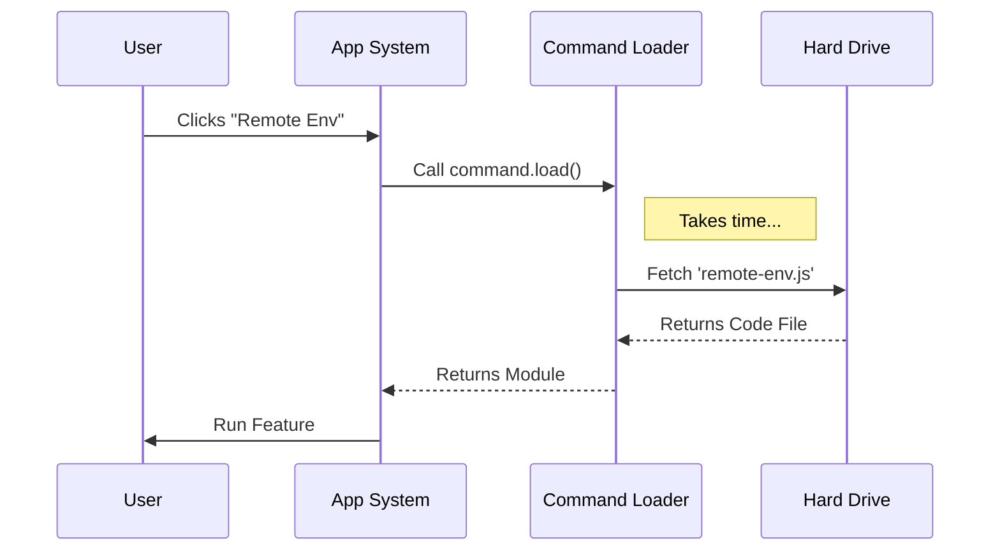

# Chapter 3: Lazy Module Loading

In the previous chapter, [Access Control Policies](02_access_control_policies.md), we built a security system to decide *who* is allowed to use a feature.

Now, imagine an authorized user (a "Subscriber") has just clicked the **"Remote Env"** button. The security guard said "Yes." Now we need to actually deliver the feature.

This brings us to **Lazy Module Loading**.

## The Problem: The "Over-Packed Suitcase"

The `remote-env` feature is complex. It contains heavy code for:
1.  Connecting to SSH servers.
2.  Rendering complex terminal windows.
3.  Managing file transfers.

If we loaded all this code as soon as the application started, it would be like going on a weekend trip but packing your entire house into your suitcase. Your trip (the app start-up) would be incredibly slow and heavy.

**The Goal:** We want the application to start fast. We only want to unpack the "Remote Env" gear *if and when* the user decides to use it.

---

## The Concept: Just-In-Time Delivery

In standard programming, we usually import code at the top of the file. This is called **Static Import**.

```typescript
// ❌ The slow way (Static Import)
import { startRemoteSession } from './remote-env.js';

// This code runs immediately when the app opens!
```

To solve our problem, we use **Dynamic Import**. This is a special JavaScript function that acts like a delivery service. It doesn't fetch the file until you specifically ask for it.

```typescript
// ✅ The fast way (Dynamic Import)
const startRemoteSession = await import('./remote-env.js');

// This code only runs when this line is executed!
```

### Analogy
*   **Static Import:** Buying a DVD. You have the movie physically in your house all the time, taking up space on your shelf, even if you don't watch it.
*   **Dynamic Import:** Streaming a movie. You don't have the movie data until you press "Play." It saves space and resources.

---

## Solving the Use Case

Let's look back at our Command Registration file from Chapter 1. We used a specific property called `load`.

### The Load Function

In our registration object, we wrap the import inside an arrow function.

```typescript
// index.ts

export default {
  name: 'remote-env',
  
  // ... other properties ...

  // The Lazy Loader
  load: () => import('./remote-env.js'),
} 
```

**Explanation:**
1.  **`() => ...`**: This is a function definition. The code inside hasn't run yet; it is just "sitting there," waiting to be called.
2.  **`import(...)`**: This tells the browser/system: "Go find this file, download it, and parse it."

Because this is wrapped in a function, the heavy `remote-env.js` file is **not** touched when the application starts. The app remains lightweight.

---

## Under the Hood: The Loading Process

What actually happens when a user clicks the command?

We need a system to handle the "Waiting" period. Dynamic imports are **asynchronous**—meaning they take a few milliseconds (or seconds) to fetch the file from the disk or network.

### The Flow
1.  **Click:** User clicks the command.
2.  **Trigger:** The system calls the `load()` function.
3.  **Fetch:** The system goes to the disk to find `remote-env.js`.
4.  **Execute:** The file is loaded and returned to the system.

Here is the sequence of events:



---

## Internal Implementation

Let's look at the code that runs *after* the user clicks. This would be part of our central command runner.

### Step 1: Handling the Click
When the user clicks, we look up the command object we created in Chapter 1.

```typescript
// command-runner.ts

async function onCommandClick(command: Command) {
  console.log("Loading feature...");

  // 1. Call the load function
  // The 'await' keyword pauses here until the file is ready
  const loadedModule = await command.load();

  // ... continue to Step 2
}
```

**Explanation:**
*   **`async / await`**: This is crucial. It tells JavaScript: "Don't crash. Just pause this function until the `import` is finished."
*   **`loadedModule`**: This variable now holds everything that was inside `remote-env.js`.

### Step 2: Running the Feature
Now that we have the module, we can use it. The module usually exports a default function or component to start the feature.

```typescript
// ... inside onCommandClick

  // 2. The module is now loaded!
  console.log("Feature loaded successfully.");

  // 3. Find the default export and use it
  const featureComponent = loadedModule.default;
  
  return featureComponent;
}
```

**Example Input/Output:**

*   **Before Click:** `loadedModule` is undefined. The generic `Command` object is small (1KB).
*   **Action:** User clicks.
*   **Wait:** System waits 50ms for the file to load.
*   **After Click:** `loadedModule` contains the 5MB of logic needed for the Remote Environment.

---

## The "Heavy" File

Just to complete the picture, here is a glimpse of what the file we are loading looks like. This is the file that was "Deferred."

```typescript
// remote-env.js (The Heavy File)

// We import heavy libraries here
import { Terminal } from 'xterm'; 
import { SSHClient } from 'ssh2';

// This code runs ONLY after lazy loading finishes
console.log("Initializing Heavy Machinery...");

export default function RemoteEnvUI() {
  return "I am the Remote Environment Interface";
}
```

Because `import { Terminal }` is inside this file, the `xterm` library (which is very large) is *also* lazy loaded. We save a huge amount of memory!

---

## Conclusion

You have successfully implemented a high-performance loading pattern!

1.  We used **Dynamic Imports** (`import()`) to keep our initial bundle size small.
2.  We wrapped the import in a **`load` function** in our command registration.
3.  We used **`await`** to handle the delay while the file is fetched.

At this point in the tutorial:
1.  We know the command exists ([Command Registration](01_command_registration.md)).
2.  We know the user is allowed to use it ([Access Control Policies](02_access_control_policies.md)).
3.  We have successfully fetched the code from the disk (Lazy Loading).

Now we hold the code in our hands. But... it's just code. How do we put it on the screen so the user can interact with it?

[Next: UI Command Handler](04_ui_command_handler.md)

---

Generated by [Code IQ](https://github.com/adityasoni99/Code-IQ)