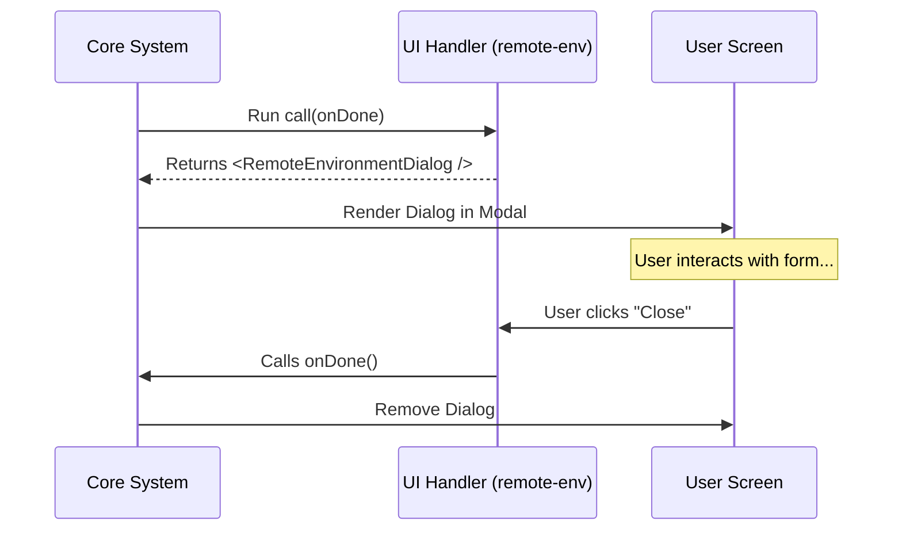

# Chapter 4: UI Command Handler

Welcome to the final chapter of our tutorial series!

In the previous chapter, [Lazy Module Loading](03_lazy_module_loading.md), we learned how to efficiently fetch the heavy code for our "Remote Environment" feature from the disk.

Now, we have the code in our hands. But code is just text. **How do we turn that code into a visual window that the user can actually click and type in?**

This brings us to the **UI Command Handler**.

## The Goal: Bridging Logic and Vision

Imagine you have just downloaded a video game (Lazy Loading). To actually play it, you need a console or a PC to render the graphics on your TV.

The **UI Command Handler** is that rendering console.

### The Use Case
We have fetched the `remote-env.tsx` file. Now we need to:
1.  **Launch** a dialog box (a popup window).
2.  **Pass control** to that dialog so the user can configure their remote session.
3.  **Wait** for the user to finish (click "Connect" or "Cancel").

---

## The Concept: The `call` Function

To make this work, the system and the feature need a standard agreement (an Interface).

The agreement is simple: **"Every UI feature must export a function named `call`."**

The system promises: "I will call this function when the user clicks."
The feature promises: "I will return a React component (the UI) for you to display."

### Key Concepts

1.  **`onDone`**: A "Callback". This is a button the system gives to the feature saying, "Press this when you are finished so I can close the window."
2.  **`ReactNode`**: The actual visual elements (buttons, text, forms) that React draws on the screen.

---

## The Solution

Let's write the code for `remote-env.tsx`. This is the file that was lazy-loaded in the previous chapter.

### Step 1: Importing Dependencies

First, we import React and the actual design of our dialog box.

```typescript
// remote-env.tsx
import * as React from 'react';

// The visual component (The "Look and Feel")
import { RemoteEnvironmentDialog } from '../../components/RemoteEnvironmentDialog.js';

// The type definition for the "Finished" signal
import type { LocalJSXCommandOnDone } from '../../types/command.js';
```

**Explanation:**
*   `RemoteEnvironmentDialog`: This is a standard React component (like a `<div>` or `<button>`) that contains our form, text inputs, and styling. We keep the styling separate from the command logic.

### Step 2: The Handler Function

Now, we export the required `call` function. This is the entry point.

```typescript
// ... inside remote-env.tsx

export async function call(
  onDone: LocalJSXCommandOnDone
): Promise<React.ReactNode> {
  
  // Return the visual component to the system
  return <RemoteEnvironmentDialog onDone={onDone} />;
}
```

**Explanation:**
*   **`export async function call`**: This makes the function public so the System can find it.
*   **`onDone`**: We receive this tool from the System. We pass it down to the Dialog so the Dialog can click it later.
*   **`return <RemoteEnvironmentDialog ... />`**: We don't render this to the DOM ourselves. We just *hand it back* to the System. The System decides where to put it.

---

## Putting It Together

Here is the complete, minimal file. It is surprisingly simple because its only job is to connect the System to the Visual Component.

```typescript
// --- File: remote-env.tsx ---
import * as React from 'react';
import { RemoteEnvironmentDialog } from '../../components/RemoteEnvironmentDialog.js';
import type { LocalJSXCommandOnDone } from '../../types/command.js';

export async function call(onDone: LocalJSXCommandOnDone): Promise<React.ReactNode> {
  // Pass the "onDone" switch to the dialog
  return <RemoteEnvironmentDialog onDone={onDone} />;
}
```

---

## Under the Hood: How the System Renders It

How does a returned function result in pixels on the screen?

When you return the component, the System wraps it in a "Modal Layer" (a transparent overlay that sits on top of the rest of the app).

### The Flow

1.  **Invoke:** The System runs `module.call()`.
2.  **Receive:** The System gets the `<RemoteEnvironmentDialog />`.
3.  **Mount:** The System tells React: "Draw this component inside the Global Modal Area."
4.  **Wait:** The System waits for `onDone` to be called.



### Internal Implementation (Simplified)

Here is a simplified look at the code inside the System (e.g., inside `CommandRunner.tsx`) that handles this process.

```typescript
// System Code: CommandRunner.tsx

async function executeCommand(module: any) {
  // 1. Create a way to close the window
  const onDone = () => {
    setModalVisible(false); // Hides the UI
    console.log("Command finished");
  };

  // 2. Ask the module for the UI
  const content = await module.call(onDone);

  // 3. Put the UI on the screen
  setModalContent(content);
  setModalVisible(true);
}
```

**Example Inputs & Outputs:**
*   **Input:** The `remote-env` module we created.
*   **Action:** The user sees a popup window appear over their current work.
*   **Result:** When the user finishes, `setModalVisible(false)` runs, and the popup vanishes.

---

## Why Separate the Handler from the Dialog?

You might wonder: *Why didn't we just write the React code directly inside `call`?*

```typescript
// ❌ Bad Practice: Mixing Logic and View
export async function call(onDone) {
  return (
    <div style={{ backgroundColor: 'red' }}>
      <h1>My Dialog</h1>
      <button onClick={onDone}>Close</button>
    </div>
  );
}
```

We avoid this because:
1.  **Reusability:** The `RemoteEnvironmentDialog` might be used in other places (e.g., inside a Settings page), not just as a popup command.
2.  **Testing:** It is easier to test a pure React component (`RemoteEnvironmentDialog`) than a dynamic command handler.
3.  **Cleanliness:** The `UI Command Handler` is just a bridge. It shouldn't know about CSS or HTML.

---

## Conclusion

Congratulations! You have completed the `remote-env` tutorial series.

You have built a sophisticated feature pipeline:

1.  **[Command Registration](01_command_registration.md)**: You created an "ID Card" so the system knows the feature exists.
2.  **[Access Control Policies](02_access_control_policies.md)**: You added security guards to ensure only Subscribers can enter.
3.  **[Lazy Module Loading](03_lazy_module_loading.md)**: You optimized performance by only loading the code when necessary.
4.  **UI Command Handler** (This Chapter): You built the bridge to display the graphical interface to the user.

You now understand the core architecture of adding powerful, scalable features to the `remote-env` project. Happy coding!

---

Generated by [Code IQ](https://github.com/adityasoni99/Code-IQ)