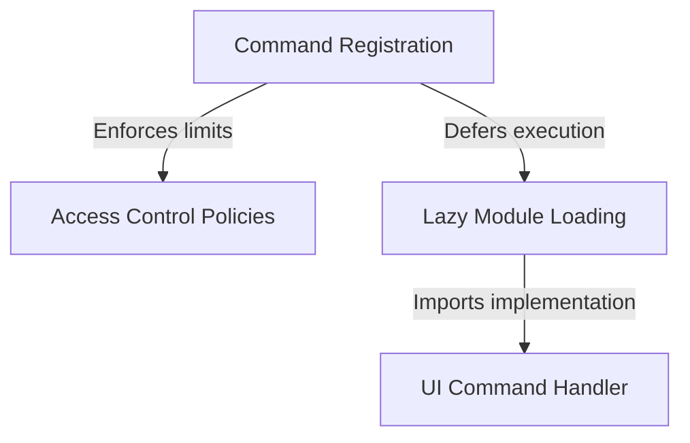

# Tutorial: remote-env

This project defines a **configuration command** that allows users to set up a *remote environment* for teleport sessions. It ensures security by checking if the user has the correct **subscription status** and **policy permissions** before the option is visible or usable. To keep the application fast, the specific code for the **user interface dialog** is only loaded when the user actually activates the command.

## Chapters

1. [Command Registration](01_command_registration.md)
2. [Access Control Policies](02_access_control_policies.md)
3. [Lazy Module Loading](03_lazy_module_loading.md)
4. [UI Command Handler](04_ui_command_handler.md)

---

Generated by [Code IQ](https://github.com/adityasoni99/Code-IQ)