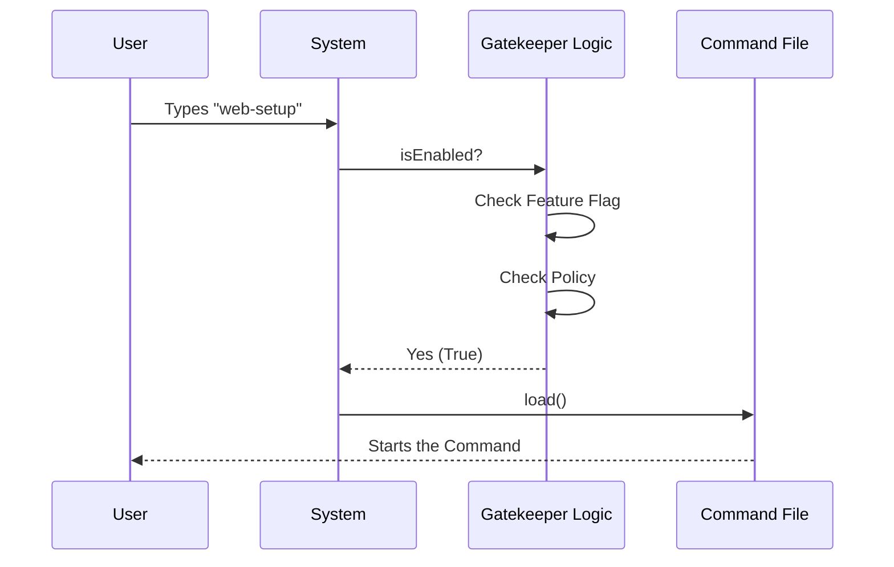

# Chapter 1: Command Registration & Gating

Welcome to the **Remote Setup** project tutorial! Since this is the first chapter, we are going to start at the very beginning: **The Front Door**.

## Motivation: The Smart Doorbell

Imagine you are building a secret clubhouse. You want people to enter, but not just *anyone* and not at *any time*.
1.  **Identity**: People need to know the name of the clubhouse to find it.
2.  **Gating**: You might want to lock the door if it's too late at night, or if the person doesn't have the secret password.

In our software, a **Command** is like that clubhouse. We want to create a command called `web-setup`. However, we only want this command to work if:
*   A specific "feature flag" is turned on (maybe we are testing it).
*   The user's security policy allows remote sessions.

This chapter teaches you how to register a command and set up these "gates" so features are only accessible when appropriate.

## Key Concepts

We will break this down into three simple parts:

1.  **Identity**: Defining what the command is called (`name`) and what it does (`description`).
2.  **The Gatekeepers**: Using `isEnabled` and `isHidden` to check rules before running.
3.  **Lazy Loading**: A performance trick to only load the heavy code when the user actually knocks on the door.

---

## How to Register and Gate a Command

Let's build our `web-setup` command configuration. We are working in `index.ts`.

### Step 1: Defining Identity
First, we tell the system the name of our command. This allows the user to run it by typing `web-setup`.

```typescript
const web = {
  type: 'local-jsx', // Defines the UI style
  name: 'web-setup', // The command the user types
  description:
    'Setup Claude Code on the web (requires GitHub)',
  availability: ['claude-ai'], // Where is this available?
  // ... more logic coming next
}
```
*   **Input**: The user lists available commands.
*   **Output**: The CLI sees "web-setup" and its description.

### Step 2: The Gatekeeper (Feature Flags)
We don't want to show this command if the feature isn't ready. We use a **Feature Flag** (like a light switch). Here, we check the flag named `tengu_cobalt_lantern`.

```typescript
import { getFeatureValue_CACHED_MAY_BE_STALE } from '../../services/analytics/growthbook.js'

// Inside the object:
isEnabled: () =>
    // Check if the "tengu_cobalt_lantern" flag is ON
    getFeatureValue_CACHED_MAY_BE_STALE('tengu_cobalt_lantern', false)
    // We will add more checks here next...
```
*   **Explanation**: `getFeatureValue` looks up the flag. If it returns `false`, the command is disabled.

### Step 3: The Policy Check
Even if the feature is ON, the user's company might forbid it. We check the `allow_remote_sessions` policy.

```typescript
import { isPolicyAllowed } from '../../services/policyLimits/index.js'

// Updating isEnabled to check BOTH flag and policy:
isEnabled: () =>
    getFeatureValue_CACHED_MAY_BE_STALE('tengu_cobalt_lantern', false) &&
    isPolicyAllowed('allow_remote_sessions'),
```
*   **Explanation**: The `&&` means **BOTH** must be true. If the policy forbids remote sessions, `isEnabled` becomes `false`.

### Step 4: Lazy Loading
Finally, if the gates open, we need to decide *what* code to run. We use `import()` inside a function. This ensures we don't load the heavy logic until the command actually starts.

```typescript
// Inside the object:
load: () => import('./remote-setup.js'),
```
*   **Effect**: The file `./remote-setup.js` contains the actual logic (which we will cover in the next chapter).

---

## Under the Hood: The Flow

What happens when a user types a command? The system acts like a bouncer at a club.

1.  **Lookup**: The system looks for a command matching the name.
2.  **Gate Check**: It asks "Is this enabled?" (Runs Step 2 & 3).
3.  **Action**: If enabled, it runs `load()` (Step 4).

Here is a simple diagram of that conversation:



## Implementation Deep Dive

Let's look at the final assembled code in `index.ts`. This combines everything we just discussed.

### Imports
We import the tools we need to check the "Gate".

```typescript
// File: index.ts
import type { Command } from '../../commands.js'
// Tool to check feature flags
import { getFeatureValue_CACHED_MAY_BE_STALE } from '../../services/analytics/growthbook.js'
// Tool to check company policies
import { isPolicyAllowed } from '../../services/policyLimits/index.js'
```

### The Command Object
This is the object that ties it all together. Notice the `isHidden` property—this completely hides the command from the help menu if the policy forbids it.

```typescript
const web = {
  type: 'local-jsx',
  name: 'web-setup',
  // ... description ...
  isEnabled: () =>
    getFeatureValue_CACHED_MAY_BE_STALE('tengu_cobalt_lantern', false) &&
    isPolicyAllowed('allow_remote_sessions'),
  get isHidden() {
    // Hide entirely if policy says no
    return !isPolicyAllowed('allow_remote_sessions')
  },
  load: () => import('./remote-setup.js'),
} satisfies Command
```

*   **`satisfies Command`**: This is a TypeScript feature ensuring our object has all the required parts of a "Command".
*   **`import('./remote-setup.js')`**: This points to the code that handles the visual interface.

## Conclusion

You have successfully defined the **Registration & Gating** for the `web-setup` command!

*   We gave it a **name**.
*   We protected it with **feature flags** and **policies**.
*   We set it up to **lazy load** the logic.

Now that the command is registered and the gates are open, what happens when the user successfully runs it? We need to show them a user interface.

[Next Chapter: Interactive Setup UI](02_interactive_setup_ui.md)

---

Generated by [Code IQ](https://github.com/adityasoni99/Code-IQ)