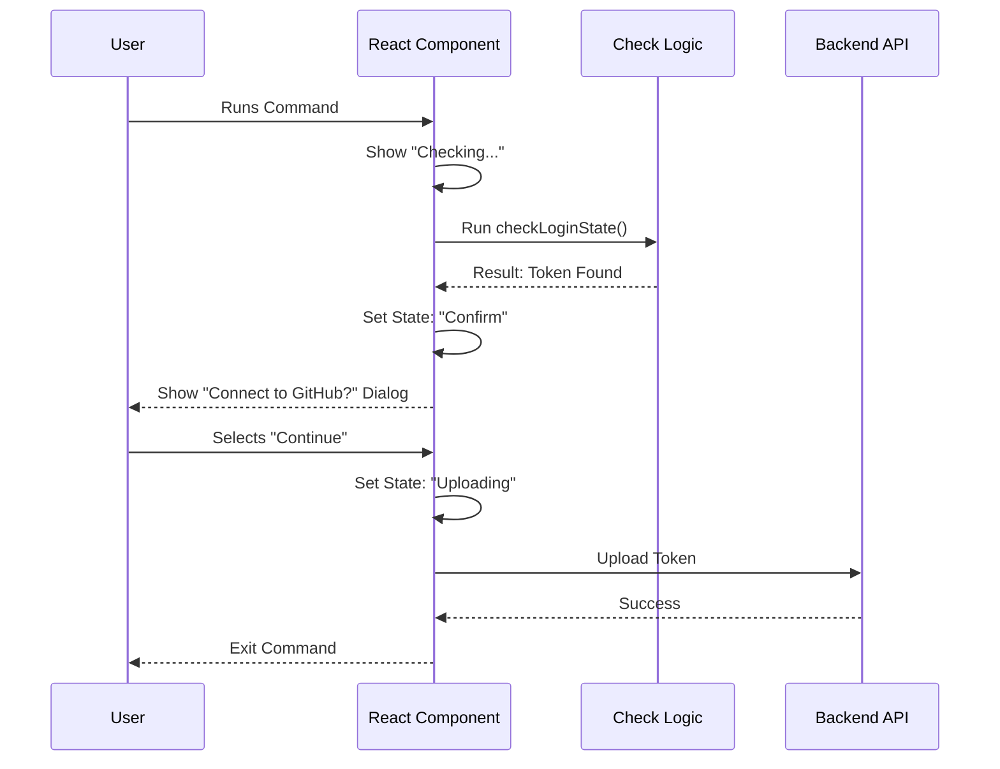

# Chapter 2: Interactive Setup UI

In [Chapter 1: Command Registration & Gating](01_command_registration___gating.md), we built the "Front Door" to our application. We learned how to register a command and guard it with security policies.

Now that the user has successfully entered, what do they see?

## Motivation: The Friendly Wizard

Terminals can be scary places. Usually, when you run a command, you stare at a blinking cursor, hoping something is happening. For a complex setup process, this "silent treatment" is bad user experience.

We want to build a **Guided Wizard** that:
1.  **Informs**: Tells the user "I'm checking your credentials..."
2.  **Asks**: "Is it okay if I connect to GitHub?"
3.  **Updates**: "Great, uploading your token now..."

To do this in a terminal, we use **React**. Yes, the same tool used for websites can render text-based UIs in your terminal!

## Key Concepts

### 1. The State Machine
Think of our setup process like a traffic light. It can only be in one "state" at a time.
*   **Checking**: The yellow light. We are figuring out the situation.
*   **Confirm**: The red light. We stop and ask the user for permission.
*   **Uploading**: The green light. We are moving forward to finish the job.

### 2. React in the Terminal (Ink)
We use a library called `Ink`. It allows us to use React components like `<Text>`, `<Box>`, and hooks like `useState`. Instead of rendering HTML `<div>`s, it renders text lines in the console.

---

## Building the UI Flow

We are working in `remote-setup.tsx`. Let's build this step-by-step.

### Step 1: Defining the States
First, we define the possible phases of our journey. We also need a place to store data (like the GitHub token) once we find it.

```typescript
type Step =
  | { name: 'checking' }
  | { name: 'confirm'; token: RedactedGithubToken }
  | { name: 'uploading' };

// Inside our Component:
const [step, setStep] = useState<Step>({ name: 'checking' });
```
*   **Concept**: We use `useState` to remember which "screen" we are currently showing. We start at `'checking'`.

### Step 2: The "Checking" Logic
When the command starts, we immediately want to check if the user is logged in. We use `useEffect` for this. This acts like a generic "start up" function.

```typescript
useEffect(() => {
  // Start the check immediately
  checkLoginState().then(async (result) => {
    if (result.status === 'has_gh_token') {
      // If we found a token, move to the CONFIRM screen
      setStep({ name: 'confirm', token: result.token });
    }
    // ... handle other error cases ...
  });
}, []);
```
*   **Explanation**: `checkLoginState` (which we will explore in [GitHub CLI Integration](03_github_cli_integration.md)) runs in the background. If it succeeds, we update our `step` state.

### Step 3: Rendering the "Checking" Screen
React allows us to decide *what* to show based on our state. If we are checking, we show a spinner.

```typescript
if (step.name === 'checking') {
  // Renders a spinning animation
  return <LoadingState message="Checking login status…" />;
}
```
*   **Output**: The user sees: `⠋ Checking login status…`

### Step 4: Rendering the "Confirm" Screen
If the check succeeds, the state changes to `confirm`. Now we show a dialog box asking for permission.

```typescript
// If we are in the 'confirm' step...
return (
  <Dialog title="Connect Claude to GitHub?" onCancel={handleCancel}>
    <Text>
      We need to connect your account to push code on your behalf.
    </Text>
    <Select
      options={[{ label: 'Continue', value: 'send' }]}
      onChange={(val) => val === 'send' ? handleConfirm(step.token) : handleCancel()}
    />
  </Dialog>
);
```
*   **Concept**: `<Dialog>` and `<Select>` are UI components that handle user input (arrow keys and Enter).
*   **Action**: If the user selects "Continue", we call `handleConfirm`.

### Step 5: Handling the Confirmation
When the user says "Continue", we move the state to `uploading` and send the data to the backend.

```typescript
const handleConfirm = async (token: RedactedGithubToken) => {
  // 1. Update UI to show we are working
  setStep({ name: 'uploading' });

  // 2. Perform the actual upload (Backend API)
  const result = await importGithubToken(token);

  // 3. Finish the command
  onDone(`Connected as ${result.username}`);
};
```
*   **Transitions**: The UI briefly flashes a "Connecting..." spinner (via the `uploading` state) before the command finishes completely.

---

## Under the Hood: The Sequence

How does the data flow through this interactive system?

1.  **Mount**: The UI appears.
2.  **Effect**: The logical check runs automatically.
3.  **Update**: The logic tells the UI "I found a token".
4.  **Interaction**: The user presses "Enter" to confirm.
5.  **Completion**: The UI closes.



## Implementation Deep Dive

Let's look at the `Web` component in `remote-setup.tsx`. This component orchestrates the entire experience.

### The Entry Point
We export a function `call` that renders our component.

```typescript
export async function call(onDone: LocalJSXCommandOnDone) {
  // Renders the Web component into the terminal
  return <Web onDone={onDone} />;
}
```

### Handling Errors
What if the user isn't logged in? We handle that in our `useEffect`.

```typescript
// Inside useEffect checkLoginState().then(...)
case 'gh_not_installed':
  const url = `${getCodeWebUrl()}/onboarding`;
  // Open their browser to help them
  await openBrowser(url);
  // Close the command with an error message
  onDone(`GitHub CLI not found. Please visit ${url}`);
  return;
```
*   **User Experience**: Instead of crashing, we open a web browser to help the user fix the problem, then we exit cleanly.

## Conclusion

We have successfully built a **State-Driven UI**.
*   We turned a complex process into simple steps (`checking`, `confirm`, `uploading`).
*   We gave the user constant feedback via loading spinners.
*   We used Dialogs to ask for consent.

However, the "Checking" phase relied on a function called `checkLoginState` to interact with the system's GitHub tools. How does that work?

[Next Chapter: GitHub CLI Integration](03_github_cli_integration.md)

---

Generated by [Code IQ](https://github.com/adityasoni99/Code-IQ)