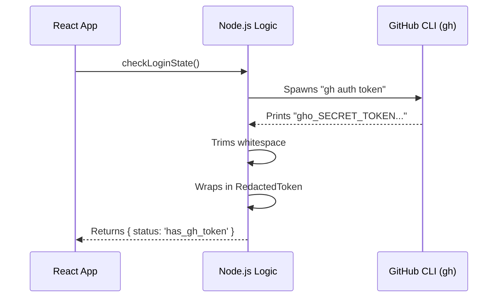

# Chapter 3: GitHub CLI Integration

In [Chapter 2: Interactive Setup UI](02_interactive_setup_ui.md), we built a beautiful interface that shows a "Checking login status…" spinner. But currently, that spinner is just for show. It doesn't actually *do* anything.

How do we actually check if the user is logged into GitHub? And how do we get their credentials without making them copy-paste long, secret codes?

## Motivation: The Digital Valet

Imagine you are at a fancy hotel. You want the valet to park your car.
1.  **The Hard Way**: You write down the exact shape of your key, the radio code, and the alarm pin, and hand that paper to the valet. (This is like manually generating and pasting API tokens).
2.  **The Easy Way**: You just hand them your keys.

Most developers already have the **GitHub CLI** (`gh`) installed and logged in on their computer. This tool holds the "keys" to their GitHub account.

Instead of asking the user to generate a new key, our application acts like the Valet. It asks the local `gh` tool: *"Hey, are you logged in? Can I borrow the token?"*

This chapter explains how our Node.js application talks to other software installed on your computer.

## Key Concepts

### 1. Child Processes (The Subcontractor)
Node.js is great, but it doesn't know how to talk to GitHub natively. However, it can hire a "subcontractor." We use a library called `execa` to run terminal commands (like `gh auth status`) from inside our code, just as if you typed them yourself.

### 2. Standard Output (`stdout`)
When you run a command in your terminal, it prints text to the screen. This is called **Standard Output**. When our code runs the command, it "captures" this text into a string variable so we can read it.

### 3. The Bridge
We need a function that bridges the gap between our **React UI** (Chapter 2) and the **System Tools** (GitHub CLI).

---

## How to Talk to the CLI

We are implementing the logic inside `checkLoginState` in `remote-setup.tsx`.

### Step 1: Hiring the Subcontractor
We use `execa` to run commands. It takes the command name and a list of arguments.

```typescript
import { execa } from 'execa';

// This runs: gh auth token
const { stdout } = await execa('gh', ['auth', 'token']);
```
*   **Input**: The system runs the command `gh auth token`.
*   **Output**: The variable `stdout` now contains the secret token string.

### Step 2: Checking Status silently
Before we ask for the token, we should check if the tool is even installed. We use a helper `getGhAuthStatus`.

```typescript
import { getGhAuthStatus } from '../../utils/github/ghAuthStatus.js';

const ghStatus = await getGhAuthStatus();

if (ghStatus === 'not_installed') {
  return { status: 'gh_not_installed' };
}
```
*   **Logic**: If the user doesn't have the CLI, we can't proceed. We tell the UI to show an error or help link.

### Step 3: Cleaning the Data
Terminal output often has invisible characters (like newlines) at the end. We must clean it up.

```typescript
// stdout might be "gho_123xyz\n"
const tokenString = stdout.trim(); 

// Now it is "gho_123xyz"
```

---

## Under the Hood: The Handshake

What actually happens when the "Checking..." spinner spins? It's a relay race.

1.  **React UI** calls the function.
2.  **Function** spawns a background process (`gh`).
3.  **GitHub CLI** prints the token to a pipe.
4.  **Function** reads the pipe and wraps the token.



## Implementation Deep Dive

Let's look at the real code in `remote-setup.tsx`. This function performs the critical security handshake.

### The Logic Flow
We verify the user's status in layers. If any layer fails, we stop early.

```typescript
async function checkLoginState(): Promise<CheckResult> {
  // 1. First, check if installed and authenticated generically
  const ghStatus = await getGhAuthStatus();
  
  if (ghStatus === 'not_installed') {
    return { status: 'gh_not_installed' };
  }
  // ... check for 'not_authenticated' ...
```

### Retrieving the Token
This is the most critical part. We use specific settings in `execa` to ensure the token is read securely and not printed to the user's screen by accident.

```typescript
// 2. If we are authenticated, get the actual token
const { stdout } = await execa('gh', ['auth', 'token'], {
  stdout: 'pipe',    // Capture output so we can read it
  stderr: 'ignore',  // Don't let errors leak to the console
  timeout: 5000,     // Don't wait forever if it hangs
  reject: false      // Don't crash if it fails
});
```
*   **`stdout: 'pipe'`**: This directs the output into our variable, not the terminal screen.
*   **`stderr: 'ignore'`**: If `gh` complains, we ignore it to keep our UI clean.

### Handling the Result
Finally, we wrap the raw string in a special object.

```typescript
const trimmed = stdout.trim();

if (!trimmed) {
  // Even if status said yes, if the token is empty, we fail.
  return { status: 'gh_not_authenticated' };
}

// Success!
return {
  status: 'has_gh_token',
  token: new RedactedGithubToken(trimmed)
};
```
*   **`RedactedGithubToken`**: You might be wondering what this class is. We just grabbed a very sensitive secret (the OAuth token). We **never** want to accidentally print this to a log file or error message.

## Conclusion

We have successfully bridged the gap between our application and the user's local tools!
1.  We verified the tool exists.
2.  We ran a child process to ask for credentials.
3.  We captured the output securely.

But now we are holding a "live grenade"—a raw access token. If we `console.log` this by mistake, it could end up in a log file that gets shared. How do we ensure this token remains safe while it travels through our app?

[Next Chapter: Redacted Token Security](04_redacted_token_security.md)

---

Generated by [Code IQ](https://github.com/adityasoni99/Code-IQ)